# Операционные системы. Лабораторная работа 1

## Вариант
- ОС: Linux 
- Fork kind: clone3 
- Benchmark 1: io-lat-write (Измерение задержки на запись накопителя с размерами блока Block Size)
- Benchmark 2: factorize (Разложение числа на простые множители)
- Block size: 512

## Задание
### Часть 1. Запуск программ
Необходимо реализовать собственную оболочку командной строки - shell. Выбор ОС для реализации производится на усмотрение студента. Shell должен предоставлять пользователю возможность запускать программы на компьютере с переданными аргументами командной строки и после завершения программы показывать реальное время ее работы (подсчитать самостоятельно как «время завершения» – «время запуска»).

### Часть 2. Мониторинг и профилирование
Разработать комплекс программ-нагрузчиков по варианту, заданному преподавателем. Каждый нагрузчик должен, как минимум, принимать параметр, который определяет количество повторений для алгоритма, указанного в задании. Программы должны нагружать вычислительную систему, дисковую подсистему или обе подсистемы сразу. Необходимо скомпилировать их без опций оптимизации компилятора.

Перед запуском нагрузчика, попробуйте оценить время работы вашей программы или ее результаты (если по варианту вам досталось измерение чего либо). Постарайтесь обосновать свои предположения. Предположение можно сделать, основываясь на свой опыт, знания ОС и характеристики используемого аппаратного обеспечения.

1. Запустите программу-нагрузчик и зафиксируйте метрики ее работы с помощью инструментов для профилирования. Сравните полученные результаты с ожидаемыми. Постарайтесь найти объяснение наблюдаемому. 
2. Определите количество нагрузчиков, которое эффективно нагружает все ядра процессора на вашей системе. Как распределяются времена  USER%, SYS%, WAIT%, а также реальное время выполнения нагрузчика, какое количество переключений контекста (вынужденных и невынужденных) происходит при этом? 
3. Увеличьте количество нагрузчиков вдвое, втрое, вчетверо. Как изменились времена, указанные на предыдущем шаге? Как ведет себя ваша система? 
4. Объедините программы-нагрузчики в одну, реализованную при помощи потоков выполнения, чтобы один нагрузчик эффективно нагружал все ядра вашей системы. Как изменились времена для того же объема вычислений? Запустите одну, две, три таких программы. 
5. Добавьте опции агрессивной оптимизации для компилятора. Как изменились времена? На сколько сократилось реальное время исполнения программы нагрузчика?

### Ограничения

Программа (комплекс программ) должна быть реализован на языке C, C++.
Дочерние процессы должны быть созданы через заданные системные вызовы выбранной операционной системы, с обеспечением корректного запуска и и завершения процессов.  Запрещено использовать высокоуровневые абстракции над системными вызовами. Необходимо использовать, в случае Unix, процедуры libc.

## Решение

### Часть 1. Запуск программ
Запуск производится через [Main](./src/Main.cpp). Программа запускает программу, переданную в аргументах, и выводит время ее работы.

### Часть 2. Мониторинг и профилирование
Созданные программы-нагрузчики:
- [io-lat-write](./src/Bench/io-lat-write.cpp) - измерение задержки на запись накопителя с размерами блока Block Size
- [factorize](./src/Bench/factorize.cpp) - разложение числа на простые множители
- [combined](./src/Bench/combined.cpp) - объединение io-lat-write и factorize в одну программу

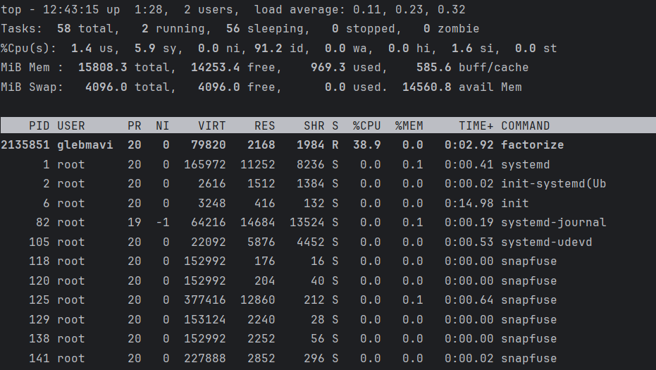

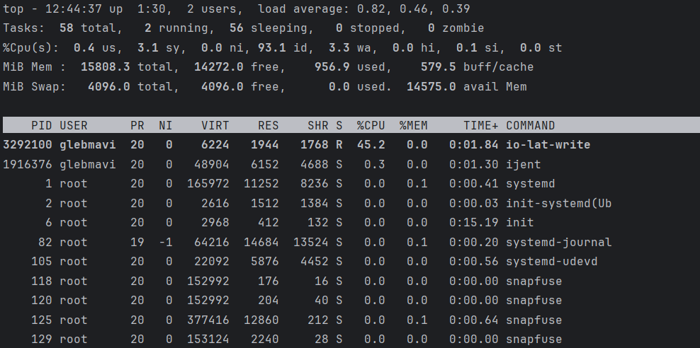

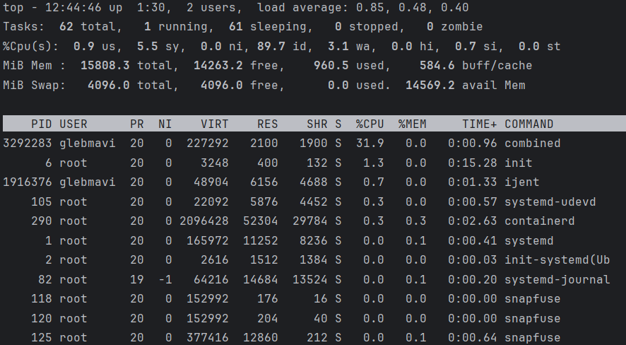

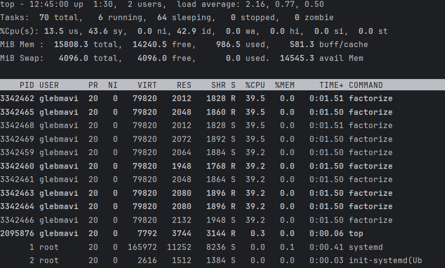

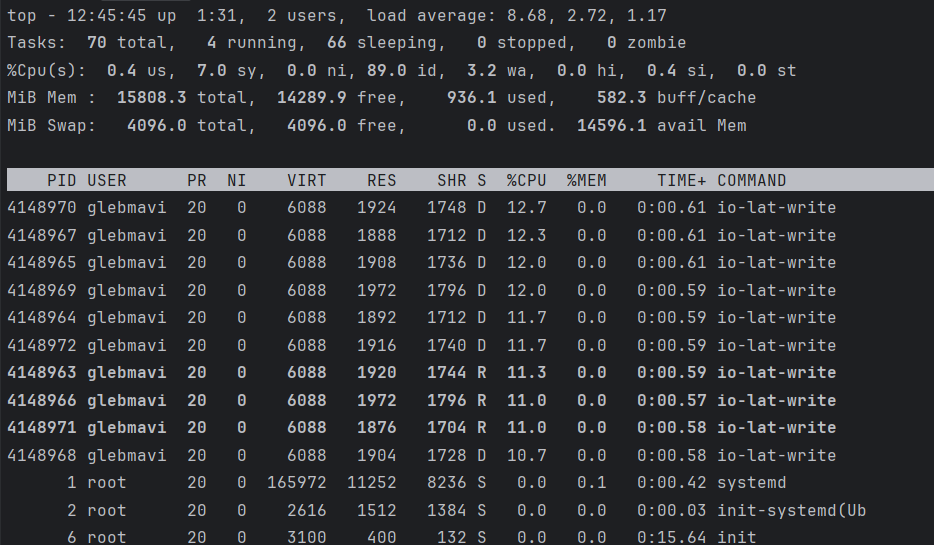
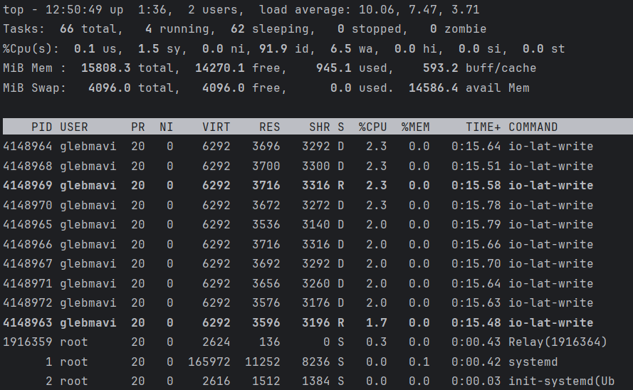

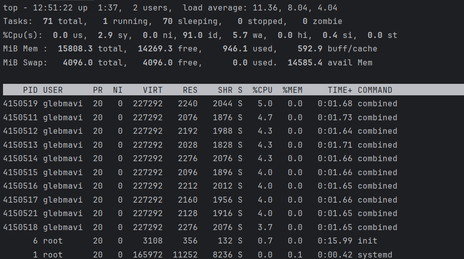

С оптимизацией
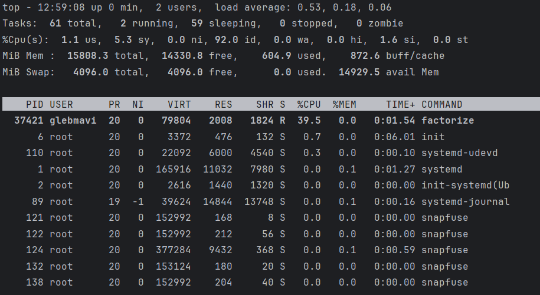

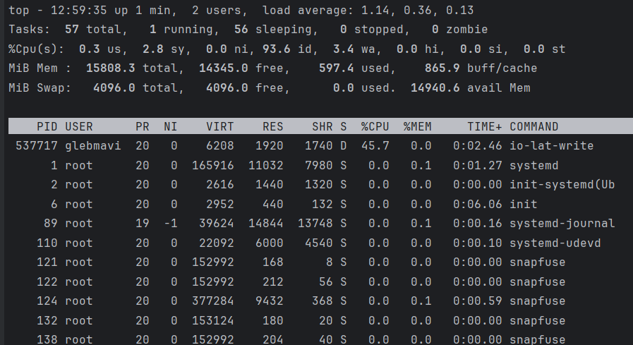

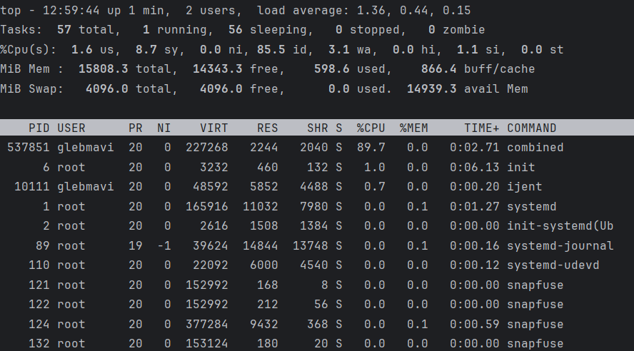

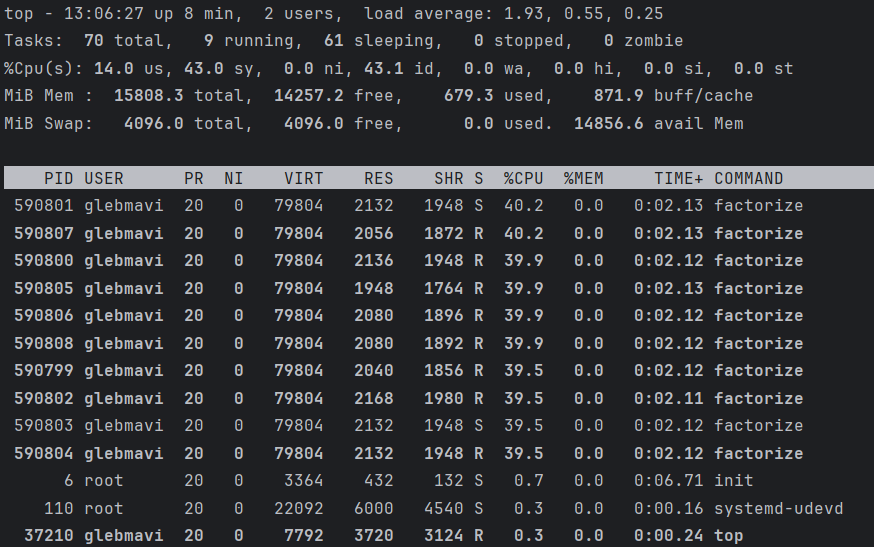

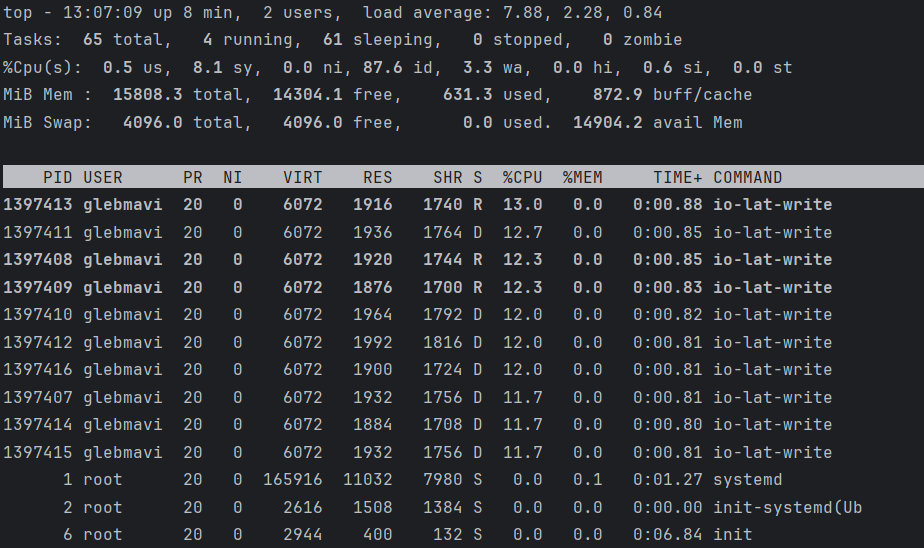

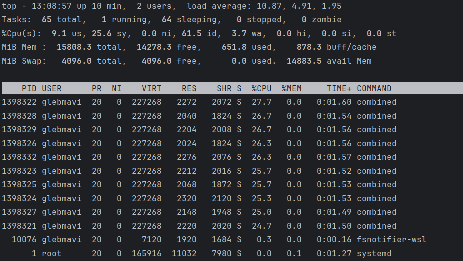