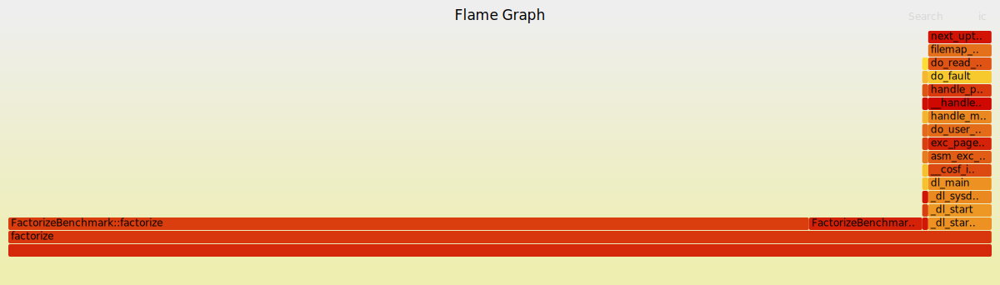
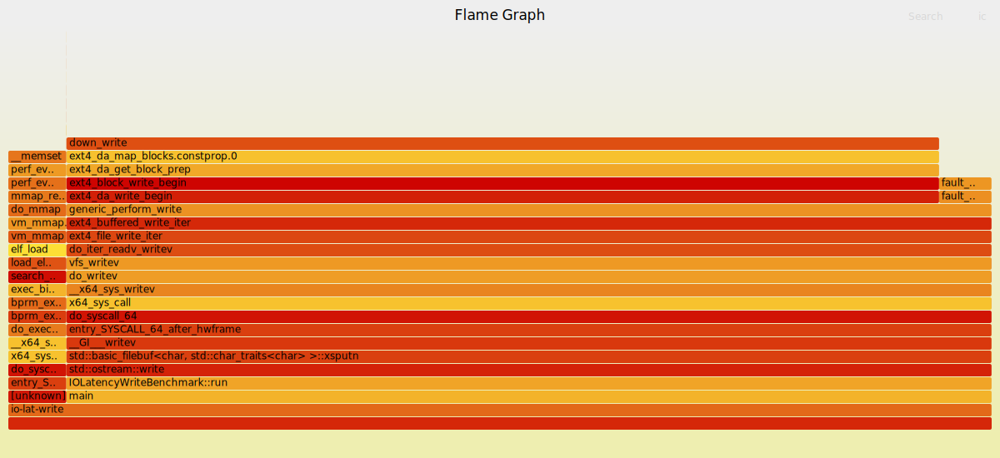
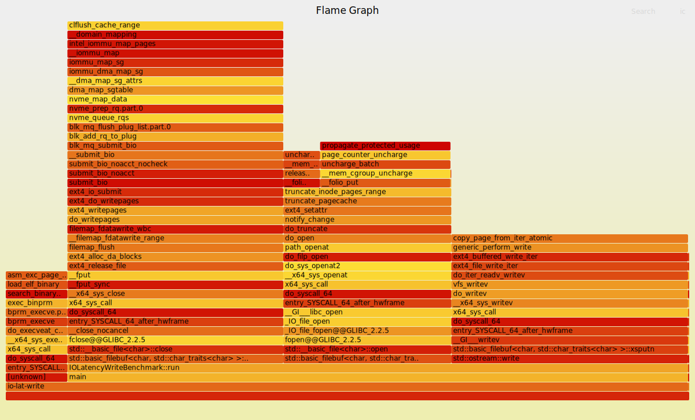
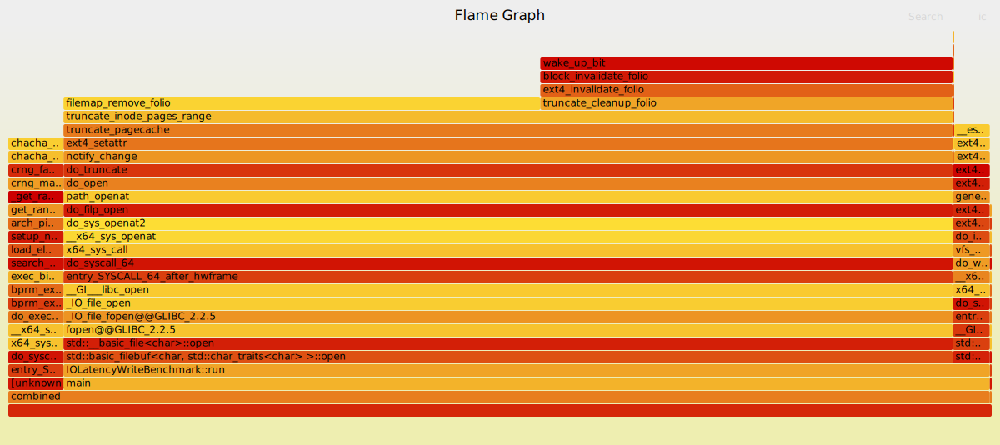

# Операционные системы. Лабораторная работа 1

## Вариант
- ОС: Linux 
- Fork kind: clone3 
- Benchmark 1: io-lat-write (Измерение задержки на запись накопителя с размерами блока Block Size)
- Benchmark 2: factorize (Разложение числа на простые множители)
- Block size: 512

## Задание
### Часть 1. Запуск программ
Необходимо реализовать собственную оболочку командной строки - shell. Выбор ОС для реализации производится на усмотрение студента. Shell должен предоставлять пользователю возможность запускать программы на компьютере с переданными аргументами командной строки и после завершения программы показывать реальное время ее работы (подсчитать самостоятельно как «время завершения» – «время запуска»).

### Часть 2. Мониторинг и профилирование
Разработать комплекс программ-нагрузчиков по варианту, заданному преподавателем. Каждый нагрузчик должен, как минимум, принимать параметр, который определяет количество повторений для алгоритма, указанного в задании. Программы должны нагружать вычислительную систему, дисковую подсистему или обе подсистемы сразу. Необходимо скомпилировать их без опций оптимизации компилятора.

Перед запуском нагрузчика, попробуйте оценить время работы вашей программы или ее результаты (если по варианту вам досталось измерение чего либо). Постарайтесь обосновать свои предположения. Предположение можно сделать, основываясь на свой опыт, знания ОС и характеристики используемого аппаратного обеспечения.

1. Запустите программу-нагрузчик и зафиксируйте метрики ее работы с помощью инструментов для профилирования. Сравните полученные результаты с ожидаемыми. Постарайтесь найти объяснение наблюдаемому. 
2. Определите количество нагрузчиков, которое эффективно нагружает все ядра процессора на вашей системе. Как распределяются времена  USER%, SYS%, WAIT%, а также реальное время выполнения нагрузчика, какое количество переключений контекста (вынужденных и невынужденных) происходит при этом? 
3. Увеличьте количество нагрузчиков вдвое, втрое, вчетверо. Как изменились времена, указанные на предыдущем шаге? Как ведет себя ваша система? 
4. Объедините программы-нагрузчики в одну, реализованную при помощи потоков выполнения, чтобы один нагрузчик эффективно нагружал все ядра вашей системы. Как изменились времена для того же объема вычислений? Запустите одну, две, три таких программы. 
5. Добавьте опции агрессивной оптимизации для компилятора. Как изменились времена? На сколько сократилось реальное время исполнения программы нагрузчика?

### Ограничения

Программа (комплекс программ) должна быть реализован на языке C, C++.
Дочерние процессы должны быть созданы через заданные системные вызовы выбранной операционной системы, с обеспечением корректного запуска и и завершения процессов.  Запрещено использовать высокоуровневые абстракции над системными вызовами. Необходимо использовать, в случае Unix, процедуры libc.

## Решение

### Часть 1. Запуск программ
Запуск производится через [Main](./src/Main.cpp). Программа запускает программу, переданную в аргументах, и выводит время ее работы.

### Часть 2. Мониторинг и профилирование
Созданные программы-нагрузчики:
- [io-lat-write](./src/Bench/io-lat-write.cpp) - измерение задержки на запись накопителя с размерами блока Block Size
- [factorize](./src/Bench/factorize.cpp) - разложение числа на простые множители
- [combined](./src/Bench/combined.cpp) - объединение io-lat-write и factorize в одну программу

Профилирование запускается через .sh скрипты (в частности [test_all.sh](./src/tests/test_all.sh) для запуска всех тестов)
Для профилирования используются следующие утилиты/команды:
- **perf** - инструмент для производительного анализа производительности системы, позволяющий собирать различные метрики, включая использование процессора, кеша, переходы контекста и другие события. Используется для детального профилирования работы приложений и системы в целом.
- **ltrace** - утилита для трассировки вызовов библиотечных функций (например, libc) в запущенной программе. Позволяет анализировать взаимодействие программы с библиотеками, отслеживать аргументы и возвращаемые значения функций.
- **strace** - утилита для трассировки системных вызовов и сигналов, выполняемых процессом. Используется для анализа взаимодействия программы с ядром операционной системы, выявления ошибок и проблем с системными ресурсами.
- **top** - интерактивная утилита для мониторинга процессов в реальном времени. Отображает информацию о загрузке процессора, использовании памяти, активности процессов и других системных метриках.
- **flamegraph** - инструмент для визуализации профилей производительности в виде "огненных графиков". Позволяет быстро идентифицировать наиболее ресурсоемкие функции и участки кода в приложении, облегчая анализ узких мест в производительности.

### Результаты

**Программа `factorize`**

Единичный экземпляр, количество итерации 1000000

- [perf](src/tests/factorize/single/perf.log)

```
=== Starting ../../cmake-build-debug/factorize benchmark ===
Factorizing 1234567890123456789: 3 3 101 3541 3607 3803 27961

 Performance counter stats for '../../cmake-build-debug/factorize 1000000':

          8,487.46 msec task-clock                       #    0.999 CPUs utilized             
               222      context-switches                 #   26.156 /sec                      
                26      cpu-migrations                   #    3.063 /sec                      
               129      page-faults                      #   15.199 /sec                      
    29,425,190,356      cpu_atom/cycles/                 #    3.467 GHz                         (0.08%)
    38,479,933,210      cpu_core/cycles/                 #    4.534 GHz                         (35.64%)
    22,109,621,224      cpu_atom/instructions/           #    0.75  insn per cycle              (0.10%)
    42,089,779,793      cpu_core/instructions/           #    1.43  insn per cycle              (42.77%)
     3,978,377,708      cpu_atom/branches/               #  468.736 M/sec                       (0.11%)
     7,655,534,788      cpu_core/branches/               #  901.981 M/sec                       (49.90%)
        18,865,180      cpu_atom/branch-misses/          #    0.47% of all branches             (0.11%)
         4,238,768      cpu_core/branch-misses/          #    0.11% of all branches             (57.02%)
             TopdownL1 (cpu_core)                 #     67.6 %  tma_backend_bound      
                                                  #      0.8 %  tma_bad_speculation    
                                                  #      8.2 %  tma_frontend_bound     
                                                  #     23.4 %  tma_retiring             (64.14%)
             TopdownL1 (cpu_atom)                 #     -2.3 %  tma_bad_speculation    
                                                  #     20.0 %  tma_retiring             (0.11%)
                                                  #     79.8 %  tma_backend_bound      
                                                  #     79.8 %  tma_backend_bound_aux  
                                                  #      2.4 %  tma_frontend_bound       (0.11%)
    33,136,950,296      L1-dcache-loads                  #    3.904 G/sec                       (0.07%)
    19,101,775,119      L1-dcache-loads                  #    2.251 G/sec                       (71.27%)
   <not supported>      L1-dcache-load-misses                                                 
         1,168,802      L1-dcache-load-misses            #    0.00% of all L1-dcache accesses   (71.27%)
       246,689,631      LLC-loads                        #   29.065 M/sec                       (0.07%)
           577,401      LLC-loads                        #   68.030 K/sec                       (71.26%)
                 0      LLC-load-misses                                                         (0.07%)
             3,655      LLC-load-misses                  #    0.00% of all LL-cache accesses    (71.28%)
     3,977,167,353      L1-icache-loads                  #  468.593 M/sec                       (0.07%)
   <not supported>      L1-icache-loads                                                       
         3,418,461      L1-icache-load-misses            #    0.09% of all L1-icache accesses   (0.07%)
         3,059,914      L1-icache-load-misses            #    0.08% of all L1-icache accesses   (28.52%)
     9,507,921,612      dTLB-loads                       #    1.120 G/sec                       (0.07%)
    19,120,315,716      dTLB-loads                       #    2.253 G/sec                       (28.52%)
            61,583      dTLB-load-misses                 #    0.00% of all dTLB cache accesses  (0.07%)
             6,617      dTLB-load-misses                 #    0.00% of all dTLB cache accesses  (28.53%)
   <not supported>      iTLB-loads                                                            
   <not supported>      iTLB-loads                                                            
           739,039      iTLB-load-misses                                                        (0.07%)
            12,783      iTLB-load-misses                                                        (28.50%)
   <not supported>      L1-dcache-prefetches                                                  
   <not supported>      L1-dcache-prefetches                                                  
   <not supported>      L1-dcache-prefetch-misses                                             
   <not supported>      L1-dcache-prefetch-misses                                             

       8.493866000 seconds time elapsed

       8.478717000 seconds user
       0.010000000 seconds sys
```

- [ltrace](src/tests/factorize/single/ltrace.log)

```
=== Starting ../../cmake-build-debug/factorize benchmark ===
Factorizing 1234567890123456789: 3 3 101 3541 3607 3803 27961
% time     seconds  usecs/call     calls      function
------ ----------- ----------- --------- --------------------
 30.34    0.000473          43        11 _ZStlsISt11char_traitsIcEERSt13basic_ostreamIcT_ES5_PKc
 20.21    0.000315          39         8 _ZNSolsEx
 12.19    0.000190          38         5 __errno_location
 10.07    0.000157          78         2 _ZNSolsEPFRSoS_E
  8.15    0.000127         127         1 _ZNSt7__cxx1112basic_stringIcSt11char_traitsIcESaIcEE13_M_local_dataEv
  3.91    0.000061          61         1 _ZNSt7__cxx1112basic_stringIcSt11char_traitsIcESaIcEE12_Alloc_hiderC1EPcRKS3_
  2.63    0.000041          41         1 strlen
  2.63    0.000041          41         1 _ZNSt7__cxx1112basic_stringIcSt11char_traitsIcESaIcEE13_S_copy_charsEPcPKcS7_
  2.57    0.000040          40         1 _ZNKSt7__cxx1112basic_stringIcSt11char_traitsIcESaIcEE7_M_dataEv
  2.44    0.000038          38         1 _ZNSt7__cxx1112basic_stringIcSt11char_traitsIcESaIcEED1Ev
  2.44    0.000038          38         1 _ZNKSt7__cxx1112basic_stringIcSt11char_traitsIcESaIcEE5c_strEv
  2.44    0.000038          38         1 _ZNSt7__cxx1112basic_stringIcSt11char_traitsIcESaIcEE13_M_set_lengthEm
------ ----------- ----------- --------- --------------------
100.00    0.001559                    34 total
```

- [strace](src/tests/factorize/single/strace.log)

```
=== Starting ../../cmake-build-debug/factorize benchmark ===
Factorizing 1234567890123456789: 3 3 101 3541 3607 3803 27961
% time     seconds  usecs/call     calls    errors syscall
------ ----------- ----------- --------- --------- ----------------
 30.91    0.000034           5         6           mprotect
 25.45    0.000028           1        22           mmap
  9.09    0.000010          10         1           munmap
  7.27    0.000008           4         2           write
  7.27    0.000008           2         3           brk
  2.73    0.000003           0         6           fstat
  2.73    0.000003           3         1           futex
  2.73    0.000003           3         1           prlimit64
  2.73    0.000003           3         1           getrandom
  1.82    0.000002           0         5           close
  1.82    0.000002           2         1           arch_prctl
  1.82    0.000002           2         1           set_tid_address
  1.82    0.000002           2         1           set_robust_list
  1.82    0.000002           2         1           rseq
  0.00    0.000000           0         4           read
  0.00    0.000000           0         2           pread64
  0.00    0.000000           0         1         1 access
  0.00    0.000000           0         1           execve
  0.00    0.000000           0         5           openat
------ ----------- ----------- --------- --------- ----------------
100.00    0.000110           1        65         1 total
```

- [top](src/tests/factorize/single/top.log)

```
top - 21:39:15 up  2:06,  1 user,  load average: 1.20, 1.09, 1.54
Tasks: 418 total,   3 running, 415 sleeping,   0 stopped,   0 zombie
%Cpu(s):  6.7 us,  0.0 sy,  0.0 ni, 93.3 id,  0.0 wa,  0.0 hi,  0.0 si,  0.0 st 
MiB Mem :  31716.0 total,  12555.6 free,   9435.3 used,  11620.3 buff/cache     
MiB Swap:   8192.0 total,   8192.0 free,      0.0 used.  22280.7 avail Mem 

    PID USER      PR  NI    VIRT    RES    SHR S  %CPU  %MEM     TIME+ COMMAND
  45075 root      20   0    6376   3328   3200 R 100.0   0.0   0:00.20 factori+
  40294 glebmavi  20   0 9538720   3.1g 711172 S  10.0  10.1   7:42.70 clion
  40384 glebmavi  20   0  266.6g 935300 315132 S  10.0   2.9   0:36.36 Rider.B+
      1 root      20   0   23780  14312   9064 S   0.0   0.0   0:04.98 systemd
```

- flamegraph


Множество экземпляров 10, количество итерации 1000000

Пример одного экземпляра (4го)

- [perf](src/tests/factorize/multiple/instance_4/perf.log)
```
=== Starting ../../cmake-build-debug/factorize benchmark ===
Factorizing 1234567890123456789: 3 3 101 3541 3607 3803 27961

 Performance counter stats for '../../cmake-build-debug/factorize 1000000':

         18,908.14 msec task-clock                       #    0.586 CPUs utilized             
             4,122      context-switches                 #  218.001 /sec                      
                57      cpu-migrations                   #    3.015 /sec                      
               128      page-faults                      #    6.770 /sec                      
     <not counted>      cpu_atom/cycles/                                                        (0.00%)
    76,230,363,677      cpu_core/cycles/                 #    4.032 GHz                         (35.73%)
     <not counted>      cpu_atom/instructions/                                                  (0.00%)
    42,033,523,407      cpu_core/instructions/                                                  (42.86%)
     <not counted>      cpu_atom/branches/                                                      (0.00%)
     7,647,641,966      cpu_core/branches/               #  404.463 M/sec                       (50.02%)
     <not counted>      cpu_atom/branch-misses/                                                 (0.00%)
         4,911,346      cpu_core/branch-misses/                                                 (57.16%)
             TopdownL1 (cpu_core)                 #     58.8 %  tma_backend_bound      
                                                  #      1.8 %  tma_bad_speculation    
                                                  #     15.1 %  tma_frontend_bound     
                                                  #     24.2 %  tma_retiring             (64.31%)
     <not counted>      L1-dcache-loads                                                         (0.00%)
    19,088,672,710      L1-dcache-loads                  #    1.010 G/sec                       (71.45%)
   <not supported>      L1-dcache-load-misses                                                 
         2,135,877      L1-dcache-load-misses                                                   (71.45%)
     <not counted>      LLC-loads                                                               (0.00%)
           276,434      LLC-loads                        #   14.620 K/sec                       (71.42%)
     <not counted>      LLC-load-misses                                                         (0.00%)
             4,167      LLC-load-misses                                                         (71.43%)
     <not counted>      L1-icache-loads                                                         (0.00%)
   <not supported>      L1-icache-loads                                                       
     <not counted>      L1-icache-load-misses                                                   (0.00%)
         3,869,362      L1-icache-load-misses                                                   (28.55%)
     <not counted>      dTLB-loads                                                              (0.00%)
    19,127,903,030      dTLB-loads                       #    1.012 G/sec                       (28.55%)
     <not counted>      dTLB-load-misses                                                        (0.00%)
            16,639      dTLB-load-misses                                                        (28.58%)
   <not supported>      iTLB-loads                                                            
   <not supported>      iTLB-loads                                                            
     <not counted>      iTLB-load-misses                                                        (0.00%)
           106,139      iTLB-load-misses                                                        (28.57%)
   <not supported>      L1-dcache-prefetches                                                  
   <not supported>      L1-dcache-prefetches                                                  
   <not supported>      L1-dcache-prefetch-misses                                             
   <not supported>      L1-dcache-prefetch-misses                                             

      32.273226278 seconds time elapsed

      18.891007000 seconds user
       0.019984000 seconds sys
```

- [ltrace](src/tests/factorize/multiple/instance_4/ltrace.log)
```
=== Starting ../../cmake-build-debug/factorize benchmark ===
Factorizing 1234567890123456789: 3 3 101 3541 3607 3803 27961
% time     seconds  usecs/call     calls      function
------ ----------- ----------- --------- --------------------
 32.36    0.000519          47        11 _ZStlsISt11char_traitsIcEERSt13basic_ostreamIcT_ES5_PKc
 21.20    0.000340          42         8 _ZNSolsEx
 12.78    0.000205          41         5 __errno_location
 11.53    0.000185          92         2 _ZNSolsEPFRSoS_E
  3.30    0.000053          53         1 _ZNSt7__cxx1112basic_stringIcSt11char_traitsIcESaIcEE13_M_local_dataEv
  2.93    0.000047          47         1 strlen
  2.74    0.000044          44         1 _ZNSt7__cxx1112basic_stringIcSt11char_traitsIcESaIcEE13_S_copy_charsEPcPKcS7_
  2.68    0.000043          43         1 _ZNSt7__cxx1112basic_stringIcSt11char_traitsIcESaIcEE12_Alloc_hiderC1EPcRKS3_
  2.68    0.000043          43         1 _ZNKSt7__cxx1112basic_stringIcSt11char_traitsIcESaIcEE7_M_dataEv
  2.62    0.000042          42         1 _ZNKSt7__cxx1112basic_stringIcSt11char_traitsIcESaIcEE5c_strEv
  2.62    0.000042          42         1 _ZNSt7__cxx1112basic_stringIcSt11char_traitsIcESaIcEE13_M_set_lengthEm
  2.56    0.000041          41         1 _ZNSt7__cxx1112basic_stringIcSt11char_traitsIcESaIcEED1Ev
------ ----------- ----------- --------- --------------------
100.00    0.001604                    34 total
```

- [strace](src/tests/factorize/multiple/instance_4/strace.log)
```
=== Starting ../../cmake-build-debug/factorize benchmark ===
Factorizing 1234567890123456789: 3 3 101 3541 3607 3803 27961
% time     seconds  usecs/call     calls    errors syscall
------ ----------- ----------- --------- --------- ----------------
  0.00    0.000000           0         4           read
  0.00    0.000000           0         2           write
  0.00    0.000000           0         5           close
  0.00    0.000000           0         6           fstat
  0.00    0.000000           0        22           mmap
  0.00    0.000000           0         6           mprotect
  0.00    0.000000           0         1           munmap
  0.00    0.000000           0         3           brk
  0.00    0.000000           0         2           pread64
  0.00    0.000000           0         1         1 access
  0.00    0.000000           0         1           execve
  0.00    0.000000           0         1           arch_prctl
  0.00    0.000000           0         1           futex
  0.00    0.000000           0         1           set_tid_address
  0.00    0.000000           0         5           openat
  0.00    0.000000           0         1           set_robust_list
  0.00    0.000000           0         1           prlimit64
  0.00    0.000000           0         1           getrandom
  0.00    0.000000           0         1           rseq
------ ----------- ----------- --------- --------- ----------------
100.00    0.000000           0        65         1 total
```

- [`top` во время исполнения всех экземпляров](src/tests/factorize/multiple/top.log)
```
top - 21:40:00 up  2:07,  1 user,  load average: 3.49, 1.57, 1.67
Tasks: 520 total,  33 running, 487 sleeping,   0 stopped,   0 zombie
%Cpu(s): 99.4 us,  0.6 sy,  0.0 ni,  0.0 id,  0.0 wa,  0.0 hi,  0.0 si,  0.0 st 
MiB Mem :  31716.0 total,  12475.9 free,   9514.5 used,  11625.7 buff/cache     
MiB Swap:   8192.0 total,   8192.0 free,      0.0 used.  22201.5 avail Mem 

    PID USER      PR  NI    VIRT    RES    SHR S  %CPU  %MEM     TIME+ COMMAND
  45358 root      20   0    6376   3328   3200 R  76.6   0.0   0:02.39 factori+
  45363 root      20   0    6376   3328   3200 R  75.2   0.0   0:02.49 factori+
  45366 root      20   0    6376   3200   3072 R  72.6   0.0   0:02.41 factori+
  45379 root      20   0    6376   3328   3200 R  69.0   0.0   0:02.17 factori+
  45310 root      20   0    6376   3328   3200 R  67.0   0.0   0:02.09 factori+
  45380 root      20   0    6376   3328   3200 R  63.7   0.0   0:02.00 factori+
  45312 root      20   0    6376   3328   3200 R  60.7   0.0   0:02.02 factori+
  45343 root      20   0    6376   3328   3200 R  60.1   0.0   0:02.02 factori+
  45362 root      20   0    6376   3328   3200 R  59.1   0.0   0:01.92 factori+
  45373 root      20   0    6376   3328   3200 R  56.8   0.0   0:01.83 factori+
  45376 root      20   0    6376   3328   3200 R  56.4   0.0   0:01.78 factori+
  45374 root      20   0    6376   3328   3200 R  55.8   0.0   0:01.86 factori+
  45337 root      20   0    6376   3328   3200 R  55.4   0.0   0:01.78 factori+
  45359 root      20   0    6376   3328   3200 R  52.8   0.0   0:01.67 factori+
  45331 root      20   0    6376   3328   3200 R  52.5   0.0   0:01.74 factori+
  45305 root      20   0    6376   3328   3200 R  51.8   0.0   0:01.67 factori+
  45382 root      20   0    6376   3328   3200 R  51.8   0.0   0:01.63 factori+
  45383 root      20   0    6376   3328   3200 R  51.5   0.0   0:01.65 factori+
  45377 root      20   0    6376   3328   3200 R  50.8   0.0   0:01.71 factori+
  45381 root      20   0    6376   3328   3200 R  49.2   0.0   0:01.55 factori+
  45350 root      20   0    6376   3328   3200 R  48.5   0.0   0:01.59 factori+
  45361 root      20   0    6376   3328   3200 R  47.5   0.0   0:01.66 factori+
  45340 root      20   0    6376   3328   3200 R  45.9   0.0   0:01.48 factori+
  45385 root      20   0    6376   3328   3200 R  45.5   0.0   0:01.46 factori+
  45384 root      20   0    6376   3328   3200 R  34.0   0.0   0:01.08 factori+
  45313 root      20   0    6376   3328   3200 R  33.7   0.0   0:01.08 factori+
  45365 root      20   0    6376   3328   3200 R  33.7   0.0   0:01.11 factori+
  45387 root      20   0    6376   3328   3200 R  33.7   0.0   0:01.09 factori+
  45386 root      20   0    6376   3328   3200 R  33.3   0.0   0:01.06 factori+
  45388 root      20   0    6376   3328   3200 R  33.3   0.0   0:01.06 factori+
```

**Программа `io-lat-write`**

Единичный экземпляр, количество итерации 1000

- [perf](src/tests/io-lat-write/single/perf.log)
```
=== Starting ../../cmake-build-debug/io-lat-write benchmark ===

Overall Statistics:
Average write latency: 0.000434264 seconds
Minimum write latency: 0.000406284 seconds
Maximum write latency: 0.000867885 seconds

 Performance counter stats for '../../cmake-build-debug/io-lat-write 1000':

            559.29 msec task-clock                       #    0.562 CPUs utilized             
             1,096      context-switches                 #    1.960 K/sec                     
                25      cpu-migrations                   #   44.699 /sec                      
               139      page-faults                      #  248.529 /sec                      
     1,909,303,868      cpu_atom/cycles/                 #    3.414 GHz                         (0.16%)
     2,414,900,569      cpu_core/cycles/                 #    4.318 GHz                         (36.03%)
     3,134,648,692      cpu_atom/instructions/           #    1.64  insn per cycle              (0.42%)
     4,814,132,737      cpu_core/instructions/           #    2.52  insn per cycle              (41.39%)
       545,384,586      cpu_atom/branches/               #  975.135 M/sec                       (0.54%)
       834,792,310      cpu_core/branches/               #    1.493 G/sec                       (47.85%)
         4,294,122      cpu_atom/branch-misses/          #    0.79% of all branches             (0.65%)
         2,363,027      cpu_core/branch-misses/          #    0.43% of all branches             (54.19%)
             TopdownL1 (cpu_core)                 #     35.4 %  tma_backend_bound      
                                                  #      5.0 %  tma_bad_speculation    
                                                  #     27.0 %  tma_frontend_bound     
                                                  #     32.7 %  tma_retiring             (64.19%)
             TopdownL1 (cpu_atom)                 #      5.6 %  tma_bad_speculation    
                                                  #     38.4 %  tma_retiring             (0.66%)
                                                  #     34.9 %  tma_backend_bound      
                                                  #     34.9 %  tma_backend_bound_aux  
                                                  #     21.1 %  tma_frontend_bound       (0.66%)
       761,621,465      L1-dcache-loads                  #    1.362 G/sec                       (0.12%)
     1,237,590,494      L1-dcache-loads                  #    2.213 G/sec                       (73.44%)
   <not supported>      L1-dcache-load-misses                                                 
         7,564,012      L1-dcache-load-misses            #    0.99% of all L1-dcache accesses   (73.85%)
         2,400,722      LLC-loads                        #    4.292 M/sec                       (0.01%)
         1,797,102      LLC-loads                        #    3.213 M/sec                       (69.43%)
     <not counted>      LLC-load-misses                                                         (0.00%)
           247,653      LLC-load-misses                  #   10.32% of all LL-cache accesses    (69.23%)
     <not counted>      L1-icache-loads                                                         (0.00%)
   <not supported>      L1-icache-loads                                                       
     <not counted>      L1-icache-load-misses                                                   (0.00%)
       109,432,466      L1-icache-load-misses                                                   (25.90%)
     <not counted>      dTLB-loads                                                              (0.00%)
     1,235,433,217      dTLB-loads                       #    2.209 G/sec                       (25.49%)
     <not counted>      dTLB-load-misses                                                        (0.00%)
            34,820      dTLB-load-misses                                                        (29.91%)
   <not supported>      iTLB-loads                                                            
   <not supported>      iTLB-loads                                                            
     <not counted>      iTLB-load-misses                                                        (0.00%)
           972,070      iTLB-load-misses                                                        (30.11%)
   <not supported>      L1-dcache-prefetches                                                  
   <not supported>      L1-dcache-prefetches                                                  
   <not supported>      L1-dcache-prefetch-misses                                             
   <not supported>      L1-dcache-prefetch-misses                                             

       0.995199672 seconds time elapsed

       0.039512000 seconds user
       0.528480000 seconds sys
```

- [ltrace](src/tests/io-lat-write/single/ltrace.log)
```
=== Starting ../../cmake-build-debug/io-lat-write benchmark ===

Overall Statistics:
Average write latency: 0.11731 seconds
Minimum write latency: 0.104903 seconds
Maximum write latency: 0.224078 seconds
% time     seconds  usecs/call     calls      function
------ ----------- ----------- --------- --------------------
 49.94   41.863132          20   2048000 _ZNSo5writeEPKcl
 48.15   40.363634          19   2049000 _ZNKSt9basic_iosIcSt11char_traitsIcEEntEv
  1.63    1.362738        1362      1000 _ZNSt14basic_ofstreamIcSt11char_traitsIcEEC1EPKcSt13_Ios_Openmode
  0.19    0.157011         157      1000 _ZNSt14basic_ofstreamIcSt11char_traitsIcEE5closeEv
  0.05    0.044354          22      2000 _ZNSt6chrono3_V212system_clock3nowEv
  0.02    0.020587          20      1000 _ZNSt14basic_ofstreamIcSt11char_traitsIcEED1Ev
  0.02    0.020088          20      1000 _ZNSo5flushEv
  0.00    0.000344          28        12 _Znwm
  0.00    0.000296          29        10 _ZStlsISt11char_traitsIcEERSt13basic_ostreamIcT_ES5_PKc
  0.00    0.000286          23        12 _ZdlPvm
  0.00    0.000263          26        10 memmove
  0.00    0.000189          37         5 __errno_location
  0.00    0.000117         117         1 _ZNSt7__cxx1112basic_stringIcSt11char_traitsIcESaIcEE13_M_local_dataEv
  0.00    0.000113         113         1 _ZNSolsEPFRSoS_E
  0.00    0.000071          23         3 _ZNSolsEd
  0.00    0.000055          55         1 _ZNSt7__cxx1112basic_stringIcSt11char_traitsIcESaIcEE12_Alloc_hiderC1EPcRKS3_
  0.00    0.000042          42         1 strlen
  0.00    0.000041          41         1 _ZNKSt7__cxx1112basic_stringIcSt11char_traitsIcESaIcEE7_M_dataEv
  0.00    0.000040          40         1 _ZNKSt7__cxx1112basic_stringIcSt11char_traitsIcESaIcEE5c_strEv
  0.00    0.000040          40         1 _ZNSt7__cxx1112basic_stringIcSt11char_traitsIcESaIcEE13_S_copy_charsEPcPKcS7_
  0.00    0.000039          39         1 memset
  0.00    0.000038          38         1 _ZNSt7__cxx1112basic_stringIcSt11char_traitsIcESaIcEED1Ev
  0.00    0.000038          38         1 _ZNSt7__cxx1112basic_stringIcSt11char_traitsIcESaIcEE13_M_set_lengthEm
------ ----------- ----------- --------- --------------------
100.00   83.833556               4103062 total
```

- [strace](src/tests/io-lat-write/single/strace.log)
```
=== Starting ../../cmake-build-debug/io-lat-write benchmark ===

Overall Statistics:
Average write latency: 0.00146423 seconds
Minimum write latency: 0.00125959 seconds
Maximum write latency: 0.00298867 seconds
% time     seconds  usecs/call     calls    errors syscall
------ ----------- ----------- --------- --------- ----------------
 65.47    0.435968           3    128000           writev
 18.17    0.121029         120      1005           openat
 16.33    0.108750         108      1005           close
  0.01    0.000097           4        22           mmap
  0.01    0.000034           5         6           mprotect
  0.00    0.000010          10         1           munmap
  0.00    0.000006           1         6           fstat
  0.00    0.000005           1         4           read
  0.00    0.000004           2         2           pread64
  0.00    0.000003           3         1           arch_prctl
  0.00    0.000002           2         1           set_tid_address
  0.00    0.000002           2         1           set_robust_list
  0.00    0.000002           2         1           prlimit64
  0.00    0.000002           2         1           rseq
  0.00    0.000000           0         2           write
  0.00    0.000000           0         3           brk
  0.00    0.000000           0         1         1 access
  0.00    0.000000           0         1           execve
  0.00    0.000000           0         1           futex
  0.00    0.000000           0         1           getrandom
------ ----------- ----------- --------- --------- ----------------
100.00    0.665914           5    130065         1 total
```

- [top](src/tests/io-lat-write/single/top.log)
```
top - 22:32:30 up  1:26,  1 user,  load average: 1.23, 3.48, 2.69
Tasks: 382 total,   3 running, 379 sleeping,   0 stopped,   0 zombie
%Cpu(s):  0.6 us,  6.0 sy,  0.0 ni, 91.1 id,  2.4 wa,  0.0 hi,  0.0 si,  0.0 st 
MiB Mem :  31715.9 total,  11252.3 free,  10148.7 used,  12064.9 buff/cache     
MiB Swap:   8192.0 total,   8192.0 free,      0.0 used.  21567.2 avail Mem 

    PID USER      PR  NI    VIRT    RES    SHR S  %CPU  %MEM     TIME+ COMMAND
2320614 root      20   0    6384   3456   3328 R  50.0   0.0   0:00.11 io-lat-+
  19211 root      20   0       0      0      0 R  20.0   0.0   0:01.88 kworker+
      1 root      20   0   23684  14176   9440 S   0.0   0.0   0:02.94 systemd
      2 root      20   0       0      0      0 S   0.0   0.0   0:00.00 kthreadd
      3 root      20   0       0      0      0 S   0.0   0.0   0:00.00 pool_wo+
```

- flamegraph


Множество экземпляров 10, количество итерации 500

Пример одного экземпляра (4го)

- [perf](src/tests/io-lat-write/multiple/instance_4/perf.log)
```
=== Starting ../../cmake-build-debug/io-lat-write benchmark ===

Overall Statistics:
Average write latency: 0.0062263 seconds
Minimum write latency: 0.000466158 seconds
Maximum write latency: 0.0283013 seconds

 Performance counter stats for '../../cmake-build-debug/io-lat-write 500':

            646.82 msec task-clock                       #    0.165 CPUs utilized             
            11,780      context-switches                 #   18.212 K/sec                     
             2,474      cpu-migrations                   #    3.825 K/sec                     
               138      page-faults                      #  213.353 /sec                      
     1,889,556,045      cpu_atom/cycles/                 #    2.921 GHz                         (8.44%)
     2,305,661,951      cpu_core/cycles/                 #    3.565 GHz                         (27.48%)
     1,780,934,652      cpu_atom/instructions/           #    0.94  insn per cycle              (9.77%)
     2,114,633,283      cpu_core/instructions/           #    1.12  insn per cycle              (32.96%)
       321,380,974      cpu_atom/branches/               #  496.866 M/sec                       (9.27%)
       379,755,506      cpu_core/branches/               #  587.114 M/sec                       (38.82%)
         4,552,426      cpu_atom/branch-misses/          #    1.42% of all branches             (9.90%)
         2,645,113      cpu_core/branch-misses/          #    0.82% of all branches             (44.36%)
             TopdownL1 (cpu_core)                 #     42.2 %  tma_backend_bound      
                                                  #      3.8 %  tma_bad_speculation    
                                                  #     27.0 %  tma_frontend_bound     
                                                  #     27.0 %  tma_retiring             (49.30%)
             TopdownL1 (cpu_atom)                 #      7.8 %  tma_bad_speculation    
                                                  #     24.7 %  tma_retiring             (10.57%)
                                                  #     37.2 %  tma_backend_bound      
                                                  #     37.2 %  tma_backend_bound_aux  
                                                  #     30.2 %  tma_frontend_bound       (10.06%)
       802,302,532      L1-dcache-loads                  #    1.240 G/sec                       (9.15%)
       554,214,509      L1-dcache-loads                  #  856.834 M/sec                       (55.24%)
   <not supported>      L1-dcache-load-misses                                                 
        16,593,016      L1-dcache-load-misses            #    2.07% of all L1-dcache accesses   (55.09%)
       476,447,132      LLC-loads                        #  736.603 M/sec                       (8.55%)
         3,712,881      LLC-loads                        #    5.740 M/sec                       (56.28%)
       351,469,716      LLC-load-misses                  #   73.77% of all LL-cache accesses    (8.01%)
            89,829      LLC-load-misses                  #    0.02% of all LL-cache accesses    (55.66%)
     2,082,964,190      L1-icache-loads                  #    3.220 G/sec                       (8.32%)
   <not supported>      L1-icache-loads                                                       
       305,395,905      L1-icache-load-misses            #   14.66% of all L1-icache accesses   (8.23%)
        73,368,324      L1-icache-load-misses            #    3.52% of all L1-icache accesses   (22.23%)
     1,406,403,881      dTLB-loads                       #    2.174 G/sec                       (8.12%)
       550,161,934      dTLB-loads                       #  850.568 M/sec                       (22.39%)
       317,409,129      dTLB-load-misses                 #   22.57% of all dTLB cache accesses  (8.25%)
           225,012      dTLB-load-misses                 #    0.02% of all dTLB cache accesses  (21.20%)
   <not supported>      iTLB-loads                                                            
   <not supported>      iTLB-loads                                                            
       215,199,262      iTLB-load-misses                                                        (8.13%)
            99,872      iTLB-load-misses                                                        (21.81%)
   <not supported>      L1-dcache-prefetches                                                  
   <not supported>      L1-dcache-prefetches                                                  
   <not supported>      L1-dcache-prefetch-misses                                             
   <not supported>      L1-dcache-prefetch-misses                                             

       3.914212712 seconds time elapsed

       0.050660000 seconds user
       0.602753000 seconds sys
```

- [ltrace](src/tests/io-lat-write/multiple/instance_4/ltrace.log)
```
=== Starting ../../cmake-build-debug/io-lat-write benchmark ===

Overall Statistics:
Average write latency: 0.270736 seconds
Minimum write latency: 0.206738 seconds
Maximum write latency: 0.420928 seconds
% time     seconds  usecs/call     calls      function
------ ----------- ----------- --------- --------------------
 51.75   48.414964          47   1024000 _ZNSo5writeEPKcl
 47.90   44.817113          43   1024500 _ZNKSt9basic_iosIcSt11char_traitsIcEEntEv
  0.14    0.133631         267       500 _ZNSt14basic_ofstreamIcSt11char_traitsIcEEC1EPKcSt13_Ios_Openmode
  0.11    0.100151         200       500 _ZNSt14basic_ofstreamIcSt11char_traitsIcEE5closeEv
  0.05    0.046374          46      1000 _ZNSt6chrono3_V212system_clock3nowEv
  0.02    0.022579          45       500 _ZNSt14basic_ofstreamIcSt11char_traitsIcEED1Ev
  0.02    0.021428          42       500 _ZNSo5flushEv
  0.00    0.001123         224         5 __errno_location
  0.00    0.000514          51        10 _ZStlsISt11char_traitsIcEERSt13basic_ostreamIcT_ES5_PKc
  0.00    0.000495          45        11 _ZdlPvm
  0.00    0.000476          52         9 memmove
  0.00    0.000475          43        11 _Znwm
  0.00    0.000178          59         3 _ZNSolsEd
  0.00    0.000041          41         1 _ZNSolsEPFRSoS_E
  0.00    0.000027          27         1 _ZNSt7__cxx1112basic_stringIcSt11char_traitsIcESaIcEED1Ev
  0.00    0.000021          21         1 _ZNSt7__cxx1112basic_stringIcSt11char_traitsIcESaIcEE13_M_local_dataEv
  0.00    0.000021          21         1 _ZNSt7__cxx1112basic_stringIcSt11char_traitsIcESaIcEE13_S_copy_charsEPcPKcS7_
  0.00    0.000020          20         1 _ZNKSt7__cxx1112basic_stringIcSt11char_traitsIcESaIcEE5c_strEv
  0.00    0.000020          20         1 _ZNKSt7__cxx1112basic_stringIcSt11char_traitsIcESaIcEE7_M_dataEv
  0.00    0.000020          20         1 _ZNSt7__cxx1112basic_stringIcSt11char_traitsIcESaIcEE13_M_set_lengthEm
  0.00    0.000019          19         1 _ZNSt7__cxx1112basic_stringIcSt11char_traitsIcESaIcEE12_Alloc_hiderC1EPcRKS3_
  0.00    0.000019          19         1 strlen
  0.00    0.000019          19         1 memset
------ ----------- ----------- --------- --------------------
100.00   93.559728               2051559 total
```

- [strace](src/tests/io-lat-write/multiple/instance_4/strace.log)
```
=== Starting ../../cmake-build-debug/io-lat-write benchmark ===

Overall Statistics:
Average write latency: 0.0151781 seconds
Minimum write latency: 0.00552348 seconds
Maximum write latency: 0.0837683 seconds
% time     seconds  usecs/call     calls    errors syscall
------ ----------- ----------- --------- --------- ----------------
 86.57    0.751663          11     64000           writev
  6.98    0.060640         120       505           close
  6.42    0.055757         110       505           openat
  0.01    0.000093           4        22           mmap
  0.00    0.000030           5         6           mprotect
  0.00    0.000010           1         6           fstat
  0.00    0.000009           2         4           read
  0.00    0.000009           4         2           write
  0.00    0.000004           4         1           munmap
  0.00    0.000004           2         2           pread64
  0.00    0.000003           1         3           brk
  0.00    0.000002           2         1           arch_prctl
  0.00    0.000002           2         1           set_tid_address
  0.00    0.000002           2         1           set_robust_list
  0.00    0.000002           2         1           rseq
  0.00    0.000001           1         1           futex
  0.00    0.000001           1         1           prlimit64
  0.00    0.000001           1         1           getrandom
  0.00    0.000000           0         1         1 access
  0.00    0.000000           0         1           execve
------ ----------- ----------- --------- --------- ----------------
100.00    0.868233          13     65065         1 total
```

- [`top` во время исполнения всех экземпляров](src/tests/io-lat-write/multiple/top.log)
```
top - 22:35:15 up  1:29,  1 user,  load average: 9.19, 4.73, 3.20
Tasks: 480 total,   1 running, 479 sleeping,   0 stopped,   0 zombie
%Cpu(s): 12.7 us, 46.4 sy,  0.0 ni, 39.8 id,  1.1 wa,  0.0 hi,  0.0 si,  0.0 st 
MiB Mem :  31715.9 total,  11045.9 free,  10350.2 used,  12070.8 buff/cache     
MiB Swap:   8192.0 total,   8192.0 free,      0.0 used.  21365.8 avail Mem 

    PID USER      PR  NI    VIRT    RES    SHR S  %CPU  %MEM     TIME+ COMMAND
3921001 root      20   0    5112   3108   2596 S  49.8   0.0   0:01.57 ltrace
3920985 root      20   0    5112   3108   2596 S  49.5   0.0   0:01.58 ltrace
3921017 root      20   0    5112   2872   2488 S  48.8   0.0   0:01.55 ltrace
3921018 root      20   0    5112   2872   2488 S  48.8   0.0   0:01.56 ltrace
3921046 root      20   0    5112   2872   2488 S  48.8   0.0   0:01.55 ltrace
3920994 root      20   0    5112   2852   2468 S  48.5   0.0   0:01.56 ltrace
3921020 root      20   0    5112   2724   2340 S  48.5   0.0   0:01.55 ltrace
3920981 root      20   0    5112   3040   2528 S  48.2   0.0   0:01.54 ltrace
3921033 root      20   0    5112   3108   2596 S  48.2   0.0   0:01.53 ltrace
3920995 root      20   0    5112   3108   2596 S  47.8   0.0   0:01.52 ltrace
3921105 root      20   0    6384   3456   3328 D  16.9   0.0   0:00.53 io-lat-+
3921107 root      20   0    6384   3200   3200 D  16.9   0.0   0:00.53 io-lat-+
3921100 root      20   0    6384   3456   3328 D  16.6   0.0   0:00.52 io-lat-+
3921103 root      20   0    6384   3456   3328 D  16.6   0.0   0:00.52 io-lat-+
3921106 root      20   0    6384   3456   3328 D  16.6   0.0   0:00.52 io-lat-+
3921101 root      20   0    6384   3456   3328 D  16.3   0.0   0:00.51 io-lat-+
3921099 root      20   0    6384   3456   3328 D  15.9   0.0   0:00.50 io-lat-+
3921102 root      20   0    6384   3328   3200 D  15.9   0.0   0:00.51 io-lat-+
3921104 root      20   0    6384   3456   3328 D  15.9   0.0   0:00.50 io-lat-+
3921108 root      20   0    6384   3456   3328 D  15.9   0.0   0:00.50 io-lat-+
3921068 root      20   0    6384   3328   3200 D  15.0   0.0   0:00.46 io-lat-+
3921028 root      20   0    6384   3456   3328 D  14.6   0.0   0:00.46 io-lat-+
3921034 root      20   0    6384   3200   3200 D  14.6   0.0   0:00.46 io-lat-+
3921071 root      20   0    6384   3456   3328 D  14.6   0.0   0:00.46 io-lat-+
3921088 root      20   0    6384   3328   3200 D  14.6   0.0   0:00.46 io-lat-+
3921045 root      20   0    6384   3200   3072 D  14.3   0.0   0:00.45 io-lat-+
3921059 root      20   0    6384   3456   3328 D  14.3   0.0   0:00.45 io-lat-+
3921061 root      20   0    6384   3456   3328 D  14.3   0.0   0:00.45 io-lat-+
3921066 root      20   0    6384   3328   3200 D  14.3   0.0   0:00.45 io-lat-+
3921077 root      20   0    6384   3200   3072 D  14.3   0.0   0:00.45 io-lat-+
  19523 root      20   0       0      0      0 I   7.3   0.0   0:01.14 kworker+
3921074 root      20   0    6384   3456   3328 D   6.3   0.0   0:00.20 io-lat-+
3921083 root      20   0    6384   3456   3328 D   6.3   0.0   0:00.19 io-lat-+
3921057 root      20   0    6384   3200   3200 D   6.0   0.0   0:00.19 io-lat-+
3921062 root      20   0    6384   3456   3328 D   6.0   0.0   0:00.19 io-lat-+
3921085 root      20   0    6384   3456   3328 D   6.0   0.0   0:00.18 io-lat-+
3921086 root      20   0    6384   3456   3328 D   6.0   0.0   0:00.19 io-lat-+
3921070 root      20   0    6384   3456   3328 D   5.6   0.0   0:00.18 io-lat-+
3921078 root      20   0    6384   3456   3328 D   5.6   0.0   0:00.18 io-lat-+
3921095 root      20   0    6384   3456   3328 D   5.6   0.0   0:00.18 io-lat-+
3921097 root      20   0    6384   3456   3328 D   5.6   0.0   0:00.18 io-lat-+
  11497 glebmavi  20   0 9648544   3.1g 737960 S   3.7  10.0   9:32.55 clion
3920991 root      20   0   19564   3584   3072 S   3.0   0.0   0:00.09 strace
3920996 root      20   0   19564   3456   2944 S   3.0   0.0   0:00.09 strace
3921004 root      20   0   19564   3456   2944 S   3.0   0.0   0:00.09 strace
3921007 root      20   0   19564   3456   2944 S   3.0   0.0   0:00.09 strace
3921022 root      20   0   19564   3456   2944 S   3.0   0.0   0:00.09 strace
3921024 root      20   0   19564   3456   2944 S   3.0   0.0   0:00.09 strace
3921026 root      20   0   19564   3456   2944 S   3.0   0.0   0:00.09 strace
3921040 root      20   0   19564   3456   2944 S   3.0   0.0   0:00.09 strace
3921052 root      20   0   19564   3456   2944 S   3.0   0.0   0:00.09 strace
3921002 root      20   0   19564   3456   2944 S   2.7   0.0   0:00.08 strace
```

**Программа `combined`**

Единичный экземпляр, количество итерации --factorize-iterations 500000 --io-iterations 500

- [perf](src/tests/combined/single/perf.log)
```
=== Starting ../../cmake-build-debug/combined benchmark ===
Factorizing 1234567890123456789: 3 3 101 3541 3607 3803 27961

Overall Statistics:
Average write latency: 0.000420547 seconds
Minimum write latency: 0.000406768 seconds
Maximum write latency: 0.000525686 seconds
Both benchmarks have completed successfully.

 Performance counter stats for '../../cmake-build-debug/combined --factorize-iterations 500000 --io-iterations 500':

          4,425.31 msec task-clock                       #    0.944 CPUs utilized             
               514      context-switches                 #  116.150 /sec                      
                 4      cpu-migrations                   #    0.904 /sec                      
               136      page-faults                      #   30.732 /sec                      
    13,358,450,062      cpu_atom/cycles/                 #    3.019 GHz                         (0.00%)
    20,435,379,694      cpu_core/cycles/                 #    4.618 GHz                         (37.09%)
    10,076,816,936      cpu_atom/instructions/           #    0.75  insn per cycle              (0.01%)
    23,878,666,902      cpu_core/instructions/           #    1.79  insn per cycle              (44.12%)
     1,803,587,396      cpu_atom/branches/               #  407.562 M/sec                       (0.01%)
     4,292,767,484      cpu_core/branches/               #  970.050 M/sec                       (51.08%)
        16,831,607      cpu_atom/branch-misses/          #    0.93% of all branches             (0.01%)
         3,496,444      cpu_core/branch-misses/          #    0.19% of all branches             (58.07%)
             TopdownL1 (cpu_core)                 #     62.4 %  tma_backend_bound      
                                                  #      2.0 %  tma_bad_speculation    
                                                  #     13.3 %  tma_frontend_bound     
                                                  #     22.4 %  tma_retiring             (65.02%)
             TopdownL1 (cpu_atom)                 #     -4.7 %  tma_bad_speculation    
                                                  #     18.5 %  tma_retiring             (0.01%)
                                                  #     78.6 %  tma_backend_bound      
                                                  #     78.6 %  tma_backend_bound_aux  
                                                  #      7.5 %  tma_frontend_bound       (0.01%)
     <not counted>      L1-dcache-loads                                                         (0.00%)
    10,156,647,748      L1-dcache-loads                  #    2.295 G/sec                       (71.28%)
   <not supported>      L1-dcache-load-misses                                                 
         5,080,950      L1-dcache-load-misses                                                   (71.58%)
     <not counted>      LLC-loads                                                               (0.00%)
         1,248,643      LLC-loads                        #  282.160 K/sec                       (71.56%)
     <not counted>      LLC-load-misses                                                         (0.00%)
           130,701      LLC-load-misses                                                         (71.31%)
     <not counted>      L1-icache-loads                                                         (0.00%)
   <not supported>      L1-icache-loads                                                       
     <not counted>      L1-icache-load-misses                                                   (0.00%)
        60,621,866      L1-icache-load-misses                                                   (28.71%)
     <not counted>      dTLB-loads                                                              (0.00%)
    10,168,036,508      dTLB-loads                       #    2.298 G/sec                       (28.40%)
     <not counted>      dTLB-load-misses                                                        (0.00%)
            13,574      dTLB-load-misses                                                        (28.43%)
   <not supported>      iTLB-loads                                                            
   <not supported>      iTLB-loads                                                            
     <not counted>      iTLB-load-misses                                                        (0.00%)
           524,043      iTLB-load-misses                                                        (28.68%)
   <not supported>      L1-dcache-prefetches                                                  
   <not supported>      L1-dcache-prefetches                                                  
   <not supported>      L1-dcache-prefetch-misses                                             
   <not supported>      L1-dcache-prefetch-misses                                             

       4.686463132 seconds time elapsed

       4.234152000 seconds user
       0.194580000 seconds sys
```

- [ltrace](src/tests/combined/single/ltrace.log)
```
=== Starting ../../cmake-build-debug/combined benchmark ===
Factorizing 1234567890123456789: 3 3 101 3541 3607 3803 27961

Overall Statistics:
Average write latency: 0.124983 seconds
Minimum write latency: 0.108515 seconds
Maximum write latency: 0.205589 seconds
Both benchmarks have completed successfully.
% time     seconds  usecs/call     calls      function
------ ----------- ----------- --------- --------------------
 48.37   22.308945          21   1024000 _ZNSo5writeEPKcl
 46.59   21.488394          20   1024500 _ZNKSt9basic_iosIcSt11char_traitsIcEEntEv
  4.75    2.190172        4380       500 _ZNSt14basic_ofstreamIcSt11char_traitsIcEEC1EPKcSt13_Ios_Openmode
  0.19    0.088527         177       500 _ZNSt14basic_ofstreamIcSt11char_traitsIcEE5closeEv
  0.05    0.023823          23      1000 _ZNSt6chrono3_V212system_clock3nowEv
  0.02    0.011319          22       500 _ZNSt14basic_ofstreamIcSt11char_traitsIcEED1Ev
  0.02    0.010510          21       500 _ZNSo5flushEv
  0.00    0.000508          26        19 _ZStlsISt11char_traitsIcEERSt13basic_ostreamIcT_ES5_PKc
  0.00    0.000387          38        10 __errno_location
  0.00    0.000386          38        10 strlen
  0.00    0.000311          38         8 _ZNKSt7__cxx1112basic_stringIcSt11char_traitsIcESaIcEE4sizeEv
  0.00    0.000290          26        11 _Znwm
  0.00    0.000244          22        11 _ZdlPvm
  0.00    0.000212          53         4 _ZNSt7__cxx1112basic_stringIcSt11char_traitsIcESaIcEE13_M_local_dataEv
  0.00    0.000201          22         9 memmove
  0.00    0.000200          50         4 _ZNSt7__cxx1112basic_stringIcSt11char_traitsIcESaIcEED1Ev
  0.00    0.000179          59         3 _ZNSolsEPFRSoS_E
  0.00    0.000164          20         8 _ZNSolsEx
  0.00    0.000160          40         4 _ZNSt7__cxx1112basic_stringIcSt11char_traitsIcESaIcEE13_M_set_lengthEm
  0.00    0.000158          39         4 _ZNSt7__cxx1112basic_stringIcSt11char_traitsIcESaIcEE12_Alloc_hiderC1EPcRKS3_
  0.00    0.000155          38         4 _ZNSt7__cxx1112basic_stringIcSt11char_traitsIcESaIcEE13_S_copy_charsEPcPKcS7_
  0.00    0.000154          38         4 _ZNKSt7__cxx1112basic_stringIcSt11char_traitsIcESaIcEE7_M_dataEv
  0.00    0.000088          44         2 memcmp
  0.00    0.000078          26         3 _ZNSolsEd
  0.00    0.000077          38         2 _ZNKSt7__cxx1112basic_stringIcSt11char_traitsIcESaIcEE5c_strEv
  0.00    0.000077          38         2 _ZNKSt7__cxx1112basic_stringIcSt11char_traitsIcESaIcEE4dataEv
  0.00    0.000040          40         1 _ZNSt7__cxx1112basic_stringIcSt11char_traitsIcESaIcEE7_M_dataEPc
  0.00    0.000040          40         1 _ZNSt7__cxx1112basic_stringIcSt11char_traitsIcESaIcEE9_M_createERmm
  0.00    0.000039          39         1 _ZNSt7__cxx1112basic_stringIcSt11char_traitsIcESaIcEE11_M_capacityEm
  0.00    0.000032          32         1 memset
------ ----------- ----------- --------- --------------------
100.00   46.125870               2051626 total
```

- [strace](src/tests/combined/single/strace.log)
```
=== Starting ../../cmake-build-debug/combined benchmark ===
Factorizing 1234567890123456789: 3 3 101 3541 3607 3803 27961

Overall Statistics:
Average write latency: 0.00146576 seconds
Minimum write latency: 0.00126586 seconds
Maximum write latency: 0.00286453 seconds
Both benchmarks have completed successfully.
% time     seconds  usecs/call     calls    errors syscall
------ ----------- ----------- --------- --------- ----------------
 64.75    0.199747           3     64000           writev
 18.96    0.058480         115       505           openat
 16.28    0.050238          99       505           close
  0.00    0.000014           4         3           write
  0.00    0.000008           2         3           brk
  0.00    0.000003           0         6           fstat
  0.00    0.000003           3         1           futex
  0.00    0.000003           3         1           getrandom
  0.00    0.000000           0         4           read
  0.00    0.000000           0        22           mmap
  0.00    0.000000           0         6           mprotect
  0.00    0.000000           0         1           munmap
  0.00    0.000000           0         2           pread64
  0.00    0.000000           0         1         1 access
  0.00    0.000000           0         1           execve
  0.00    0.000000           0         1           arch_prctl
  0.00    0.000000           0         1           set_tid_address
  0.00    0.000000           0         1           set_robust_list
  0.00    0.000000           0         1           prlimit64
  0.00    0.000000           0         1           rseq
------ ----------- ----------- --------- --------- ----------------
100.00    0.308496           4     65066         1 total
```

- [top](src/tests/combined/single/top.log)
```
top - 21:37:10 up  2:04,  1 user,  load average: 1.39, 1.11, 1.61
Tasks: 421 total,   2 running, 419 sleeping,   0 stopped,   0 zombie
%Cpu(s): 13.8 us,  1.2 sy,  0.0 ni, 85.0 id,  0.0 wa,  0.0 hi,  0.0 si,  0.0 st 
MiB Mem :  31716.0 total,  12560.6 free,   9430.7 used,  11619.5 buff/cache     
MiB Swap:   8192.0 total,   8192.0 free,      0.0 used.  22285.3 avail Mem 

    PID USER      PR  NI    VIRT    RES    SHR S  %CPU  %MEM     TIME+ COMMAND
  44725 root      20   0    6376   3328   3200 R  90.9   0.0   0:00.20 combined
  40294 glebmavi  20   0 9538720   3.1g 711172 S  36.4  10.0   7:23.97 clion
  18619 glebmavi  20   0 4176824 521368 255788 S   9.1   1.6   8:04.62 firefox
  29461 glebmavi  20   0 3194688 762712 126360 S   9.1   2.3   7:56.04 Isolate+
      1 root      20   0   23780  14312   9064 S   0.0   0.0   0:04.98 systemd
```

- flamegraph


Множество экземпляров 10, количество итерации --factorize-iterations 500000 --io-iterations 100

Пример одного экземпляра (4го)

- [perf](src/tests/combined/multiple/instance_4/perf.log)
```
=== Starting ../../cmake-build-debug/combined benchmark ===
Factorizing 1234567890123456789: 3 3 101 3541 3607 3803 27961

Overall Statistics:
Average write latency: 0.00103003 seconds
Minimum write latency: 0.000454086 seconds
Maximum write latency: 0.0133703 seconds
Both benchmarks have completed successfully.

 Performance counter stats for '../../cmake-build-debug/combined --factorize-iterations 500000 --io-iterations 100':

          9,123.54 msec task-clock                       #    0.587 CPUs utilized             
             3,765      context-switches                 #  412.669 /sec                      
                36      cpu-migrations                   #    3.946 /sec                      
               135      page-faults                      #   14.797 /sec                      
    31,621,536,831      cpu_atom/cycles/                 #    3.466 GHz                         (17.71%)
    36,778,273,433      cpu_core/cycles/                 #    4.031 GHz                         (18.82%)
    22,780,981,977      cpu_atom/instructions/           #    0.72  insn per cycle              (20.63%)
    20,390,250,103      cpu_core/instructions/           #    0.64  insn per cycle              (22.60%)
     4,140,877,095      cpu_atom/branches/               #  453.868 M/sec                       (20.64%)
     3,709,552,143      cpu_core/branches/               #  406.592 M/sec                       (26.39%)
         3,794,843      cpu_atom/branch-misses/          #    0.09% of all branches             (20.63%)
         2,255,471      cpu_core/branch-misses/          #    0.05% of all branches             (30.13%)
             TopdownL1 (cpu_core)                 #     55.4 %  tma_backend_bound      
                                                  #      1.8 %  tma_bad_speculation    
                                                  #     18.7 %  tma_frontend_bound     
                                                  #     24.0 %  tma_retiring             (33.89%)
             TopdownL1 (cpu_atom)                 #      0.8 %  tma_bad_speculation    
                                                  #     19.6 %  tma_retiring             (20.69%)
                                                  #     78.7 %  tma_backend_bound      
                                                  #     78.7 %  tma_backend_bound_aux  
                                                  #      1.0 %  tma_frontend_bound       (20.74%)
    22,769,691,348      L1-dcache-loads                  #    2.496 G/sec                       (17.79%)
     9,220,164,494      L1-dcache-loads                  #    1.011 G/sec                       (37.67%)
   <not supported>      L1-dcache-load-misses                                                 
         1,471,095      L1-dcache-load-misses            #    0.01% of all L1-dcache accesses   (37.67%)
     6,663,847,380      LLC-loads                        #  730.402 M/sec                       (17.79%)
           259,116      LLC-loads                        #   28.401 K/sec                       (37.66%)
    19,834,905,038      LLC-load-misses                  #  297.65% of all LL-cache accesses    (17.73%)
            15,105      LLC-load-misses                  #    0.00% of all LL-cache accesses    (37.66%)
    28,215,616,766      L1-icache-loads                  #    3.093 G/sec                       (17.71%)
   <not supported>      L1-icache-loads                                                       
        14,863,189      L1-icache-load-misses            #    0.05% of all L1-icache accesses   (17.72%)
         5,315,035      L1-icache-load-misses            #    0.02% of all L1-icache accesses   (15.05%)
    35,356,465,874      dTLB-loads                       #    3.875 G/sec                       (17.68%)
     9,240,614,529      dTLB-loads                       #    1.013 G/sec                       (15.06%)
     6,594,129,943      dTLB-load-misses                 #   18.65% of all dTLB cache accesses  (17.68%)
             6,255      dTLB-load-misses                 #    0.00% of all dTLB cache accesses  (15.06%)
   <not supported>      iTLB-loads                                                            
   <not supported>      iTLB-loads                                                            
     6,460,074,467      iTLB-load-misses                                                        (17.68%)
            58,117      iTLB-load-misses                                                        (15.06%)
   <not supported>      L1-dcache-prefetches                                                  
   <not supported>      L1-dcache-prefetches                                                  
   <not supported>      L1-dcache-prefetch-misses                                             
   <not supported>      L1-dcache-prefetch-misses                                             

      15.531439738 seconds time elapsed

       9.041625000 seconds user
       0.067922000 seconds sys
```

- [ltrace](src/tests/combined/multiple/instance_4/ltrace.log)
```
=== Starting ../../cmake-build-debug/combined benchmark ===
Factorizing 1234567890123456789: 3 3 101 3541 3607 3803 27961

Overall Statistics:
Average write latency: 0.279758 seconds
Minimum write latency: 0.236709 seconds
Maximum write latency: 0.687073 seconds
Both benchmarks have completed successfully.
% time     seconds  usecs/call     calls      function
------ ----------- ----------- --------- --------------------
 52.29   10.257751          50    204800 _ZNSo5writeEPKcl
 47.39    9.295529          45    204900 _ZNKSt9basic_iosIcSt11char_traitsIcEEntEv
  0.10    0.020020         200       100 _ZNSt14basic_ofstreamIcSt11char_traitsIcEE5closeEv
  0.09    0.017178         171       100 _ZNSt14basic_ofstreamIcSt11char_traitsIcEEC1EPKcSt13_Ios_Openmode
  0.05    0.009356          46       200 _ZNSt6chrono3_V212system_clock3nowEv
  0.02    0.004800          48       100 _ZNSt14basic_ofstreamIcSt11char_traitsIcEED1Ev
  0.02    0.004467          44       100 _ZNSo5flushEv
  0.01    0.001070         107        10 __errno_location
  0.00    0.000960          50        19 _ZStlsISt11char_traitsIcEERSt13basic_ostreamIcT_ES5_PKc
  0.00    0.000595          74         8 _ZNKSt7__cxx1112basic_stringIcSt11char_traitsIcESaIcEE4sizeEv
  0.00    0.000585          58        10 strlen
  0.00    0.000441          49         9 _Znwm
  0.00    0.000369          41         9 _ZdlPvm
  0.00    0.000358          44         8 _ZNSolsEx
  0.00    0.000314          44         7 memmove
  0.00    0.000213          53         4 _ZNKSt7__cxx1112basic_stringIcSt11char_traitsIcESaIcEE7_M_dataEv
  0.00    0.000212          53         4 _ZNSt7__cxx1112basic_stringIcSt11char_traitsIcESaIcEE13_S_copy_charsEPcPKcS7_
  0.00    0.000212          53         4 _ZNSt7__cxx1112basic_stringIcSt11char_traitsIcESaIcEE13_M_set_lengthEm
  0.00    0.000198          49         4 _ZNSt7__cxx1112basic_stringIcSt11char_traitsIcESaIcEE12_Alloc_hiderC1EPcRKS3_
  0.00    0.000181          45         4 _ZNSt7__cxx1112basic_stringIcSt11char_traitsIcESaIcEED1Ev
  0.00    0.000171          42         4 _ZNSt7__cxx1112basic_stringIcSt11char_traitsIcESaIcEE13_M_local_dataEv
  0.00    0.000166          55         3 _ZNSolsEPFRSoS_E
  0.00    0.000155          51         3 _ZNSolsEd
  0.00    0.000129          64         2 memcmp
  0.00    0.000104          52         2 _ZNKSt7__cxx1112basic_stringIcSt11char_traitsIcESaIcEE4dataEv
  0.00    0.000096          48         2 _ZNKSt7__cxx1112basic_stringIcSt11char_traitsIcESaIcEE5c_strEv
  0.00    0.000048          48         1 memset
  0.00    0.000037          37         1 _ZNSt7__cxx1112basic_stringIcSt11char_traitsIcESaIcEE9_M_createERmm
  0.00    0.000035          35         1 _ZNSt7__cxx1112basic_stringIcSt11char_traitsIcESaIcEE7_M_dataEPc
  0.00    0.000033          33         1 _ZNSt7__cxx1112basic_stringIcSt11char_traitsIcESaIcEE11_M_capacityEm
------ ----------- ----------- --------- --------------------
100.00   19.615783                410420 total
```

- [strace](src/tests/combined/multiple/instance_4/strace.log)
```
=== Starting ../../cmake-build-debug/combined benchmark ===
Factorizing 1234567890123456789: 3 3 101 3541 3607 3803 27961

Overall Statistics:
Average write latency: 0.0162473 seconds
Minimum write latency: 0.00463389 seconds
Maximum write latency: 0.0728105 seconds
Both benchmarks have completed successfully.
% time     seconds  usecs/call     calls    errors syscall
------ ----------- ----------- --------- --------- ----------------
 84.29    0.103302           8     12800           writev
  8.41    0.010303          98       105           openat
  7.30    0.008950          85       105           close
  0.00    0.000004           1         3           write
  0.00    0.000000           0         4           read
  0.00    0.000000           0         6           fstat
  0.00    0.000000           0        22           mmap
  0.00    0.000000           0         6           mprotect
  0.00    0.000000           0         1           munmap
  0.00    0.000000           0         3           brk
  0.00    0.000000           0         2           pread64
  0.00    0.000000           0         1         1 access
  0.00    0.000000           0         1           execve
  0.00    0.000000           0         1           arch_prctl
  0.00    0.000000           0         1           futex
  0.00    0.000000           0         1           set_tid_address
  0.00    0.000000           0         1           set_robust_list
  0.00    0.000000           0         1           prlimit64
  0.00    0.000000           0         1           getrandom
  0.00    0.000000           0         1           rseq
------ ----------- ----------- --------- --------- ----------------
100.00    0.122559           9     13066         1 total
```

- [`top` во время исполнения всех экземпляров](src/tests/combined/multiple/top.log)
```
top - 21:40:47 up  2:08,  1 user,  load average: 10.74, 4.05, 2.52
Tasks: 519 total,  31 running, 488 sleeping,   0 stopped,   0 zombie
%Cpu(s): 99.8 us,  0.2 sy,  0.0 ni,  0.0 id,  0.0 wa,  0.0 hi,  0.0 si,  0.0 st 
MiB Mem :  31716.0 total,  12488.2 free,   9502.0 used,  11624.7 buff/cache     
MiB Swap:   8192.0 total,   8192.0 free,      0.0 used.  22213.9 avail Mem 

    PID USER      PR  NI    VIRT    RES    SHR S  %CPU  %MEM     TIME+ COMMAND
  45643 root      20   0    6376   3328   3200 R  91.7   0.0   0:02.96 combined
  45620 root      20   0    6376   3328   3200 R  88.4   0.0   0:02.88 combined
  45567 root      20   0    6376   3200   3072 R  79.8   0.0   0:02.62 combined
  45575 root      20   0    6376   3200   3200 R  79.5   0.0   0:02.54 combined
  45650 root      20   0    6376   3328   3200 R  68.2   0.0   0:02.15 combined
  45597 root      20   0    6376   3328   3200 R  62.3   0.0   0:02.04 combined
  45655 root      20   0    6376   3328   3200 R  62.3   0.0   0:01.96 combined
  45573 root      20   0    6376   3072   2944 R  60.3   0.0   0:01.92 combined
  45649 root      20   0    6376   3328   3200 R  57.6   0.0   0:01.82 combined
  45631 root      20   0    6376   3328   3200 R  54.3   0.0   0:01.71 combined
  45634 root      20   0    6376   3328   3200 R  52.3   0.0   0:01.70 combined
  45642 root      20   0    6376   3328   3200 R  51.3   0.0   0:01.70 combined
  45656 root      20   0    6376   3328   3200 R  50.3   0.0   0:01.58 combined
  45590 root      20   0    6376   3328   3200 R  49.0   0.0   0:01.58 combined
  45609 root      20   0    6376   3328   3200 R  48.7   0.0   0:01.66 combined
  45572 root      20   0    6376   3200   3072 R  47.4   0.0   0:01.53 combined
  45653 root      20   0    6376   3328   3200 R  47.0   0.0   0:01.50 combined
  45647 root      20   0    6376   3328   3200 R  46.4   0.0   0:01.50 combined
  45569 root      20   0    6376   3328   3200 R  45.7   0.0   0:01.45 combined
  45646 root      20   0    6376   3328   3200 R  45.4   0.0   0:01.46 combined
  45621 root      20   0    6376   3328   3200 R  43.7   0.0   0:01.44 combined
  45648 root      20   0    6376   3328   3200 R  43.7   0.0   0:01.41 combined
  45654 root      20   0    6376   3328   3200 R  43.0   0.0   0:01.39 combined
  45640 root      20   0    6376   3328   3200 R  42.1   0.0   0:01.38 combined
  45593 root      20   0    6376   3328   3200 R  39.7   0.0   0:01.27 combined
  45603 root      20   0    6376   3328   3200 R  38.7   0.0   0:01.26 combined
  45645 root      20   0    6376   3328   3200 R  38.1   0.0   0:01.21 combined
  45652 root      20   0    6376   3328   3200 R  36.8   0.0   0:01.16 combined
  45624 root      20   0    6376   3328   3200 R  36.4   0.0   0:01.16 combined
  45651 root      20   0    6376   3328   3200 R  35.8   0.0   0:01.15 combined
```

**Программа `factorize` с агрессивной оптимизацией**

Единичный экземпляр, количество итерации 100000000

- [perf](src/tests/factorize_fast/single/perf.log)
```
=== Starting ../../cmake-build-release/factorize benchmark ===
Factorizing 1234567890123456789: 3 3 101 3541 3607 3803 27961

 Performance counter stats for '../../cmake-build-release/factorize 100000000':

            140.77 msec task-clock                       #    0.994 CPUs utilized             
                17      context-switches                 #  120.763 /sec                      
                 1      cpu-migrations                   #    7.104 /sec                      
               128      page-faults                      #  909.272 /sec                      
       479,859,265      cpu_atom/cycles/                 #    3.409 GHz                         (0.27%)
       644,109,797      cpu_core/cycles/                 #    4.576 GHz                         (35.95%)
       378,696,571      cpu_atom/instructions/           #    0.79  insn per cycle              (0.31%)
     2,236,867,745      cpu_core/instructions/           #    4.66  insn per cycle              (43.03%)
        68,710,624      cpu_atom/branches/               #  488.099 M/sec                       (0.31%)
       412,739,335      cpu_core/branches/               #    2.932 G/sec                       (50.11%)
         2,815,895      cpu_atom/branch-misses/          #    4.10% of all branches             (0.31%)
            23,771      cpu_core/branch-misses/          #    0.03% of all branches             (57.22%)
             TopdownL1 (cpu_core)                 #      2.0 %  tma_backend_bound      
                                                  #      1.2 %  tma_bad_speculation    
                                                  #     43.0 %  tma_frontend_bound     
                                                  #     53.9 %  tma_retiring             (64.28%)
             TopdownL1 (cpu_atom)                 #      5.9 %  tma_bad_speculation    
                                                  #     20.7 %  tma_retiring             (0.31%)
                                                  #     41.6 %  tma_backend_bound      
                                                  #     41.6 %  tma_backend_bound_aux  
                                                  #     31.7 %  tma_frontend_bound       (0.31%)
     <not counted>      L1-dcache-loads                                                         (0.00%)
       502,908,979      L1-dcache-loads                  #    3.573 G/sec                       (70.63%)
   <not supported>      L1-dcache-load-misses                                                 
            52,489      L1-dcache-load-misses                                                   (70.64%)
     <not counted>      LLC-loads                                                               (0.00%)
            15,733      LLC-loads                        #  111.762 K/sec                       (70.64%)
     <not counted>      LLC-load-misses                                                         (0.00%)
             1,728      LLC-load-misses                                                         (70.71%)
     <not counted>      L1-icache-loads                                                         (0.00%)
   <not supported>      L1-icache-loads                                                       
     <not counted>      L1-icache-load-misses                                                   (0.00%)
            63,266      L1-icache-load-misses                                                   (29.06%)
     <not counted>      dTLB-loads                                                              (0.00%)
       504,117,715      dTLB-loads                       #    3.581 G/sec                       (29.05%)
     <not counted>      dTLB-load-misses                                                        (0.00%)
               320      dTLB-load-misses                                                        (29.05%)
   <not supported>      iTLB-loads                                                            
   <not supported>      iTLB-loads                                                            
     <not counted>      iTLB-load-misses                                                        (0.00%)
               621      iTLB-load-misses                                                        (28.98%)
   <not supported>      L1-dcache-prefetches                                                  
   <not supported>      L1-dcache-prefetches                                                  
   <not supported>      L1-dcache-prefetch-misses                                             
   <not supported>      L1-dcache-prefetch-misses                                             

       0.141605995 seconds time elapsed

       0.139219000 seconds user
       0.002003000 seconds sys
```

- [ltrace](src/tests/factorize_fast/single/ltrace.log)
```
=== Starting ../../cmake-build-release/factorize benchmark ===
Factorizing 1234567890123456789: 3 3 101 3541 3607 3803 27961
% time     seconds  usecs/call     calls      function
------ ----------- ----------- --------- --------------------
 35.80    0.000498          49        10 _ZSt16__ostream_insertIcSt11char_traitsIcEERSt13basic_ostreamIT_T0_ES6_PKS3_l
 22.50    0.000313          39         8 _ZNSo9_M_insertIxEERSoT_
  8.12    0.000113          56         2 _ZNSo5flushEv
  7.84    0.000109         109         1 _ZStlsISt11char_traitsIcEERSt13basic_ostreamIcT_ES5_PKc
  5.82    0.000081          40         2 _ZNSo3putEc
  3.95    0.000055          55         1 memcpy
  3.67    0.000051          51         1 strlen
  3.16    0.000044          44         1 _ZNKSt5ctypeIcE13_M_widen_initEv
  3.16    0.000044          44         1 __isoc23_strtol
  3.02    0.000042          42         1 __errno_location
  2.95    0.000041          41         1 _ZNSt7__cxx1112basic_stringIcSt11char_traitsIcESaIcEE10_M_disposeEv
------ ----------- ----------- --------- --------------------
100.00    0.001391                    29 total
```

- [strace](src/tests/factorize_fast/single/strace.log)
```
=== Starting ../../cmake-build-release/factorize benchmark ===
Factorizing 1234567890123456789: 3 3 101 3541 3607 3803 27961
% time     seconds  usecs/call     calls    errors syscall
------ ----------- ----------- --------- --------- ----------------
  0.00    0.000000           0         4           read
  0.00    0.000000           0         2           write
  0.00    0.000000           0         5           close
  0.00    0.000000           0         6           fstat
  0.00    0.000000           0        22           mmap
  0.00    0.000000           0         6           mprotect
  0.00    0.000000           0         1           munmap
  0.00    0.000000           0         3           brk
  0.00    0.000000           0         2           pread64
  0.00    0.000000           0         1         1 access
  0.00    0.000000           0         1           execve
  0.00    0.000000           0         1           arch_prctl
  0.00    0.000000           0         1           futex
  0.00    0.000000           0         1           set_tid_address
  0.00    0.000000           0         5           openat
  0.00    0.000000           0         1           set_robust_list
  0.00    0.000000           0         1           prlimit64
  0.00    0.000000           0         1           getrandom
  0.00    0.000000           0         1           rseq
------ ----------- ----------- --------- --------- ----------------
100.00    0.000000           0        65         1 total
```

- [top](src/tests/factorize_fast/single/top.log)
```
top - 21:58:21 up  2:25,  1 user,  load average: 0.49, 1.02, 1.77
Tasks: 418 total,   1 running, 417 sleeping,   0 stopped,   0 zombie
%Cpu(s):  1.1 us,  0.4 sy,  0.0 ni, 98.5 id,  0.0 wa,  0.0 hi,  0.0 si,  0.0 st 
MiB Mem :  31716.0 total,  12432.1 free,   9544.8 used,  11604.4 buff/cache     
MiB Swap:   8192.0 total,   8192.0 free,      0.0 used.  22171.2 avail Mem 

    PID USER      PR  NI    VIRT    RES    SHR S  %CPU  %MEM     TIME+ COMMAND
  29461 glebmavi  20   0 3237632 788256 126144 S  11.0   2.4  10:01.53 Isolate+
  40294 glebmavi  20   0 9581924   3.2g 725936 S   7.0  10.3  13:44.44 clion
  40384 glebmavi  20   0  266.8g 984.1m 326524 S   4.3   3.1   0:55.43 Rider.B+
  18619 glebmavi  20   0 4176684 519748 256180 S   2.7   1.6   8:59.48 firefox
```

- flamegraph



Множество экземпляров 10, количество итерации 100000000

Пример одного экземпляра (4го)

- [perf](src/tests/factorize_fast/multiple/instance_4/perf.log)
```
=== Starting ../../cmake-build-release/factorize benchmark ===
Factorizing 1234567890123456789: 3 3 101 3541 3607 3803 27961

 Performance counter stats for '../../cmake-build-release/factorize 100000000':

            204.89 msec task-clock                       #    0.557 CPUs utilized             
                53      context-switches                 #  258.681 /sec                      
                 2      cpu-migrations                   #    9.762 /sec                      
               127      page-faults                      #  619.858 /sec                      
     <not counted>      cpu_atom/cycles/                                                        (0.00%)
       825,263,563      cpu_core/cycles/                 #    4.028 GHz                         (34.32%)
     <not counted>      cpu_atom/instructions/                                                  (0.00%)
     2,226,315,990      cpu_core/instructions/                                                  (41.64%)
     <not counted>      cpu_atom/branches/                                                      (0.00%)
       409,449,561      cpu_core/branches/               #    1.998 G/sec                       (48.86%)
     <not counted>      cpu_atom/branch-misses/                                                 (0.00%)
            35,303      cpu_core/branch-misses/                                                 (56.15%)
             TopdownL1 (cpu_core)                 #      0.8 %  tma_backend_bound      
                                                  #      1.6 %  tma_bad_speculation    
                                                  #     24.3 %  tma_frontend_bound     
                                                  #     73.4 %  tma_retiring             (63.30%)
     <not counted>      L1-dcache-loads                                                         (0.00%)
       499,683,957      L1-dcache-loads                  #    2.439 G/sec                       (71.04%)
   <not supported>      L1-dcache-load-misses                                                 
            67,742      L1-dcache-load-misses                                                   (71.53%)
     <not counted>      LLC-loads                                                               (0.00%)
            14,099      LLC-loads                        #   68.814 K/sec                       (71.97%)
     <not counted>      LLC-load-misses                                                         (0.00%)
             2,228      LLC-load-misses                                                         (72.66%)
     <not counted>      L1-icache-loads                                                         (0.00%)
   <not supported>      L1-icache-loads                                                       
     <not counted>      L1-icache-load-misses                                                   (0.00%)
           107,570      L1-icache-load-misses                                                   (28.96%)
     <not counted>      dTLB-loads                                                              (0.00%)
       502,896,384      dTLB-loads                       #    2.455 G/sec                       (28.47%)
     <not counted>      dTLB-load-misses                                                        (0.00%)
             1,498      dTLB-load-misses                                                        (28.03%)
   <not supported>      iTLB-loads                                                            
   <not supported>      iTLB-loads                                                            
     <not counted>      iTLB-load-misses                                                        (0.00%)
               277      iTLB-load-misses                                                        (27.34%)
   <not supported>      L1-dcache-prefetches                                                  
   <not supported>      L1-dcache-prefetches                                                  
   <not supported>      L1-dcache-prefetch-misses                                             
   <not supported>      L1-dcache-prefetch-misses                                             

       0.367586160 seconds time elapsed

       0.203274000 seconds user
       0.001992000 seconds sys
```

- [ltrace](src/tests/factorize_fast/multiple/instance_4/ltrace.log)
```
=== Starting ../../cmake-build-release/factorize benchmark ===
Factorizing 1234567890123456789: 3 3 101 3541 3607 3803 27961
% time     seconds  usecs/call     calls      function
------ ----------- ----------- --------- --------------------
 33.95    0.000348          34        10 _ZSt16__ostream_insertIcSt11char_traitsIcEERSt13basic_ostreamIT_T0_ES6_PKS3_l
 25.95    0.000266          33         8 _ZNSo9_M_insertIxEERSoT_
 12.59    0.000129          64         2 _ZNSo5flushEv
  5.95    0.000061          30         2 _ZNSo3putEc
  3.61    0.000037          37         1 _ZStlsISt11char_traitsIcEERSt13basic_ostreamIcT_ES5_PKc
  3.12    0.000032          32         1 __isoc23_strtol
  3.12    0.000032          32         1 _ZNSt7__cxx1112basic_stringIcSt11char_traitsIcESaIcEE10_M_disposeEv
  3.02    0.000031          31         1 _ZNKSt5ctypeIcE13_M_widen_initEv
  2.93    0.000030          30         1 strlen
  2.93    0.000030          30         1 __errno_location
  2.83    0.000029          29         1 memcpy
------ ----------- ----------- --------- --------------------
100.00    0.001025                    29 total
```

- [strace](src/tests/factorize_fast/multiple/instance_4/strace.log)
```
=== Starting ../../cmake-build-release/factorize benchmark ===
Factorizing 1234567890123456789: 3 3 101 3541 3607 3803 27961
% time     seconds  usecs/call     calls    errors syscall
------ ----------- ----------- --------- --------- ----------------
  0.00    0.000000           0         4           read
  0.00    0.000000           0         2           write
  0.00    0.000000           0         5           close
  0.00    0.000000           0         6           fstat
  0.00    0.000000           0        22           mmap
  0.00    0.000000           0         6           mprotect
  0.00    0.000000           0         1           munmap
  0.00    0.000000           0         3           brk
  0.00    0.000000           0         2           pread64
  0.00    0.000000           0         1         1 access
  0.00    0.000000           0         1           execve
  0.00    0.000000           0         1           arch_prctl
  0.00    0.000000           0         1           futex
  0.00    0.000000           0         1           set_tid_address
  0.00    0.000000           0         5           openat
  0.00    0.000000           0         1           set_robust_list
  0.00    0.000000           0         1           prlimit64
  0.00    0.000000           0         1           getrandom
  0.00    0.000000           0         1           rseq
------ ----------- ----------- --------- --------- ----------------
100.00    0.000000           0        65         1 total
```

- [`top` во время исполнения всех экземпляров](src/tests/factorize_fast/multiple/top.log)
```
top - 21:57:15 up  2:24,  1 user,  load average: 0.63, 1.16, 1.87
Tasks: 510 total,  30 running, 480 sleeping,   0 stopped,   0 zombie
%Cpu(s): 90.5 us,  8.9 sy,  0.0 ni,  0.5 id,  0.0 wa,  0.0 hi,  0.0 si,  0.0 st 
MiB Mem :  31716.0 total,  12386.8 free,   9590.8 used,  11604.4 buff/cache     
MiB Swap:   8192.0 total,   8192.0 free,      0.0 used.  22125.2 avail Mem 

    PID USER      PR  NI    VIRT    RES    SHR S  %CPU  %MEM     TIME+ COMMAND
  49536 root      20   0    6368   3328   3200 R  83.3   0.0   0:00.19 factori+
  49545 root      20   0    6368   3328   3200 R  83.3   0.0   0:00.17 factori+
  49505 root      20   0    6368   3328   3200 R  75.0   0.0   0:00.16 factori+
  49514 root      20   0    6368   3200   3200 R  75.0   0.0   0:00.14 factori+
  49553 root      20   0    6368   3328   3200 R  75.0   0.0   0:00.13 factori+
  49502 root      20   0    6368   3328   3200 R  66.7   0.0   0:00.15 factori+
  49546 root      20   0    6368   3328   3200 R  66.7   0.0   0:00.12 factori+
  49548 root      20   0    6368   3328   3200 R  58.3   0.0   0:00.11 factori+
  49555 root      20   0    6368   3328   3200 R  58.3   0.0   0:00.11 factori+
  49503 root      20   0    6368   3328   3200 R  50.0   0.0   0:00.10 factori+
```


**Программа `io-lat-write` с агрессивной оптимизацией**

Единичный экземпляр, количество итерации 1000

- [perf](src/tests/io-lat-write_fast/single/perf.log)
```
=== Starting ../../cmake-build-release/io-lat-write benchmark ===

Overall Statistics:
Average write latency: 0.00040993 seconds
Minimum write latency: 0.000388998 seconds
Maximum write latency: 0.000651934 seconds

 Performance counter stats for '../../cmake-build-release/io-lat-write 1000':

            537.75 msec task-clock                       #    0.564 CPUs utilized             
             1,053      context-switches                 #    1.958 K/sec                     
                16      cpu-migrations                   #   29.754 /sec                      
               138      page-faults                      #  256.626 /sec                      
     1,697,968,117      cpu_atom/cycles/                 #    3.158 GHz                         (0.10%)
     2,317,104,324      cpu_core/cycles/                 #    4.309 GHz                         (33.04%)
     1,841,979,319      cpu_atom/instructions/           #    1.08  insn per cycle              (0.12%)
     4,727,368,055      cpu_core/instructions/           #    2.78  insn per cycle              (41.24%)
       327,075,978      cpu_atom/branches/               #  608.234 M/sec                       (0.12%)
       817,341,764      cpu_core/branches/               #    1.520 G/sec                       (48.97%)
        10,776,330      cpu_atom/branch-misses/          #    3.29% of all branches             (0.12%)
         1,021,920      cpu_core/branch-misses/          #    0.31% of all branches             (56.04%)
             TopdownL1 (cpu_core)                 #     37.1 %  tma_backend_bound      
                                                  #      3.5 %  tma_bad_speculation    
                                                  #     25.1 %  tma_frontend_bound     
                                                  #     34.4 %  tma_retiring             (64.17%)
             TopdownL1 (cpu_atom)                 #     16.1 %  tma_bad_speculation    
                                                  #     25.5 %  tma_retiring             (0.12%)
                                                  #     31.3 %  tma_backend_bound      
                                                  #     31.3 %  tma_backend_bound_aux  
                                                  #     27.1 %  tma_frontend_bound       (0.12%)
     <not counted>      L1-dcache-loads                                                         (0.00%)
     1,210,081,780      L1-dcache-loads                  #    2.250 G/sec                       (70.66%)
   <not supported>      L1-dcache-load-misses                                                 
         7,545,298      L1-dcache-load-misses                                                   (73.93%)
     <not counted>      LLC-loads                                                               (0.00%)
         1,802,583      LLC-loads                        #    3.352 M/sec                       (74.59%)
     <not counted>      LLC-load-misses                                                         (0.00%)
           241,574      LLC-load-misses                                                         (74.08%)
     <not counted>      L1-icache-loads                                                         (0.00%)
   <not supported>      L1-icache-loads                                                       
     <not counted>      L1-icache-load-misses                                                   (0.00%)
       105,136,256      L1-icache-load-misses                                                   (29.22%)
     <not counted>      dTLB-loads                                                              (0.00%)
     1,205,234,049      dTLB-loads                       #    2.241 G/sec                       (25.95%)
     <not counted>      dTLB-load-misses                                                        (0.00%)
            30,661      dTLB-load-misses                                                        (25.29%)
   <not supported>      iTLB-loads                                                            
   <not supported>      iTLB-loads                                                            
     <not counted>      iTLB-load-misses                                                        (0.00%)
             4,325      iTLB-load-misses                                                        (25.80%)
   <not supported>      L1-dcache-prefetches                                                  
   <not supported>      L1-dcache-prefetches                                                  
   <not supported>      L1-dcache-prefetch-misses                                             
   <not supported>      L1-dcache-prefetch-misses                                             

       0.953915298 seconds time elapsed

       0.029540000 seconds user
       0.516088000 seconds sys
```

- [ltrace](src/tests/io-lat-write_fast/single/ltrace.log)
```
=== Starting ../../cmake-build-release/io-lat-write benchmark ===

Overall Statistics:
Average write latency: 0.0572937 seconds
Minimum write latency: 0.0531266 seconds
Maximum write latency: 0.111927 seconds
% time     seconds  usecs/call     calls      function
------ ----------- ----------- --------- --------------------
 98.30   40.098798          19   2048000 _ZNSo5writeEPKcl
  0.74    0.302155         302      1000 _ZNSt13basic_filebufIcSt11char_traitsIcEE4openEPKcSt13_Ios_Openmode
  0.41    0.166919          83      2000 _ZNSt13basic_filebufIcSt11char_traitsIcEE5closeEv
  0.11    0.043038          21      2000 _ZNSt6chrono3_V212system_clock3nowEv
  0.10    0.038892          19      2000 _ZNSt9basic_iosIcSt11char_traitsIcEE4initEPSt15basic_streambufIcS1_E
  0.05    0.021636          21      1000 _ZNSt9basic_iosIcSt11char_traitsIcEE5clearESt12_Ios_Iostate
  0.05    0.020076          20      1000 _ZNSt12__basic_fileIcED1Ev
  0.05    0.019836          19      1000 _ZNSt6localeD1Ev
  0.05    0.019756          19      1000 _ZNSt8ios_baseD2Ev
  0.05    0.019633          19      1000 _ZNSt8ios_baseC2Ev
  0.05    0.019411          19      1000 _ZNSt13basic_filebufIcSt11char_traitsIcEEC1Ev
  0.05    0.019012          18      1001 _ZNSo5flushEv
  0.00    0.000368          40         9 _ZSt16__ostream_insertIcSt11char_traitsIcEERSt13basic_ostreamIT_T0_ES6_PKS3_l
  0.00    0.000266          22        12 _Znwm
  0.00    0.000230          19        12 _ZdlPvm
  0.00    0.000195          19        10 memmove
  0.00    0.000069          23         3 _ZNSo9_M_insertIdEERSoT_
  0.00    0.000055          55         1 _ZStlsISt11char_traitsIcEERSt13basic_ostreamIcT_ES5_PKc
  0.00    0.000050          50         1 __errno_location
  0.00    0.000043          43         1 __isoc23_strtol
  0.00    0.000041          41         1 _ZNSt7__cxx1112basic_stringIcSt11char_traitsIcESaIcEE10_M_disposeEv
  0.00    0.000040          40         1 _ZNKSt5ctypeIcE13_M_widen_initEv
  0.00    0.000040          40         1 memcpy
  0.00    0.000040          40         1 _ZNSo3putEc
  0.00    0.000038          38         1 strlen
------ ----------- ----------- --------- --------------------
100.00   40.790637               2062055 total
```

- [strace](src/tests/io-lat-write_fast/single/strace.log)
```
=== Starting ../../cmake-build-release/io-lat-write benchmark ===

Overall Statistics:
Average write latency: 0.00135083 seconds
Minimum write latency: 0.00125151 seconds
Maximum write latency: 0.00262326 seconds
% time     seconds  usecs/call     calls    errors syscall
------ ----------- ----------- --------- --------- ----------------
 64.68    0.419071           3    128000           writev
 18.62    0.120669         120      1005           openat
 16.69    0.108164         107      1005           close
  0.00    0.000004           2         2           write
  0.00    0.000000           0         4           read
  0.00    0.000000           0         6           fstat
  0.00    0.000000           0        22           mmap
  0.00    0.000000           0         6           mprotect
  0.00    0.000000           0         1           munmap
  0.00    0.000000           0         3           brk
  0.00    0.000000           0         2           pread64
  0.00    0.000000           0         1         1 access
  0.00    0.000000           0         1           execve
  0.00    0.000000           0         1           arch_prctl
  0.00    0.000000           0         1           futex
  0.00    0.000000           0         1           set_tid_address
  0.00    0.000000           0         1           set_robust_list
  0.00    0.000000           0         1           prlimit64
  0.00    0.000000           0         1           getrandom
  0.00    0.000000           0         1           rseq
------ ----------- ----------- --------- --------- ----------------
100.00    0.647908           4    130065         1 total
```

- [top](src/tests/io-lat-write_fast/single/top.log)
```
top - 22:40:28 up  1:34,  1 user,  load average: 2.13, 5.28, 4.14
Tasks: 382 total,   1 running, 381 sleeping,   0 stopped,   0 zombie
%Cpu(s):  0.6 us,  4.8 sy,  0.0 ni, 92.2 id,  2.4 wa,  0.0 hi,  0.0 si,  0.0 st 
MiB Mem :  31715.9 total,  11066.0 free,  10326.0 used,  12076.5 buff/cache     
MiB Swap:   8192.0 total,   8192.0 free,      0.0 used.  21389.9 avail Mem 

    PID USER      PR  NI    VIRT    RES    SHR S  %CPU  %MEM     TIME+ COMMAND
 528967 root      20   0    6368   3456   3328 D  54.5   0.0   0:00.11 io-lat-+
  14728 root      20   0       0      0      0 I  18.2   0.0   0:04.18 kworker+
   4152 glebmavi  20   0   11.9g 497592 247172 S   9.1   1.5   4:49.12 firefox
      1 root      20   0   23684  14176   9440 S   0.0   0.0   0:02.95 systemd
      2 root      20   0       0      0      0 S   0.0   0.0   0:00.00 kthreadd
```

- flamegraph



Более подробный flamegraph, с увеличенным record frequency (запуск через [detailed_flamegraph.sh](src/tests/detailed_flamegraph.sh))



Множество экземпляров 10, количество итерации 500

Пример одного экземпляра (4го)

- [perf](src/tests/io-lat-write_fast/multiple/instance_4/perf.log)
```
=== Starting ../../cmake-build-release/io-lat-write benchmark ===

Overall Statistics:
Average write latency: 0.00581672 seconds
Minimum write latency: 0.000458934 seconds
Maximum write latency: 0.0239167 seconds

 Performance counter stats for '../../cmake-build-release/io-lat-write 500':

            566.66 msec task-clock                       #    0.153 CPUs utilized             
            11,064      context-switches                 #   19.525 K/sec                     
             1,749      cpu-migrations                   #    3.087 K/sec                     
               137      page-faults                      #  241.770 /sec                      
     1,759,188,442      cpu_atom/cycles/                 #    3.105 GHz                         (10.01%)
     2,066,556,169      cpu_core/cycles/                 #    3.647 GHz                         (25.60%)
     1,741,975,845      cpu_atom/instructions/           #    0.99  insn per cycle              (11.99%)
     2,046,744,521      cpu_core/instructions/           #    1.16  insn per cycle              (31.18%)
       320,267,577      cpu_atom/branches/               #  565.190 M/sec                       (11.89%)
       360,932,894      cpu_core/branches/               #  636.953 M/sec                       (36.77%)
         3,419,141      cpu_atom/branch-misses/          #    1.07% of all branches             (11.60%)
         2,136,075      cpu_core/branch-misses/          #    0.67% of all branches             (41.22%)
             TopdownL1 (cpu_core)                 #     48.8 %  tma_backend_bound      
                                                  #      4.8 %  tma_bad_speculation    
                                                  #     22.5 %  tma_frontend_bound     
                                                  #     23.8 %  tma_retiring             (45.81%)
             TopdownL1 (cpu_atom)                 #      6.6 %  tma_bad_speculation    
                                                  #     25.8 %  tma_retiring             (10.83%)
                                                  #     39.0 %  tma_backend_bound      
                                                  #     39.0 %  tma_backend_bound_aux  
                                                  #     28.5 %  tma_frontend_bound       (11.43%)
       978,159,542      L1-dcache-loads                  #    1.726 G/sec                       (9.99%)
       534,152,122      L1-dcache-loads                  #  942.640 M/sec                       (53.35%)
   <not supported>      L1-dcache-load-misses                                                 
        12,907,317      L1-dcache-load-misses            #    1.32% of all L1-dcache accesses   (52.54%)
       202,091,963      LLC-loads                        #  356.640 M/sec                       (9.55%)
         3,296,356      LLC-loads                        #    5.817 M/sec                       (53.44%)
        88,534,584      LLC-load-misses                  #   43.81% of all LL-cache accesses    (9.05%)
            88,347      LLC-load-misses                  #    0.04% of all LL-cache accesses    (53.73%)
       844,556,777      L1-icache-loads                  #    1.490 G/sec                       (8.90%)
   <not supported>      L1-icache-loads                                                       
       721,602,228      L1-icache-load-misses            #   85.44% of all L1-icache accesses   (8.68%)
        69,744,253      L1-icache-load-misses            #    8.26% of all L1-icache accesses   (21.22%)
     1,635,161,663      dTLB-loads                       #    2.886 G/sec                       (9.02%)
       551,209,622      dTLB-loads                       #  972.743 M/sec                       (22.03%)
       498,310,710      dTLB-load-misses                 #   30.47% of all dTLB cache accesses  (8.66%)
           175,878      dTLB-load-misses                 #    0.01% of all dTLB cache accesses  (21.12%)
   <not supported>      iTLB-loads                                                            
   <not supported>      iTLB-loads                                                            
       341,867,735      iTLB-load-misses                                                        (9.28%)
            84,861      iTLB-load-misses                                                        (20.84%)
   <not supported>      L1-dcache-prefetches                                                  
   <not supported>      L1-dcache-prefetches                                                  
   <not supported>      L1-dcache-prefetch-misses                                             
   <not supported>      L1-dcache-prefetch-misses                                             

       3.695135454 seconds time elapsed

       0.036483000 seconds user
       0.535785000 seconds sys
```

- [ltrace](src/tests/io-lat-write_fast/multiple/instance_4/ltrace.log)
```
=== Starting ../../cmake-build-release/io-lat-write benchmark ===

Overall Statistics:
Average write latency: 0.138082 seconds
Minimum write latency: 0.0897643 seconds
Maximum write latency: 0.286384 seconds
% time     seconds  usecs/call     calls      function
------ ----------- ----------- --------- --------------------
 99.11   48.482917          47   1024000 _ZNSo5writeEPKcl
  0.22    0.110021         110      1000 _ZNSt13basic_filebufIcSt11char_traitsIcEE5closeEv
  0.16    0.079031         158       500 _ZNSt13basic_filebufIcSt11char_traitsIcEE4openEPKcSt13_Ios_Openmode
  0.09    0.046183          46      1000 _ZNSt6chrono3_V212system_clock3nowEv
  0.09    0.045262          45      1000 _ZNSt9basic_iosIcSt11char_traitsIcEE4initEPSt15basic_streambufIcS1_E
  0.05    0.022912          45       500 _ZNSt9basic_iosIcSt11char_traitsIcEE5clearESt12_Ios_Iostate
  0.05    0.022340          44       500 _ZNSt12__basic_fileIcED1Ev
  0.04    0.021969          43       500 _ZNSt8ios_baseC2Ev
  0.04    0.021902          43       500 _ZNSt6localeD1Ev
  0.04    0.021901          43       500 _ZNSt8ios_baseD2Ev
  0.04    0.021884          43       500 _ZNSt13basic_filebufIcSt11char_traitsIcEEC1Ev
  0.04    0.021755          43       501 _ZNSo5flushEv
  0.00    0.000484          44        11 _Znwm
  0.00    0.000480          43        11 _ZdlPvm
  0.00    0.000470          52         9 memmove
  0.00    0.000292          32         9 _ZSt16__ostream_insertIcSt11char_traitsIcEERSt13basic_ostreamIT_T0_ES6_PKS3_l
  0.00    0.000080          26         3 _ZNSo9_M_insertIdEERSoT_
  0.00    0.000051          51         1 _ZStlsISt11char_traitsIcEERSt13basic_ostreamIcT_ES5_PKc
  0.00    0.000051          51         1 _ZNSt7__cxx1112basic_stringIcSt11char_traitsIcESaIcEE10_M_disposeEv
  0.00    0.000047          47         1 _ZNKSt5ctypeIcE13_M_widen_initEv
  0.00    0.000045          45         1 __isoc23_strtol
  0.00    0.000044          44         1 _ZNSo3putEc
  0.00    0.000044          44         1 strlen
  0.00    0.000042          42         1 memcpy
  0.00    0.000042          42         1 __errno_location
------ ----------- ----------- --------- --------------------
100.00   48.920249               1031052 total
```

- [strace](src/tests/io-lat-write_fast/multiple/instance_4/strace.log)
```
=== Starting ../../cmake-build-release/io-lat-write benchmark ===

Overall Statistics:
Average write latency: 0.0146182 seconds
Minimum write latency: 0.00539188 seconds
Maximum write latency: 0.0926418 seconds
% time     seconds  usecs/call     calls    errors syscall
------ ----------- ----------- --------- --------- ----------------
 87.12    0.756320          11     64000           writev
  6.50    0.056439         111       505           close
  6.38    0.055401         109       505           openat
  0.00    0.000006           3         2           write
  0.00    0.000000           0         4           read
  0.00    0.000000           0         6           fstat
  0.00    0.000000           0        22           mmap
  0.00    0.000000           0         6           mprotect
  0.00    0.000000           0         1           munmap
  0.00    0.000000           0         3           brk
  0.00    0.000000           0         2           pread64
  0.00    0.000000           0         1         1 access
  0.00    0.000000           0         1           execve
  0.00    0.000000           0         1           arch_prctl
  0.00    0.000000           0         1           futex
  0.00    0.000000           0         1           set_tid_address
  0.00    0.000000           0         1           set_robust_list
  0.00    0.000000           0         1           prlimit64
  0.00    0.000000           0         1           getrandom
  0.00    0.000000           0         1           rseq
------ ----------- ----------- --------- --------- ----------------
100.00    0.868166          13     65065         1 total
```

- [`top` во время исполнения всех экземпляров](src/tests/io-lat-write_fast/multiple/top.log)
```
top - 22:42:46 up  1:37,  1 user,  load average: 10.34, 6.17, 4.55
Tasks: 455 total,  22 running, 422 sleeping,  11 stopped,   0 zombie
%Cpu(s): 16.7 us, 62.1 sy,  0.0 ni, 20.8 id,  0.4 wa,  0.0 hi,  0.0 si,  0.0 st 
MiB Mem :  31715.9 total,  11013.0 free,  10376.9 used,  12079.0 buff/cache     
MiB Swap:   8192.0 total,   8192.0 free,      0.0 used.  21339.0 avail Mem 

    PID USER      PR  NI    VIRT    RES    SHR S  %CPU  %MEM     TIME+ COMMAND
2129294 root      20   0    5112   2872   2488 S  56.1   0.0   0:02.78 ltrace
2129314 root      20   0    5112   2980   2596 R  55.8   0.0   0:02.73 ltrace
2129318 root      20   0    5112   2624   2240 R  55.8   0.0   0:02.76 ltrace
2129282 root      20   0    5112   2852   2468 R  55.5   0.0   0:02.71 ltrace
2129288 root      20   0    5112   2872   2488 R  55.5   0.0   0:02.73 ltrace
2129297 root      20   0    5112   2852   2468 R  55.5   0.0   0:02.73 ltrace
2129316 root      20   0    5112   2816   2432 R  55.5   0.0   0:02.75 ltrace
2129322 root      20   0    5112   2852   2468 R  55.5   0.0   0:02.73 ltrace
2129366 root      20   0    5112   2872   2488 S  55.1   0.0   0:02.73 ltrace
2129319 root      20   0    5112   2980   2596 R  54.8   0.0   0:02.71 ltrace
2129392 root      20   0    6368   3456   3328 R  25.2   0.0   0:00.92 io-lat-+
2129353 root      20   0    6368   3456   3328 t  24.9   0.0   0:00.92 io-lat-+
2129374 root      20   0    6368   3456   3328 R  24.9   0.0   0:00.92 io-lat-+
2129385 root      20   0    6368   3456   3328 R  24.9   0.0   0:00.92 io-lat-+
2129388 root      20   0    6368   3456   3328 R  24.9   0.0   0:00.91 io-lat-+
2129391 root      20   0    6368   3456   3328 t  24.9   0.0   0:00.92 io-lat-+
2129394 root      20   0    6368   3456   3328 t  24.9   0.0   0:00.92 io-lat-+
2129398 root      20   0    6368   3456   3328 R  24.9   0.0   0:00.93 io-lat-+
2129387 root      20   0    6368   3456   3328 R  24.3   0.0   0:00.90 io-lat-+
2129399 root      20   0    6368   3456   3328 t  24.3   0.0   0:00.90 io-lat-+
2129341 root      20   0    6368   3456   3328 R  17.6   0.0   0:00.86 io-lat-+
2129339 root      20   0    6368   3456   3328 R  17.3   0.0   0:00.87 io-lat-+
2129346 root      20   0    6368   3456   3328 t  17.3   0.0   0:00.85 io-lat-+
2129347 root      20   0    6368   3328   3200 t  17.3   0.0   0:00.86 io-lat-+
2129348 root      20   0    6368   3328   3200 t  17.3   0.0   0:00.86 io-lat-+
2129375 root      20   0    6368   3456   3328 t  17.3   0.0   0:00.86 io-lat-+
2129382 root      20   0    6368   3328   3200 R  17.3   0.0   0:00.86 io-lat-+
2129304 root      20   0   19564   3456   2944 R  16.9   0.0   0:00.58 strace
2129328 root      20   0   19564   3456   2944 R  16.9   0.0   0:00.58 strace
2129330 root      20   0   19564   3456   2944 S  16.9   0.0   0:00.59 strace
2129332 root      20   0   19564   3456   2944 R  16.9   0.0   0:00.59 strace
2129338 root      20   0    6368   3200   3200 t  16.9   0.0   0:00.84 io-lat-+
2129351 root      20   0    6368   3328   3200 t  16.9   0.0   0:00.85 io-lat-+
2129393 root      20   0    6368   3328   3200 t  16.9   0.0   0:00.85 io-lat-+
2129286 root      20   0   19564   3456   2944 S  16.6   0.0   0:00.58 strace
2129295 root      20   0   19564   3584   3072 S  16.6   0.0   0:00.58 strace
2129300 root      20   0   19564   3456   2944 R  16.6   0.0   0:00.58 strace
2129325 root      20   0   19564   3456   2944 S  16.6   0.0   0:00.58 strace
2129371 root      20   0   19564   3456   2944 S  16.6   0.0   0:00.58 strace
2129333 root      20   0   19564   3456   2944 S  16.3   0.0   0:00.56 strace
  11497 glebmavi  20   0 9659984   3.1g 737960 S   6.6  10.1   9:56.76 clion
```

**Программа `combined` с агрессивной оптимизацией**

Единичный экземпляр, количество итерации --factorize-iterations 500000 --io-iterations 500

- [perf](src/tests/combined_fast/single/perf.log)
```
=== Starting ../../cmake-build-release/combined benchmark ===
Factorizing 1234567890123456789: 3 3 101 3541 3607 3803 27961

Overall Statistics:
Average write latency: 0.00042283 seconds
Minimum write latency: 0.00039867 seconds
Maximum write latency: 0.000777899 seconds
Both benchmarks have completed successfully.

 Performance counter stats for '../../cmake-build-release/combined --factorize-iterations 500000 --io-iterations 500':

            281.70 msec task-clock                       #    0.555 CPUs utilized             
               517      context-switches                 #    1.835 K/sec                     
                 6      cpu-migrations                   #   21.299 /sec                      
               138      page-faults                      #  489.884 /sec                      
       937,506,310      cpu_atom/cycles/                 #    3.328 GHz                         (0.08%)
     1,221,010,674      cpu_core/cycles/                 #    4.334 GHz                         (38.78%)
     1,792,571,227      cpu_atom/instructions/           #    1.91  insn per cycle              (0.43%)
     2,403,314,557      cpu_core/instructions/           #    2.56  insn per cycle              (45.02%)
       375,616,583      cpu_atom/branches/               #    1.333 G/sec                       (0.79%)
       414,954,307      cpu_core/branches/               #    1.473 G/sec                       (51.34%)
         2,678,413      cpu_atom/branch-misses/          #    0.71% of all branches             (1.05%)
           990,865      cpu_core/branch-misses/          #    0.26% of all branches             (57.10%)
             TopdownL1 (cpu_core)                 #     39.1 %  tma_backend_bound      
                                                  #      2.8 %  tma_bad_speculation    
                                                  #     24.5 %  tma_frontend_bound     
                                                  #     33.6 %  tma_retiring             (64.69%)
             TopdownL1 (cpu_atom)                 #      5.0 %  tma_bad_speculation    
                                                  #     42.3 %  tma_retiring             (1.53%)
                                                  #     27.2 %  tma_backend_bound      
                                                  #     27.2 %  tma_backend_bound_aux  
                                                  #     25.5 %  tma_frontend_bound       (1.70%)
       415,809,744      L1-dcache-loads                  #    1.476 G/sec                       (1.82%)
       610,610,299      L1-dcache-loads                  #    2.168 G/sec                       (64.83%)
   <not supported>      L1-dcache-load-misses                                                 
         4,287,933      L1-dcache-load-misses            #    1.03% of all L1-dcache accesses   (64.99%)
           535,951      LLC-loads                        #    1.903 M/sec                       (1.56%)
         1,005,648      LLC-loads                        #    3.570 M/sec                       (63.89%)
                 0      LLC-load-misses                                                         (1.07%)
           129,867      LLC-load-misses                  #   24.23% of all LL-cache accesses    (65.94%)
       277,898,236      L1-icache-loads                  #  986.506 M/sec                       (0.91%)
   <not supported>      L1-icache-loads                                                       
         6,233,707      L1-icache-load-misses            #    2.24% of all L1-icache accesses   (0.10%)
        56,125,137      L1-icache-load-misses            #   20.20% of all L1-icache accesses   (32.56%)
     <not counted>      dTLB-loads                                                              (0.00%)
       621,010,682      dTLB-loads                       #    2.205 G/sec                       (32.40%)
     <not counted>      dTLB-load-misses                                                        (0.00%)
            17,906      dTLB-load-misses                                                        (33.50%)
   <not supported>      iTLB-loads                                                            
   <not supported>      iTLB-loads                                                            
     <not counted>      iTLB-load-misses                                                        (0.00%)
           494,139      iTLB-load-misses                                                        (31.45%)
   <not supported>      L1-dcache-prefetches                                                  
   <not supported>      L1-dcache-prefetches                                                  
   <not supported>      L1-dcache-prefetch-misses                                             
   <not supported>      L1-dcache-prefetch-misses                                             

       0.507900891 seconds time elapsed

       0.019149000 seconds user
       0.266177000 seconds sys
```

- [ltrace](src/tests/combined_fast/single/ltrace.log)
```
=== Starting ../../cmake-build-release/combined benchmark ===
Factorizing 1234567890123456789: 3 3 101 3541 3607 3803 27961

Overall Statistics:
Average write latency: 0.0630666 seconds
Minimum write latency: 0.054764 seconds
Maximum write latency: 0.113674 seconds
Both benchmarks have completed successfully.
% time     seconds  usecs/call     calls      function
------ ----------- ----------- --------- --------------------
 98.43   22.179040          21   1024000 _ZNSo5writeEPKcl
  0.58    0.130239         260       500 _ZNSt13basic_filebufIcSt11char_traitsIcEE4openEPKcSt13_Ios_Openmode
  0.43    0.096415          96      1000 _ZNSt13basic_filebufIcSt11char_traitsIcEE5closeEv
  0.11    0.025486          25      1000 _ZNSt6chrono3_V212system_clock3nowEv
  0.10    0.021857          21      1000 _ZNSt9basic_iosIcSt11char_traitsIcEE4initEPSt15basic_streambufIcS1_E
  0.05    0.011754          23       500 _ZNSt9basic_iosIcSt11char_traitsIcEE5clearESt12_Ios_Iostate
  0.05    0.011073          22       500 _ZNSt12__basic_fileIcED1Ev
  0.05    0.011020          21       503 _ZNSo5flushEv
  0.05    0.010942          21       500 _ZNSt8ios_baseD2Ev
  0.05    0.010928          21       500 _ZNSt13basic_filebufIcSt11char_traitsIcEEC1Ev
  0.05    0.010927          21       500 _ZNSt6localeD1Ev
  0.05    0.010722          21       500 _ZNSt8ios_baseC2Ev
  0.00    0.000812          45        18 _ZSt16__ostream_insertIcSt11char_traitsIcEERSt13basic_ostreamIT_T0_ES6_PKS3_l
  0.00    0.000449          37        12 _ZdlPvm
  0.00    0.000315          39         8 _ZNSo9_M_insertIxEERSoT_
  0.00    0.000293          26        11 _Znwm
  0.00    0.000216          24         9 memmove
  0.00    0.000158          39         4 strlen
  0.00    0.000153          38         4 memcpy
  0.00    0.000099          33         3 _ZNSo3putEc
  0.00    0.000085          28         3 _ZNSo9_M_insertIdEERSoT_
  0.00    0.000080          40         2 __isoc23_strtol
  0.00    0.000078          39         2 __errno_location
  0.00    0.000059          59         1 _ZStlsISt11char_traitsIcEERSt13basic_ostreamIcT_ES5_PKc
  0.00    0.000046          46         1 _ZNSt7__cxx1112basic_stringIcSt11char_traitsIcESaIcEE9_M_createERmm
  0.00    0.000041          41         1 _ZNKSt5ctypeIcE13_M_widen_initEv
------ ----------- ----------- --------- --------------------
100.00   22.533287               1031082 total
```

- [strace](src/tests/combined_fast/single/strace.log)
```
=== Starting ../../cmake-build-release/combined benchmark ===
Factorizing 1234567890123456789: 3 3 101 3541 3607 3803 27961

Overall Statistics:
Average write latency: 0.0015976 seconds
Minimum write latency: 0.00130988 seconds
Maximum write latency: 0.00291788 seconds
Both benchmarks have completed successfully.
% time     seconds  usecs/call     calls    errors syscall
------ ----------- ----------- --------- --------- ----------------
 65.56    0.242867           3     64000           writev
 17.98    0.066589         131       505           openat
 16.34    0.060539         119       505           close
  0.04    0.000161           7        22           mmap
  0.04    0.000155         155         1           execve
  0.01    0.000033           5         6           mprotect
  0.01    0.000019           3         6           fstat
  0.00    0.000013           4         3           write
  0.00    0.000013          13         1           munmap
  0.00    0.000012           3         4           read
  0.00    0.000011           3         3           brk
  0.00    0.000005           2         2           pread64
  0.00    0.000003           3         1         1 access
  0.00    0.000003           3         1           arch_prctl
  0.00    0.000003           3         1           futex
  0.00    0.000003           3         1           prlimit64
  0.00    0.000003           3         1           getrandom
  0.00    0.000002           2         1           set_tid_address
  0.00    0.000002           2         1           set_robust_list
  0.00    0.000002           2         1           rseq
------ ----------- ----------- --------- --------- ----------------
100.00    0.370438           5     65066         1 total
```

- [top](src/tests/combined_fast/single/top.log)
```
top - 21:38:22 up  2:05,  1 user,  load average: 1.25, 1.10, 1.57
Tasks: 419 total,   1 running, 418 sleeping,   0 stopped,   0 zombie
%Cpu(s):  2.4 us,  5.4 sy,  0.0 ni, 89.8 id,  2.4 wa,  0.0 hi,  0.0 si,  0.0 st 
MiB Mem :  31716.0 total,  12555.7 free,   9436.1 used,  11618.4 buff/cache     
MiB Swap:   8192.0 total,   8192.0 free,      0.0 used.  22279.9 avail Mem 

    PID USER      PR  NI    VIRT    RES    SHR S  %CPU  %MEM     TIME+ COMMAND
  44927 root      20   0    6368   3456   3328 D  60.0   0.0   0:00.12 combined
```

- flamegraph



Множество экземпляров 10, количество итерации --factorize-iterations 500000 --io-iterations 100

Пример одного экземпляра (4го)

- [perf](src/tests/combined_fast/multiple/instance_4/perf.log)
```
=== Starting ../../cmake-build-release/combined benchmark ===
Factorizing 1234567890123456789: 3 3 101 3541 3607 3803 27961

Overall Statistics:
Average write latency: 0.00630362 seconds
Minimum write latency: 0.000477838 seconds
Maximum write latency: 0.0249006 seconds
Both benchmarks have completed successfully.

 Performance counter stats for '../../cmake-build-release/combined --factorize-iterations 500000 --io-iterations 100':

            123.12 msec task-clock                       #    0.157 CPUs utilized             
             1,927      context-switches                 #   15.652 K/sec                     
               392      cpu-migrations                   #    3.184 K/sec                     
               140      page-faults                      #    1.137 K/sec                     
       384,386,036      cpu_atom/cycles/                 #    3.122 GHz                         (7.00%)
       456,503,749      cpu_core/cycles/                 #    3.708 GHz                         (27.75%)
       350,218,743      cpu_atom/instructions/           #    0.91  insn per cycle              (8.53%)
       454,087,421      cpu_core/instructions/           #    1.18  insn per cycle              (33.50%)
        64,019,958      cpu_atom/branches/               #  519.995 M/sec                       (10.81%)
        81,308,287      cpu_core/branches/               #  660.417 M/sec                       (39.34%)
           733,743      cpu_atom/branch-misses/          #    1.15% of all branches             (10.49%)
           565,672      cpu_core/branch-misses/          #    0.88% of all branches             (43.85%)
             TopdownL1 (cpu_core)                 #     46.6 %  tma_backend_bound      
                                                  #      3.8 %  tma_bad_speculation    
                                                  #     23.5 %  tma_frontend_bound     
                                                  #     26.1 %  tma_retiring             (51.19%)
             TopdownL1 (cpu_atom)                 #      8.2 %  tma_bad_speculation    
                                                  #     23.7 %  tma_retiring             (10.58%)
                                                  #     39.3 %  tma_backend_bound      
                                                  #     39.3 %  tma_backend_bound_aux  
                                                  #     28.8 %  tma_frontend_bound       (10.50%)
       370,932,399      L1-dcache-loads                  #    3.013 G/sec                       (6.01%)
       110,034,172      L1-dcache-loads                  #  893.740 M/sec                       (56.05%)
   <not supported>      L1-dcache-load-misses                                                 
         2,892,506      L1-dcache-load-misses            #    0.78% of all L1-dcache accesses   (55.21%)
       269,447,092      LLC-loads                        #    2.189 G/sec                       (5.72%)
           718,628      LLC-loads                        #    5.837 M/sec                       (59.15%)
        46,860,968      LLC-load-misses                  #   17.39% of all LL-cache accesses    (7.44%)
            19,651      LLC-load-misses                  #    0.01% of all LL-cache accesses    (59.20%)
       174,560,082      L1-icache-loads                  #    1.418 G/sec                       (6.59%)
   <not supported>      L1-icache-loads                                                       
         5,366,109      L1-icache-load-misses            #    3.07% of all L1-icache accesses   (6.72%)
        14,560,663      L1-icache-load-misses            #    8.34% of all L1-icache accesses   (23.27%)
        99,702,887      dTLB-loads                       #  809.825 M/sec                       (6.91%)
       110,996,693      dTLB-loads                       #  901.558 M/sec                       (24.11%)
       301,742,672      dTLB-load-misses                 #  302.64% of all dTLB cache accesses  (7.44%)
            50,208      dTLB-load-misses                 #    0.05% of all dTLB cache accesses  (20.18%)
   <not supported>      iTLB-loads                                                            
   <not supported>      iTLB-loads                                                            
       167,169,396      iTLB-load-misses                                                        (7.76%)
           108,770      iTLB-load-misses                                                        (20.12%)
   <not supported>      L1-dcache-prefetches                                                  
   <not supported>      L1-dcache-prefetches                                                  
   <not supported>      L1-dcache-prefetch-misses                                             
   <not supported>      L1-dcache-prefetch-misses                                             

       0.783002355 seconds time elapsed

       0.012976000 seconds user
       0.111379000 seconds sys
```

- [ltrace](src/tests/combined_fast/multiple/instance_4/ltrace.log)
```
=== Starting ../../cmake-build-release/combined benchmark ===
Factorizing 1234567890123456789: 3 3 101 3541 3607 3803 27961

Overall Statistics:
Average write latency: 0.130692 seconds
Minimum write latency: 0.112011 seconds
Maximum write latency: 0.244762 seconds
Both benchmarks have completed successfully.
% time     seconds  usecs/call     calls      function
------ ----------- ----------- --------- --------------------
 99.07    9.163418          44    204800 _ZNSo5writeEPKcl
  0.21    0.019786         197       100 _ZNSt13basic_filebufIcSt11char_traitsIcEE4openEPKcSt13_Ios_Openmode
  0.19    0.017806          89       200 _ZNSt13basic_filebufIcSt11char_traitsIcEE5closeEv
  0.09    0.008340          41       200 _ZNSt6chrono3_V212system_clock3nowEv
  0.09    0.008316          41       200 _ZNSt9basic_iosIcSt11char_traitsIcEE4initEPSt15basic_streambufIcS1_E
  0.05    0.004289          41       103 _ZNSo5flushEv
  0.05    0.004200          42       100 _ZNSt8ios_baseD2Ev
  0.05    0.004191          41       100 _ZNSt8ios_baseC2Ev
  0.04    0.004136          41       100 _ZNSt6localeD1Ev
  0.04    0.004128          41       100 _ZNSt9basic_iosIcSt11char_traitsIcEE5clearESt12_Ios_Iostate
  0.04    0.004091          40       100 _ZNSt12__basic_fileIcED1Ev
  0.04    0.003971          39       100 _ZNSt13basic_filebufIcSt11char_traitsIcEEC1Ev
  0.01    0.000686          38        18 _ZSt16__ostream_insertIcSt11char_traitsIcEERSt13basic_ostreamIT_T0_ES6_PKS3_l
  0.00    0.000380          38        10 _ZdlPvm
  0.00    0.000376          41         9 _Znwm
  0.00    0.000352          44         8 _ZNSo9_M_insertIxEERSoT_
  0.00    0.000280          40         7 memmove
  0.00    0.000180          45         4 strlen
  0.00    0.000173          43         4 memcpy
  0.00    0.000120          40         3 _ZNSo3putEc
  0.00    0.000091          45         2 __isoc23_strtol
  0.00    0.000088          29         3 _ZNSo9_M_insertIdEERSoT_
  0.00    0.000086          43         2 __errno_location
  0.00    0.000054          54         1 _ZStlsISt11char_traitsIcEERSt13basic_ostreamIcT_ES5_PKc
  0.00    0.000051          51         1 _ZNSt7__cxx1112basic_stringIcSt11char_traitsIcESaIcEE9_M_createERmm
  0.00    0.000048          48         1 _ZNKSt5ctypeIcE13_M_widen_initEv
------ ----------- ----------- --------- --------------------
100.00    9.249637                206276 total
```

- [strace](src/tests/combined_fast/multiple/instance_4/strace.log)
```
=== Starting ../../cmake-build-release/combined benchmark ===
Factorizing 1234567890123456789: 3 3 101 3541 3607 3803 27961

Overall Statistics:
Average write latency: 0.0131688 seconds
Minimum write latency: 0.00390776 seconds
Maximum write latency: 0.0657533 seconds
Both benchmarks have completed successfully.
% time     seconds  usecs/call     calls    errors syscall
------ ----------- ----------- --------- --------- ----------------
 86.47    0.138794          10     12800           writev
  7.05    0.011309         107       105           close
  6.48    0.010393          98       105           openat
  0.00    0.000007           2         3           write
  0.00    0.000000           0         4           read
  0.00    0.000000           0         6           fstat
  0.00    0.000000           0        22           mmap
  0.00    0.000000           0         6           mprotect
  0.00    0.000000           0         1           munmap
  0.00    0.000000           0         3           brk
  0.00    0.000000           0         2           pread64
  0.00    0.000000           0         1         1 access
  0.00    0.000000           0         1           execve
  0.00    0.000000           0         1           arch_prctl
  0.00    0.000000           0         1           futex
  0.00    0.000000           0         1           set_tid_address
  0.00    0.000000           0         1           set_robust_list
  0.00    0.000000           0         1           prlimit64
  0.00    0.000000           0         1           getrandom
  0.00    0.000000           0         1           rseq
------ ----------- ----------- --------- --------- ----------------
100.00    0.160503          12     13066         1 total
```

- [`top` во время исполнения всех экземпляров](src/tests/combined_fast/multiple/top.log)
```
top - 21:42:54 up  2:10,  1 user,  load average: 6.64, 5.17, 3.18
Tasks: 462 total,  11 running, 442 sleeping,   9 stopped,   0 zombie
%Cpu(s): 17.4 us, 45.7 sy,  0.0 ni, 36.9 id,  0.0 wa,  0.0 hi,  0.0 si,  0.0 st 
MiB Mem :  31716.0 total,  12713.8 free,   9276.3 used,  11567.2 buff/cache     
MiB Swap:   8192.0 total,   8192.0 free,      0.0 used.  22439.7 avail Mem 

    PID USER      PR  NI    VIRT    RES    SHR S  %CPU  %MEM     TIME+ COMMAND
  46268 root      20   0    5112   3056   2544 R  73.1   0.0   0:04.15 ltrace
  46279 root      20   0    5112   2724   2340 R  73.1   0.0   0:04.15 ltrace
  46284 root      20   0    5112   3060   2548 S  73.1   0.0   0:04.14 ltrace
  46303 root      20   0    5112   2980   2596 R  72.8   0.0   0:04.14 ltrace
  46305 root      20   0    5112   2872   2488 R  72.8   0.0   0:04.13 ltrace
  46308 root      20   0    5112   2872   2488 R  72.8   0.0   0:04.13 ltrace
  46328 root      20   0    5112   2976   2464 R  72.8   0.0   0:04.12 ltrace
  46275 root      20   0    5112   2808   2424 R  72.4   0.0   0:04.13 ltrace
  46285 root      20   0    5112   2996   2484 R  72.4   0.0   0:04.13 ltrace
  46306 root      20   0    5112   3044   2532 R  72.4   0.0   0:04.14 ltrace
  46339 root      20   0    6368   3456   3328 t  21.9   0.0   0:01.24 combined
  46342 root      20   0    6368   3328   3200 t  21.9   0.0   0:01.23 combined
  46337 root      20   0    6368   3328   3200 t  21.6   0.0   0:01.22 combined
  46341 root      20   0    6368   3456   3328 t  21.6   0.0   0:01.23 combined
  46370 root      20   0    6368   3328   3200 t  21.6   0.0   0:01.24 combined
  46379 root      20   0    6368   3072   3072 R  21.6   0.0   0:01.23 combined
  46320 root      20   0    6368   3456   3328 t  21.3   0.0   0:01.22 combined
  46332 root      20   0    6368   3328   3200 t  21.3   0.0   0:01.22 combined
  46347 root      20   0    6368   3328   3200 t  21.3   0.0   0:01.23 combined
  46363 root      20   0    6368   3328   3200 t  21.3   0.0   0:01.22 combined
  40294 glebmavi  20   0 9538716   3.0g 711940 S   4.7   9.6   8:17.02 clion
```
