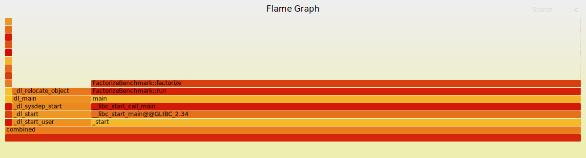

# Операционные системы. Лабораторная работа 1

## Вариант
- ОС: Linux 
- Fork kind: clone3 
- Benchmark 1: io-lat-write (Измерение задержки на запись накопителя с размерами блока Block Size)
- Benchmark 2: factorize (Разложение числа на простые множители)
- Block size: 512

## Задание
### Часть 1. Запуск программ
Необходимо реализовать собственную оболочку командной строки - shell. Выбор ОС для реализации производится на усмотрение студента. Shell должен предоставлять пользователю возможность запускать программы на компьютере с переданными аргументами командной строки и после завершения программы показывать реальное время ее работы (подсчитать самостоятельно как «время завершения» – «время запуска»).

### Часть 2. Мониторинг и профилирование
Разработать комплекс программ-нагрузчиков по варианту, заданному преподавателем. Каждый нагрузчик должен, как минимум, принимать параметр, который определяет количество повторений для алгоритма, указанного в задании. Программы должны нагружать вычислительную систему, дисковую подсистему или обе подсистемы сразу. Необходимо скомпилировать их без опций оптимизации компилятора.

Перед запуском нагрузчика, попробуйте оценить время работы вашей программы или ее результаты (если по варианту вам досталось измерение чего либо). Постарайтесь обосновать свои предположения. Предположение можно сделать, основываясь на свой опыт, знания ОС и характеристики используемого аппаратного обеспечения.

1. Запустите программу-нагрузчик и зафиксируйте метрики ее работы с помощью инструментов для профилирования. Сравните полученные результаты с ожидаемыми. Постарайтесь найти объяснение наблюдаемому. 
2. Определите количество нагрузчиков, которое эффективно нагружает все ядра процессора на вашей системе. Как распределяются времена  USER%, SYS%, WAIT%, а также реальное время выполнения нагрузчика, какое количество переключений контекста (вынужденных и невынужденных) происходит при этом? 
3. Увеличьте количество нагрузчиков вдвое, втрое, вчетверо. Как изменились времена, указанные на предыдущем шаге? Как ведет себя ваша система? 
4. Объедините программы-нагрузчики в одну, реализованную при помощи потоков выполнения, чтобы один нагрузчик эффективно нагружал все ядра вашей системы. Как изменились времена для того же объема вычислений? Запустите одну, две, три таких программы. 
5. Добавьте опции агрессивной оптимизации для компилятора. Как изменились времена? На сколько сократилось реальное время исполнения программы нагрузчика?

### Ограничения

Программа (комплекс программ) должна быть реализован на языке C, C++.
Дочерние процессы должны быть созданы через заданные системные вызовы выбранной операционной системы, с обеспечением корректного запуска и и завершения процессов.  Запрещено использовать высокоуровневые абстракции над системными вызовами. Необходимо использовать, в случае Unix, процедуры libc.

## Решение

### Часть 1. Запуск программ
Запуск производится через [Main](./src/Main.cpp). Программа запускает программу, переданную в аргументах, и выводит время ее работы.

### Часть 2. Мониторинг и профилирование
Созданные программы-нагрузчики:
- [io-lat-write](./src/Bench/io-lat-write.cpp) - измерение задержки на запись накопителя с размерами блока Block Size
- [factorize](./src/Bench/factorize.cpp) - разложение числа на простые множители
- [combined](./src/Bench/combined.cpp) - объединение io-lat-write и factorize в одну программу

Профилирование запускается через .sh скрипты (в частности [test_all.sh](./src/tests/test_all.sh) для запуска всех тестов)
Для профилирования используются следующие утилиты/команды:
- **perf** - инструмент для производительного анализа производительности системы, позволяющий собирать различные метрики, включая использование процессора, кеша, переходы контекста и другие события. Используется для детального профилирования работы приложений и системы в целом.
- **ltrace** - утилита для трассировки вызовов библиотечных функций (например, libc) в запущенной программе. Позволяет анализировать взаимодействие программы с библиотеками, отслеживать аргументы и возвращаемые значения функций.
- **strace** - утилита для трассировки системных вызовов и сигналов, выполняемых процессом. Используется для анализа взаимодействия программы с ядром операционной системы, выявления ошибок и проблем с системными ресурсами.
- **top** - интерактивная утилита для мониторинга процессов в реальном времени. Отображает информацию о загрузке процессора, использовании памяти, активности процессов и других системных метриках.
- **flamegraph** - инструмент для визуализации профилей производительности в виде "огненных графиков". Позволяет быстро идентифицировать наиболее ресурсоемкие функции и участки кода в приложении, облегчая анализ узких мест в производительности.

### Результаты

**Программа `factorize`**

Единичный экземпляр, количество итерации 100000

- [perf](src/tests/factorize/single/perf.log)

```
=== Starting ../../cmake-build-debug/factorize benchmark ===
Factorizing 1234567890123456789: 3 3 101 3541 3607 3803 27961

 Performance counter stats for '../../cmake-build-debug/factorize 100000':

          5,456.71 msec task-clock                       #    0.936 CPUs utilized             
           102,618      context-switches                 #   18.806 K/sec                     
             3,860      cpu-migrations                   #  707.386 /sec                      
               136      page-faults                      #   24.923 /sec                      
     3,164,637,706      cpu_atom/cycles/                 #    0.580 GHz                         (18.77%)
     9,951,354,601      cpu_core/cycles/                 #    1.824 GHz                         (34.74%)
     1,372,515,139      cpu_atom/instructions/           #    0.43  insn per cycle              (33.88%)
    15,165,791,590      cpu_core/instructions/           #    4.79  insn per cycle              (40.64%)
       538,714,960      cpu_atom/branches/               #   98.725 M/sec                       (54.37%)
     2,771,570,259      cpu_core/branches/               #  507.920 M/sec                       (48.07%)
         2,082,101      cpu_atom/branch-misses/          #    0.39% of all branches             (49.98%)
         9,385,925      cpu_core/branch-misses/          #    1.74% of all branches             (55.19%)
             TopdownL1 (cpu_core)                 #     40.9 %  tma_backend_bound      
                                                  #      3.4 %  tma_bad_speculation    
                                                  #     26.4 %  tma_frontend_bound     
                                                  #     29.2 %  tma_retiring             (61.52%)
             TopdownL1 (cpu_atom)                 #    -34.2 %  tma_bad_speculation    
                                                  #     15.1 %  tma_retiring             (63.94%)
                                                  #    104.2 %  tma_backend_bound      
                                                  #    104.2 %  tma_backend_bound_aux  
                                                  #     15.0 %  tma_frontend_bound       (60.13%)
     3,828,332,977      L1-dcache-loads                  #  701.583 M/sec                       (57.69%)
     4,105,527,306      L1-dcache-loads                  #  752.382 M/sec                       (70.33%)
   <not supported>      L1-dcache-load-misses                                                 
       185,697,152      L1-dcache-load-misses            #    4.85% of all L1-dcache accesses   (69.88%)
        69,637,102      LLC-loads                        #   12.762 M/sec                       (55.13%)
        36,055,289      LLC-loads                        #    6.608 M/sec                       (69.68%)
                66      LLC-load-misses                  #    0.00% of all LL-cache accesses    (54.41%)
           540,996      LLC-load-misses                  #    0.78% of all LL-cache accesses    (71.04%)
     1,616,839,867      L1-icache-loads                  #  296.303 M/sec                       (51.20%)
   <not supported>      L1-icache-loads                                                       
       142,301,275      L1-icache-load-misses            #    8.80% of all L1-icache accesses   (51.33%)
       252,397,114      L1-icache-load-misses            #   15.61% of all L1-icache accesses   (27.72%)
     2,244,781,729      dTLB-loads                       #  411.380 M/sec                       (38.57%)
     3,979,308,951      dTLB-loads                       #  729.251 M/sec                       (29.06%)
            65,895      dTLB-load-misses                 #    0.00% of all dTLB cache accesses  (45.08%)
         1,023,292      dTLB-load-misses                 #    0.05% of all dTLB cache accesses  (28.88%)
   <not supported>      iTLB-loads                                                            
   <not supported>      iTLB-loads                                                            
         7,456,821      iTLB-load-misses                                                        (35.40%)
         2,117,520      iTLB-load-misses                                                        (27.52%)
   <not supported>      L1-dcache-prefetches                                                  
   <not supported>      L1-dcache-prefetches                                                  
   <not supported>      L1-dcache-prefetch-misses                                             
   <not supported>      L1-dcache-prefetch-misses                                             

       5.828515355 seconds time elapsed

       0.914976000 seconds user
       1.952062000 seconds sys
```

- [ltrace](src/tests/factorize/single/ltrace.log)

```
=== Starting ../../cmake-build-debug/factorize benchmark ===
Factorizing 1234567890123456789: 3 3 101 3541 3607 3803 27961
% time     seconds  usecs/call     calls      function
------ ----------- ----------- --------- --------------------
 70.03   21.434723         214    100000 _ZNSt6thread4joinEv
 22.74    6.959332          69    100000 _ZNSt6thread15_M_start_threadESt10unique_ptrINS_6_StateESt14default_deleteIS1_EEPFvvE
  7.23    2.211784          22    100000 _Znwm
  0.00    0.000137          27         5 _ZStlsISt11char_traitsIcEERSt13basic_ostreamIcT_ES5_PKc
  0.00    0.000112          22         5 __errno_location
  0.00    0.000036          36         1 _ZNSolsEPFRSoS_E
  0.00    0.000024          24         1 _ZNSt7__cxx1112basic_stringIcSt11char_traitsIcESaIcEE13_M_local_dataEv
  0.00    0.000023          23         1 _ZNSt7__cxx1112basic_stringIcSt11char_traitsIcESaIcEE13_S_copy_charsEPcPKcS7_
  0.00    0.000023          23         1 _ZNKSt7__cxx1112basic_stringIcSt11char_traitsIcESaIcEE7_M_dataEv
  0.00    0.000022          22         1 strlen
  0.00    0.000022          22         1 _ZNSolsEx
  0.00    0.000021          21         1 _ZNSt7__cxx1112basic_stringIcSt11char_traitsIcESaIcEE12_Alloc_hiderC1EPcRKS3_
  0.00    0.000021          21         1 _ZNKSt7__cxx1112basic_stringIcSt11char_traitsIcESaIcEE5c_strEv
  0.00    0.000021          21         1 _ZNSt7__cxx1112basic_stringIcSt11char_traitsIcESaIcEE13_M_set_lengthEm
  0.00    0.000020          20         1 _ZNSt7__cxx1112basic_stringIcSt11char_traitsIcESaIcEED1Ev
------ ----------- ----------- --------- --------------------
100.00   30.606321                300020 total
```

- [strace](src/tests/factorize/single/strace.log)

```
=== Starting ../../cmake-build-debug/factorize benchmark ===
Factorizing 1234567890123456789: 3 3 101 3541 3607 3803 27961
% time     seconds  usecs/call     calls    errors syscall
------ ----------- ----------- --------- --------- ----------------
 55.44    0.372145           3    100000           clone3
 23.33    0.156597           1     99479      5361 futex
 21.17    0.142097           0    200001           rt_sigprocmask
  0.02    0.000163           7        23           mmap
  0.02    0.000138         138         1           execve
  0.01    0.000042           6         7           mprotect
  0.00    0.000029           5         5           openat
  0.00    0.000019           3         6           fstat
  0.00    0.000012           3         4           read
  0.00    0.000012           2         5           close
  0.00    0.000011          11         1           munmap
  0.00    0.000010           3         3           brk
  0.00    0.000005           2         2           pread64
  0.00    0.000004           4         1           write
  0.00    0.000004           4         1         1 access
  0.00    0.000003           3         1           prlimit64
  0.00    0.000003           3         1           getrandom
  0.00    0.000002           2         1           rt_sigaction
  0.00    0.000002           2         1           arch_prctl
  0.00    0.000002           2         1           set_tid_address
  0.00    0.000002           2         1           set_robust_list
  0.00    0.000002           2         1           rseq
------ ----------- ----------- --------- --------- ----------------
100.00    0.671304           1    399546      5362 total
```

- [top](src/tests/factorize/single/top.log)

```
top - 22:29:46 up  1:24,  1 user,  load average: 3.38, 5.31, 3.03
Tasks: 383 total,   1 running, 382 sleeping,   0 stopped,   0 zombie
%Cpu(s):  4.3 us,  2.7 sy,  0.0 ni, 92.8 id,  0.1 wa,  0.0 hi,  0.1 si,  0.0 st 
MiB Mem :  31715.9 total,  14749.6 free,  10189.2 used,   8551.1 buff/cache     
MiB Swap:   8192.0 total,   8192.0 free,      0.0 used.  21526.7 avail Mem 

    PID USER      PR  NI    VIRT    RES    SHR S  %CPU  %MEM     TIME+ COMMAND
2120522 root      20   0   80116   3712   3584 S  27.2   0.0   0:00.87 factori+
  11497 glebmavi  20   0 9664928   3.1g 737704 S   4.0  10.0   9:17.75 clion
   6164 glebmavi  20   0 2721912 244808 117504 S   1.7   0.8   4:50.24 Isolate+
    129 root      20   0       0      0      0 I   1.0   0.0   0:09.11 kworker+
    162 root      20   0       0      0      0 I   1.0   0.0   0:00.61 kworker+
```

- flamegraph


Множество экземпляров 10, количество итерации 50000

Пример одного экземпляра (4го)

- [perf](src/tests/factorize/multiple/instance_4/perf.log)
```
=== Starting ../../cmake-build-debug/factorize benchmark ===
Factorizing 1234567890123456789: 3 3 101 3541 3607 3803 27961

 Performance counter stats for '../../cmake-build-debug/factorize 50000':

          3,888.12 msec task-clock                       #    0.412 CPUs utilized             
            57,912      context-switches                 #   14.895 K/sec                     
            16,536      cpu-migrations                   #    4.253 K/sec                     
               136      page-faults                      #   34.978 /sec                      
     1,714,291,323      cpu_atom/cycles/                 #    0.441 GHz                         (39.55%)
     5,059,843,580      cpu_core/cycles/                 #    1.301 GHz                         (69.10%)
     1,440,634,893      cpu_atom/instructions/           #    0.84  insn per cycle              (46.34%)
     5,262,694,065      cpu_core/instructions/           #    3.07  insn per cycle              (71.76%)
       322,485,720      cpu_atom/branches/               #   82.941 M/sec                       (38.76%)
     1,096,332,266      cpu_core/branches/               #  281.970 M/sec                       (74.42%)
         5,160,668      cpu_atom/branch-misses/          #    1.60% of all branches             (36.28%)
         7,874,655      cpu_core/branch-misses/          #    2.44% of all branches             (75.98%)
             TopdownL1 (cpu_core)                 #     23.8 %  tma_backend_bound      
                                                  #      4.4 %  tma_bad_speculation    
                                                  #     38.0 %  tma_frontend_bound     
                                                  #     33.9 %  tma_retiring             (77.53%)
             TopdownL1 (cpu_atom)                 #      7.5 %  tma_bad_speculation    
                                                  #     23.7 %  tma_retiring             (35.91%)
                                                  #     37.8 %  tma_backend_bound      
                                                  #     37.8 %  tma_backend_bound_aux  
                                                  #     31.1 %  tma_frontend_bound       (34.59%)
       981,354,395      L1-dcache-loads                  #  252.398 M/sec                       (28.69%)
     2,640,461,960      L1-dcache-loads                  #  679.110 M/sec                       (75.00%)
   <not supported>      L1-dcache-load-misses                                                 
        96,149,704      L1-dcache-load-misses            #    9.80% of all L1-dcache accesses   (76.43%)
       256,750,514      LLC-loads                        #   66.035 M/sec                       (37.78%)
        31,409,039      LLC-loads                        #    8.078 M/sec                       (75.89%)
       487,549,430      LLC-load-misses                  #  189.89% of all LL-cache accesses    (38.91%)
           733,914      LLC-load-misses                  #    0.29% of all LL-cache accesses    (74.96%)
       916,242,187      L1-icache-loads                  #  235.652 M/sec                       (39.04%)
   <not supported>      L1-icache-loads                                                       
       546,681,463      L1-icache-load-misses            #   59.67% of all L1-icache accesses   (37.54%)
       184,273,693      L1-icache-load-misses            #   20.11% of all L1-icache accesses   (35.25%)
       909,588,383      dTLB-loads                       #  233.940 M/sec                       (36.75%)
     1,428,747,021      dTLB-loads                       #  367.465 M/sec                       (55.72%)
       243,965,104      dTLB-load-misses                 #   26.82% of all dTLB cache accesses  (40.27%)
         1,365,799      dTLB-load-misses                 #    0.15% of all dTLB cache accesses  (55.10%)
   <not supported>      iTLB-loads                                                            
   <not supported>      iTLB-loads                                                            
       207,575,240      iTLB-load-misses                                                        (41.99%)
         1,724,119      iTLB-load-misses                                                        (56.31%)
   <not supported>      L1-dcache-prefetches                                                  
   <not supported>      L1-dcache-prefetches                                                  
   <not supported>      L1-dcache-prefetch-misses                                             
   <not supported>      L1-dcache-prefetch-misses                                             

       9.427480686 seconds time elapsed

       0.567952000 seconds user
       2.866970000 seconds sys
```

- [ltrace](src/tests/factorize/multiple/instance_4/ltrace.log)
```
=== Starting ../../cmake-build-debug/factorize benchmark ===
Factorizing 1234567890123456789: 3 3 101 3541 3607 3803 27961
% time     seconds  usecs/call     calls      function
------ ----------- ----------- --------- --------------------
 61.05   18.946574         378     50000 _ZNSt6thread4joinEv
 29.46    9.141307         182     50000 _ZNSt6thread15_M_start_threadESt10unique_ptrINS_6_StateESt14default_deleteIS1_EEPFvvE
  9.49    2.944600          58     50000 _Znwm
  0.00    0.000507         101         5 _ZStlsISt11char_traitsIcEERSt13basic_ostreamIcT_ES5_PKc
  0.00    0.000210          42         5 __errno_location
  0.00    0.000168         168         1 _ZNSolsEPFRSoS_E
  0.00    0.000110         110         1 _ZNSt7__cxx1112basic_stringIcSt11char_traitsIcESaIcEE12_Alloc_hiderC1EPcRKS3_
  0.00    0.000097          97         1 strlen
  0.00    0.000074          74         1 _ZNSt7__cxx1112basic_stringIcSt11char_traitsIcESaIcEE13_S_copy_charsEPcPKcS7_
  0.00    0.000066          66         1 _ZNSt7__cxx1112basic_stringIcSt11char_traitsIcESaIcEE13_M_local_dataEv
  0.00    0.000063          63         1 _ZNKSt7__cxx1112basic_stringIcSt11char_traitsIcESaIcEE7_M_dataEv
  0.00    0.000063          63         1 _ZNSt7__cxx1112basic_stringIcSt11char_traitsIcESaIcEE13_M_set_lengthEm
  0.00    0.000054          54         1 _ZNSt7__cxx1112basic_stringIcSt11char_traitsIcESaIcEED1Ev
  0.00    0.000039          39         1 _ZNKSt7__cxx1112basic_stringIcSt11char_traitsIcESaIcEE5c_strEv
  0.00    0.000039          39         1 _ZNSolsEx
------ ----------- ----------- --------- --------------------
100.00   31.033971                150020 total
```

- [strace](src/tests/factorize/multiple/instance_4/strace.log)
```
=== Starting ../../cmake-build-debug/factorize benchmark ===
Factorizing 1234567890123456789: 3 3 101 3541 3607 3803 27961
% time     seconds  usecs/call     calls    errors syscall
------ ----------- ----------- --------- --------- ----------------
 69.57    0.648895          12     50000           clone3
 26.71    0.249133           2    100001           rt_sigprocmask
  3.68    0.034295           6      4909      2107 futex
  0.02    0.000171           7        23           mmap
  0.00    0.000045           6         7           mprotect
  0.00    0.000027           5         5           openat
  0.00    0.000022           3         6           fstat
  0.00    0.000012           3         4           read
  0.00    0.000012          12         1           munmap
  0.00    0.000010           2         5           close
  0.00    0.000010           3         3           brk
  0.00    0.000009           9         1           write
  0.00    0.000004           2         2           pread64
  0.00    0.000003           3         1           rt_sigaction
  0.00    0.000003           3         1         1 access
  0.00    0.000003           3         1           set_tid_address
  0.00    0.000003           3         1           set_robust_list
  0.00    0.000003           3         1           getrandom
  0.00    0.000002           2         1           arch_prctl
  0.00    0.000002           2         1           prlimit64
  0.00    0.000002           2         1           rseq
  0.00    0.000000           0         1           execve
------ ----------- ----------- --------- --------- ----------------
100.00    0.932666           6    154976      2108 total
```

- [`top` во время исполнения всех экземпляров](src/tests/factorize/multiple/top.log)
```
top - 22:34:43 up  1:29,  1 user,  load average: 7.24, 3.95, 2.91
Tasks: 480 total,  27 running, 438 sleeping,  15 stopped,   0 zombie
%Cpu(s): 19.5 us, 78.5 sy,  0.0 ni,  1.9 id,  0.0 wa,  0.0 hi,  0.0 si,  0.0 st 
MiB Mem :  31715.9 total,  11040.4 free,  10354.0 used,  12072.5 buff/cache     
MiB Swap:   8192.0 total,   8192.0 free,      0.0 used.  21361.9 avail Mem 

    PID USER      PR  NI    VIRT    RES    SHR S  %CPU  %MEM     TIME+ COMMAND
2420845 root      20   0    5112   2724   2340 R  37.5   0.0   0:02.24 ltrace
2420862 root      20   0    5112   2872   2488 R  37.5   0.0   0:02.21 ltrace
2420819 root      20   0    5112   3136   2624 S  37.2   0.0   0:02.31 ltrace
2420804 root      20   0    5112   2852   2468 R  36.9   0.0   0:02.33 ltrace
2420842 root      20   0    5112   3044   2532 S  36.9   0.0   0:02.19 ltrace
2420984 root      20   0   80116   3712   3584 R  36.9   0.0   0:02.28 factori+
2420809 root      20   0    5112   2980   2468 S  36.5   0.0   0:02.22 ltrace
2420878 root      20   0    5112   2852   2468 R  36.5   0.0   0:02.23 ltrace
2420966 root      20   0   80116   3584   3456 R  36.5   0.0   0:02.26 factori+
2421037 root      20   0   80116   3712   3584 R  36.5   0.0   0:02.28 factori+
2421100 root      20   0   80116   3712   3584 R  36.5   0.0   0:02.28 factori+
2421166 root      20   0   80116   3712   3584 R  36.5   0.0   0:02.28 factori+
2421030 root      20   0   80116   3712   3584 R  36.2   0.0   0:02.28 factori+
2421053 root      20   0   80116   3584   3456 R  36.2   0.0   0:02.27 factori+
2420810 root      20   0    5112   2872   2488 R  35.9   0.0   0:02.27 ltrace
2420884 root      20   0    5112   2872   2488 R  35.9   0.0   0:02.20 ltrace
2420977 root      20   0   80116   3456   3328 R  35.9   0.0   0:02.25 factori+
2421149 root      20   0   80116   3712   3584 R  35.9   0.0   0:02.27 factori+
2420860 root      20   0    5112   3060   2548 R  35.5   0.0   0:02.17 ltrace
2421253 root      20   0   80116   3712   3584 S  35.5   0.0   0:02.24 factori+
2420888 root      20   0   80116   3456   3456 R  20.3   0.0   0:01.25 factori+
2420887 root      20   0   80116   3712   3584 t  19.6   0.0   0:01.20 factori+
2420892 root      20   0   80116   3584   3456 t  19.6   0.0   0:01.21 factori+
2420944 root      20   0   80116   3712   3584 t  19.6   0.0   0:01.21 factori+
2420958 root      20   0   80116   3584   3456 R  19.6   0.0   0:01.21 factori+
2420899 root      20   0   80116   3712   3584 t  19.3   0.0   0:01.20 factori+
2420914 root      20   0   80116   3456   3456 t  19.3   0.0   0:01.19 factori+
2420847 root      20   0   19564   3456   2944 S  18.9   0.0   0:01.16 strace
2420882 root      20   0   80116   3712   3584 R  18.9   0.0   0:01.19 factori+
2420900 root      20   0   80116   3584   3456 t  18.9   0.0   0:01.19 factori+
2421061 root      20   0   80116   3456   3456 R  18.9   0.0   0:01.18 factori+
2420817 root      20   0   19564   3456   2944 R  18.3   0.0   0:01.11 strace
2420833 root      20   0   19564   3456   2944 R  18.3   0.0   0:01.11 strace
2420883 root      20   0   19564   3456   2944 R  18.3   0.0   0:01.12 strace
2420813 root      20   0   19564   3456   2944 S  17.9   0.0   0:01.10 strace
2420818 root      20   0   19564   3456   2944 S  17.9   0.0   0:01.10 strace
2420853 root      20   0   19564   3456   2944 R  17.9   0.0   0:01.11 strace
2420873 root      20   0   19564   3456   2944 R  17.9   0.0   0:01.11 strace
2420890 root      20   0   19564   3456   2944 S  17.9   0.0   0:01.09 strace
2420874 root      20   0   19564   3456   2944 R  17.6   0.0   0:01.09 strace
2420904 root      20   0   80116   3712   3584 t  15.0   0.0   0:00.92 factori+
2420832 root      20   0   80116   3584   3456 t  14.3   0.0   0:00.88 factori+
2420875 root      20   0   80116   3712   3584 S  14.3   0.0   0:00.88 factori+
2420894 root      20   0   80116   3584   3456 t  14.3   0.0   0:00.90 factori+
2420839 root      20   0   80116   3584   3456 t  14.0   0.0   0:00.86 factori+
2420852 root      20   0   80116   3584   3456 t  14.0   0.0   0:00.87 factori+
2420846 root      20   0   80116   3712   3584 t  13.6   0.0   0:00.85 factori+
2420907 root      20   0   80116   3456   3328 t  13.6   0.0   0:00.88 factori+
2420909 root      20   0   80116   3584   3456 t  13.6   0.0   0:00.86 factori+
2420930 root      20   0   80116   3584   3456 t  13.6   0.0   0:00.84 factori+
```

**Программа `io-lat-write`**

Единичный экземпляр, количество итерации 1000

- [perf](src/tests/io-lat-write/single/perf.log)
```
=== Starting ../../cmake-build-debug/io-lat-write benchmark ===

Overall Statistics:
Average write latency: 0.000434264 seconds
Minimum write latency: 0.000406284 seconds
Maximum write latency: 0.000867885 seconds

 Performance counter stats for '../../cmake-build-debug/io-lat-write 1000':

            559.29 msec task-clock                       #    0.562 CPUs utilized             
             1,096      context-switches                 #    1.960 K/sec                     
                25      cpu-migrations                   #   44.699 /sec                      
               139      page-faults                      #  248.529 /sec                      
     1,909,303,868      cpu_atom/cycles/                 #    3.414 GHz                         (0.16%)
     2,414,900,569      cpu_core/cycles/                 #    4.318 GHz                         (36.03%)
     3,134,648,692      cpu_atom/instructions/           #    1.64  insn per cycle              (0.42%)
     4,814,132,737      cpu_core/instructions/           #    2.52  insn per cycle              (41.39%)
       545,384,586      cpu_atom/branches/               #  975.135 M/sec                       (0.54%)
       834,792,310      cpu_core/branches/               #    1.493 G/sec                       (47.85%)
         4,294,122      cpu_atom/branch-misses/          #    0.79% of all branches             (0.65%)
         2,363,027      cpu_core/branch-misses/          #    0.43% of all branches             (54.19%)
             TopdownL1 (cpu_core)                 #     35.4 %  tma_backend_bound      
                                                  #      5.0 %  tma_bad_speculation    
                                                  #     27.0 %  tma_frontend_bound     
                                                  #     32.7 %  tma_retiring             (64.19%)
             TopdownL1 (cpu_atom)                 #      5.6 %  tma_bad_speculation    
                                                  #     38.4 %  tma_retiring             (0.66%)
                                                  #     34.9 %  tma_backend_bound      
                                                  #     34.9 %  tma_backend_bound_aux  
                                                  #     21.1 %  tma_frontend_bound       (0.66%)
       761,621,465      L1-dcache-loads                  #    1.362 G/sec                       (0.12%)
     1,237,590,494      L1-dcache-loads                  #    2.213 G/sec                       (73.44%)
   <not supported>      L1-dcache-load-misses                                                 
         7,564,012      L1-dcache-load-misses            #    0.99% of all L1-dcache accesses   (73.85%)
         2,400,722      LLC-loads                        #    4.292 M/sec                       (0.01%)
         1,797,102      LLC-loads                        #    3.213 M/sec                       (69.43%)
     <not counted>      LLC-load-misses                                                         (0.00%)
           247,653      LLC-load-misses                  #   10.32% of all LL-cache accesses    (69.23%)
     <not counted>      L1-icache-loads                                                         (0.00%)
   <not supported>      L1-icache-loads                                                       
     <not counted>      L1-icache-load-misses                                                   (0.00%)
       109,432,466      L1-icache-load-misses                                                   (25.90%)
     <not counted>      dTLB-loads                                                              (0.00%)
     1,235,433,217      dTLB-loads                       #    2.209 G/sec                       (25.49%)
     <not counted>      dTLB-load-misses                                                        (0.00%)
            34,820      dTLB-load-misses                                                        (29.91%)
   <not supported>      iTLB-loads                                                            
   <not supported>      iTLB-loads                                                            
     <not counted>      iTLB-load-misses                                                        (0.00%)
           972,070      iTLB-load-misses                                                        (30.11%)
   <not supported>      L1-dcache-prefetches                                                  
   <not supported>      L1-dcache-prefetches                                                  
   <not supported>      L1-dcache-prefetch-misses                                             
   <not supported>      L1-dcache-prefetch-misses                                             

       0.995199672 seconds time elapsed

       0.039512000 seconds user
       0.528480000 seconds sys
```

- [ltrace](src/tests/io-lat-write/single/ltrace.log)
```
=== Starting ../../cmake-build-debug/io-lat-write benchmark ===

Overall Statistics:
Average write latency: 0.11731 seconds
Minimum write latency: 0.104903 seconds
Maximum write latency: 0.224078 seconds
% time     seconds  usecs/call     calls      function
------ ----------- ----------- --------- --------------------
 49.94   41.863132          20   2048000 _ZNSo5writeEPKcl
 48.15   40.363634          19   2049000 _ZNKSt9basic_iosIcSt11char_traitsIcEEntEv
  1.63    1.362738        1362      1000 _ZNSt14basic_ofstreamIcSt11char_traitsIcEEC1EPKcSt13_Ios_Openmode
  0.19    0.157011         157      1000 _ZNSt14basic_ofstreamIcSt11char_traitsIcEE5closeEv
  0.05    0.044354          22      2000 _ZNSt6chrono3_V212system_clock3nowEv
  0.02    0.020587          20      1000 _ZNSt14basic_ofstreamIcSt11char_traitsIcEED1Ev
  0.02    0.020088          20      1000 _ZNSo5flushEv
  0.00    0.000344          28        12 _Znwm
  0.00    0.000296          29        10 _ZStlsISt11char_traitsIcEERSt13basic_ostreamIcT_ES5_PKc
  0.00    0.000286          23        12 _ZdlPvm
  0.00    0.000263          26        10 memmove
  0.00    0.000189          37         5 __errno_location
  0.00    0.000117         117         1 _ZNSt7__cxx1112basic_stringIcSt11char_traitsIcESaIcEE13_M_local_dataEv
  0.00    0.000113         113         1 _ZNSolsEPFRSoS_E
  0.00    0.000071          23         3 _ZNSolsEd
  0.00    0.000055          55         1 _ZNSt7__cxx1112basic_stringIcSt11char_traitsIcESaIcEE12_Alloc_hiderC1EPcRKS3_
  0.00    0.000042          42         1 strlen
  0.00    0.000041          41         1 _ZNKSt7__cxx1112basic_stringIcSt11char_traitsIcESaIcEE7_M_dataEv
  0.00    0.000040          40         1 _ZNKSt7__cxx1112basic_stringIcSt11char_traitsIcESaIcEE5c_strEv
  0.00    0.000040          40         1 _ZNSt7__cxx1112basic_stringIcSt11char_traitsIcESaIcEE13_S_copy_charsEPcPKcS7_
  0.00    0.000039          39         1 memset
  0.00    0.000038          38         1 _ZNSt7__cxx1112basic_stringIcSt11char_traitsIcESaIcEED1Ev
  0.00    0.000038          38         1 _ZNSt7__cxx1112basic_stringIcSt11char_traitsIcESaIcEE13_M_set_lengthEm
------ ----------- ----------- --------- --------------------
100.00   83.833556               4103062 total
```

- [strace](src/tests/io-lat-write/single/strace.log)
```
=== Starting ../../cmake-build-debug/io-lat-write benchmark ===

Overall Statistics:
Average write latency: 0.00146423 seconds
Minimum write latency: 0.00125959 seconds
Maximum write latency: 0.00298867 seconds
% time     seconds  usecs/call     calls    errors syscall
------ ----------- ----------- --------- --------- ----------------
 65.47    0.435968           3    128000           writev
 18.17    0.121029         120      1005           openat
 16.33    0.108750         108      1005           close
  0.01    0.000097           4        22           mmap
  0.01    0.000034           5         6           mprotect
  0.00    0.000010          10         1           munmap
  0.00    0.000006           1         6           fstat
  0.00    0.000005           1         4           read
  0.00    0.000004           2         2           pread64
  0.00    0.000003           3         1           arch_prctl
  0.00    0.000002           2         1           set_tid_address
  0.00    0.000002           2         1           set_robust_list
  0.00    0.000002           2         1           prlimit64
  0.00    0.000002           2         1           rseq
  0.00    0.000000           0         2           write
  0.00    0.000000           0         3           brk
  0.00    0.000000           0         1         1 access
  0.00    0.000000           0         1           execve
  0.00    0.000000           0         1           futex
  0.00    0.000000           0         1           getrandom
------ ----------- ----------- --------- --------- ----------------
100.00    0.665914           5    130065         1 total
```

- [top](src/tests/io-lat-write/single/top.log)
```
top - 22:32:30 up  1:26,  1 user,  load average: 1.23, 3.48, 2.69
Tasks: 382 total,   3 running, 379 sleeping,   0 stopped,   0 zombie
%Cpu(s):  0.6 us,  6.0 sy,  0.0 ni, 91.1 id,  2.4 wa,  0.0 hi,  0.0 si,  0.0 st 
MiB Mem :  31715.9 total,  11252.3 free,  10148.7 used,  12064.9 buff/cache     
MiB Swap:   8192.0 total,   8192.0 free,      0.0 used.  21567.2 avail Mem 

    PID USER      PR  NI    VIRT    RES    SHR S  %CPU  %MEM     TIME+ COMMAND
2320614 root      20   0    6384   3456   3328 R  50.0   0.0   0:00.11 io-lat-+
  19211 root      20   0       0      0      0 R  20.0   0.0   0:01.88 kworker+
      1 root      20   0   23684  14176   9440 S   0.0   0.0   0:02.94 systemd
      2 root      20   0       0      0      0 S   0.0   0.0   0:00.00 kthreadd
      3 root      20   0       0      0      0 S   0.0   0.0   0:00.00 pool_wo+
```

- flamegraph


Множество экземпляров 10, количество итерации 500

Пример одного экземпляра (4го)

- [perf](src/tests/io-lat-write/multiple/instance_4/perf.log)
```
=== Starting ../../cmake-build-debug/io-lat-write benchmark ===

Overall Statistics:
Average write latency: 0.0062263 seconds
Minimum write latency: 0.000466158 seconds
Maximum write latency: 0.0283013 seconds

 Performance counter stats for '../../cmake-build-debug/io-lat-write 500':

            646.82 msec task-clock                       #    0.165 CPUs utilized             
            11,780      context-switches                 #   18.212 K/sec                     
             2,474      cpu-migrations                   #    3.825 K/sec                     
               138      page-faults                      #  213.353 /sec                      
     1,889,556,045      cpu_atom/cycles/                 #    2.921 GHz                         (8.44%)
     2,305,661,951      cpu_core/cycles/                 #    3.565 GHz                         (27.48%)
     1,780,934,652      cpu_atom/instructions/           #    0.94  insn per cycle              (9.77%)
     2,114,633,283      cpu_core/instructions/           #    1.12  insn per cycle              (32.96%)
       321,380,974      cpu_atom/branches/               #  496.866 M/sec                       (9.27%)
       379,755,506      cpu_core/branches/               #  587.114 M/sec                       (38.82%)
         4,552,426      cpu_atom/branch-misses/          #    1.42% of all branches             (9.90%)
         2,645,113      cpu_core/branch-misses/          #    0.82% of all branches             (44.36%)
             TopdownL1 (cpu_core)                 #     42.2 %  tma_backend_bound      
                                                  #      3.8 %  tma_bad_speculation    
                                                  #     27.0 %  tma_frontend_bound     
                                                  #     27.0 %  tma_retiring             (49.30%)
             TopdownL1 (cpu_atom)                 #      7.8 %  tma_bad_speculation    
                                                  #     24.7 %  tma_retiring             (10.57%)
                                                  #     37.2 %  tma_backend_bound      
                                                  #     37.2 %  tma_backend_bound_aux  
                                                  #     30.2 %  tma_frontend_bound       (10.06%)
       802,302,532      L1-dcache-loads                  #    1.240 G/sec                       (9.15%)
       554,214,509      L1-dcache-loads                  #  856.834 M/sec                       (55.24%)
   <not supported>      L1-dcache-load-misses                                                 
        16,593,016      L1-dcache-load-misses            #    2.07% of all L1-dcache accesses   (55.09%)
       476,447,132      LLC-loads                        #  736.603 M/sec                       (8.55%)
         3,712,881      LLC-loads                        #    5.740 M/sec                       (56.28%)
       351,469,716      LLC-load-misses                  #   73.77% of all LL-cache accesses    (8.01%)
            89,829      LLC-load-misses                  #    0.02% of all LL-cache accesses    (55.66%)
     2,082,964,190      L1-icache-loads                  #    3.220 G/sec                       (8.32%)
   <not supported>      L1-icache-loads                                                       
       305,395,905      L1-icache-load-misses            #   14.66% of all L1-icache accesses   (8.23%)
        73,368,324      L1-icache-load-misses            #    3.52% of all L1-icache accesses   (22.23%)
     1,406,403,881      dTLB-loads                       #    2.174 G/sec                       (8.12%)
       550,161,934      dTLB-loads                       #  850.568 M/sec                       (22.39%)
       317,409,129      dTLB-load-misses                 #   22.57% of all dTLB cache accesses  (8.25%)
           225,012      dTLB-load-misses                 #    0.02% of all dTLB cache accesses  (21.20%)
   <not supported>      iTLB-loads                                                            
   <not supported>      iTLB-loads                                                            
       215,199,262      iTLB-load-misses                                                        (8.13%)
            99,872      iTLB-load-misses                                                        (21.81%)
   <not supported>      L1-dcache-prefetches                                                  
   <not supported>      L1-dcache-prefetches                                                  
   <not supported>      L1-dcache-prefetch-misses                                             
   <not supported>      L1-dcache-prefetch-misses                                             

       3.914212712 seconds time elapsed

       0.050660000 seconds user
       0.602753000 seconds sys
```

- [ltrace](src/tests/io-lat-write/multiple/instance_4/ltrace.log)
```
=== Starting ../../cmake-build-debug/io-lat-write benchmark ===

Overall Statistics:
Average write latency: 0.270736 seconds
Minimum write latency: 0.206738 seconds
Maximum write latency: 0.420928 seconds
% time     seconds  usecs/call     calls      function
------ ----------- ----------- --------- --------------------
 51.75   48.414964          47   1024000 _ZNSo5writeEPKcl
 47.90   44.817113          43   1024500 _ZNKSt9basic_iosIcSt11char_traitsIcEEntEv
  0.14    0.133631         267       500 _ZNSt14basic_ofstreamIcSt11char_traitsIcEEC1EPKcSt13_Ios_Openmode
  0.11    0.100151         200       500 _ZNSt14basic_ofstreamIcSt11char_traitsIcEE5closeEv
  0.05    0.046374          46      1000 _ZNSt6chrono3_V212system_clock3nowEv
  0.02    0.022579          45       500 _ZNSt14basic_ofstreamIcSt11char_traitsIcEED1Ev
  0.02    0.021428          42       500 _ZNSo5flushEv
  0.00    0.001123         224         5 __errno_location
  0.00    0.000514          51        10 _ZStlsISt11char_traitsIcEERSt13basic_ostreamIcT_ES5_PKc
  0.00    0.000495          45        11 _ZdlPvm
  0.00    0.000476          52         9 memmove
  0.00    0.000475          43        11 _Znwm
  0.00    0.000178          59         3 _ZNSolsEd
  0.00    0.000041          41         1 _ZNSolsEPFRSoS_E
  0.00    0.000027          27         1 _ZNSt7__cxx1112basic_stringIcSt11char_traitsIcESaIcEED1Ev
  0.00    0.000021          21         1 _ZNSt7__cxx1112basic_stringIcSt11char_traitsIcESaIcEE13_M_local_dataEv
  0.00    0.000021          21         1 _ZNSt7__cxx1112basic_stringIcSt11char_traitsIcESaIcEE13_S_copy_charsEPcPKcS7_
  0.00    0.000020          20         1 _ZNKSt7__cxx1112basic_stringIcSt11char_traitsIcESaIcEE5c_strEv
  0.00    0.000020          20         1 _ZNKSt7__cxx1112basic_stringIcSt11char_traitsIcESaIcEE7_M_dataEv
  0.00    0.000020          20         1 _ZNSt7__cxx1112basic_stringIcSt11char_traitsIcESaIcEE13_M_set_lengthEm
  0.00    0.000019          19         1 _ZNSt7__cxx1112basic_stringIcSt11char_traitsIcESaIcEE12_Alloc_hiderC1EPcRKS3_
  0.00    0.000019          19         1 strlen
  0.00    0.000019          19         1 memset
------ ----------- ----------- --------- --------------------
100.00   93.559728               2051559 total
```

- [strace](src/tests/io-lat-write/multiple/instance_4/strace.log)
```
=== Starting ../../cmake-build-debug/io-lat-write benchmark ===

Overall Statistics:
Average write latency: 0.0151781 seconds
Minimum write latency: 0.00552348 seconds
Maximum write latency: 0.0837683 seconds
% time     seconds  usecs/call     calls    errors syscall
------ ----------- ----------- --------- --------- ----------------
 86.57    0.751663          11     64000           writev
  6.98    0.060640         120       505           close
  6.42    0.055757         110       505           openat
  0.01    0.000093           4        22           mmap
  0.00    0.000030           5         6           mprotect
  0.00    0.000010           1         6           fstat
  0.00    0.000009           2         4           read
  0.00    0.000009           4         2           write
  0.00    0.000004           4         1           munmap
  0.00    0.000004           2         2           pread64
  0.00    0.000003           1         3           brk
  0.00    0.000002           2         1           arch_prctl
  0.00    0.000002           2         1           set_tid_address
  0.00    0.000002           2         1           set_robust_list
  0.00    0.000002           2         1           rseq
  0.00    0.000001           1         1           futex
  0.00    0.000001           1         1           prlimit64
  0.00    0.000001           1         1           getrandom
  0.00    0.000000           0         1         1 access
  0.00    0.000000           0         1           execve
------ ----------- ----------- --------- --------- ----------------
100.00    0.868233          13     65065         1 total
```

- [`top` во время исполнения всех экземпляров](src/tests/io-lat-write/multiple/top.log)
```
top - 22:35:15 up  1:29,  1 user,  load average: 9.19, 4.73, 3.20
Tasks: 480 total,   1 running, 479 sleeping,   0 stopped,   0 zombie
%Cpu(s): 12.7 us, 46.4 sy,  0.0 ni, 39.8 id,  1.1 wa,  0.0 hi,  0.0 si,  0.0 st 
MiB Mem :  31715.9 total,  11045.9 free,  10350.2 used,  12070.8 buff/cache     
MiB Swap:   8192.0 total,   8192.0 free,      0.0 used.  21365.8 avail Mem 

    PID USER      PR  NI    VIRT    RES    SHR S  %CPU  %MEM     TIME+ COMMAND
3921001 root      20   0    5112   3108   2596 S  49.8   0.0   0:01.57 ltrace
3920985 root      20   0    5112   3108   2596 S  49.5   0.0   0:01.58 ltrace
3921017 root      20   0    5112   2872   2488 S  48.8   0.0   0:01.55 ltrace
3921018 root      20   0    5112   2872   2488 S  48.8   0.0   0:01.56 ltrace
3921046 root      20   0    5112   2872   2488 S  48.8   0.0   0:01.55 ltrace
3920994 root      20   0    5112   2852   2468 S  48.5   0.0   0:01.56 ltrace
3921020 root      20   0    5112   2724   2340 S  48.5   0.0   0:01.55 ltrace
3920981 root      20   0    5112   3040   2528 S  48.2   0.0   0:01.54 ltrace
3921033 root      20   0    5112   3108   2596 S  48.2   0.0   0:01.53 ltrace
3920995 root      20   0    5112   3108   2596 S  47.8   0.0   0:01.52 ltrace
3921105 root      20   0    6384   3456   3328 D  16.9   0.0   0:00.53 io-lat-+
3921107 root      20   0    6384   3200   3200 D  16.9   0.0   0:00.53 io-lat-+
3921100 root      20   0    6384   3456   3328 D  16.6   0.0   0:00.52 io-lat-+
3921103 root      20   0    6384   3456   3328 D  16.6   0.0   0:00.52 io-lat-+
3921106 root      20   0    6384   3456   3328 D  16.6   0.0   0:00.52 io-lat-+
3921101 root      20   0    6384   3456   3328 D  16.3   0.0   0:00.51 io-lat-+
3921099 root      20   0    6384   3456   3328 D  15.9   0.0   0:00.50 io-lat-+
3921102 root      20   0    6384   3328   3200 D  15.9   0.0   0:00.51 io-lat-+
3921104 root      20   0    6384   3456   3328 D  15.9   0.0   0:00.50 io-lat-+
3921108 root      20   0    6384   3456   3328 D  15.9   0.0   0:00.50 io-lat-+
3921068 root      20   0    6384   3328   3200 D  15.0   0.0   0:00.46 io-lat-+
3921028 root      20   0    6384   3456   3328 D  14.6   0.0   0:00.46 io-lat-+
3921034 root      20   0    6384   3200   3200 D  14.6   0.0   0:00.46 io-lat-+
3921071 root      20   0    6384   3456   3328 D  14.6   0.0   0:00.46 io-lat-+
3921088 root      20   0    6384   3328   3200 D  14.6   0.0   0:00.46 io-lat-+
3921045 root      20   0    6384   3200   3072 D  14.3   0.0   0:00.45 io-lat-+
3921059 root      20   0    6384   3456   3328 D  14.3   0.0   0:00.45 io-lat-+
3921061 root      20   0    6384   3456   3328 D  14.3   0.0   0:00.45 io-lat-+
3921066 root      20   0    6384   3328   3200 D  14.3   0.0   0:00.45 io-lat-+
3921077 root      20   0    6384   3200   3072 D  14.3   0.0   0:00.45 io-lat-+
  19523 root      20   0       0      0      0 I   7.3   0.0   0:01.14 kworker+
3921074 root      20   0    6384   3456   3328 D   6.3   0.0   0:00.20 io-lat-+
3921083 root      20   0    6384   3456   3328 D   6.3   0.0   0:00.19 io-lat-+
3921057 root      20   0    6384   3200   3200 D   6.0   0.0   0:00.19 io-lat-+
3921062 root      20   0    6384   3456   3328 D   6.0   0.0   0:00.19 io-lat-+
3921085 root      20   0    6384   3456   3328 D   6.0   0.0   0:00.18 io-lat-+
3921086 root      20   0    6384   3456   3328 D   6.0   0.0   0:00.19 io-lat-+
3921070 root      20   0    6384   3456   3328 D   5.6   0.0   0:00.18 io-lat-+
3921078 root      20   0    6384   3456   3328 D   5.6   0.0   0:00.18 io-lat-+
3921095 root      20   0    6384   3456   3328 D   5.6   0.0   0:00.18 io-lat-+
3921097 root      20   0    6384   3456   3328 D   5.6   0.0   0:00.18 io-lat-+
  11497 glebmavi  20   0 9648544   3.1g 737960 S   3.7  10.0   9:32.55 clion
3920991 root      20   0   19564   3584   3072 S   3.0   0.0   0:00.09 strace
3920996 root      20   0   19564   3456   2944 S   3.0   0.0   0:00.09 strace
3921004 root      20   0   19564   3456   2944 S   3.0   0.0   0:00.09 strace
3921007 root      20   0   19564   3456   2944 S   3.0   0.0   0:00.09 strace
3921022 root      20   0   19564   3456   2944 S   3.0   0.0   0:00.09 strace
3921024 root      20   0   19564   3456   2944 S   3.0   0.0   0:00.09 strace
3921026 root      20   0   19564   3456   2944 S   3.0   0.0   0:00.09 strace
3921040 root      20   0   19564   3456   2944 S   3.0   0.0   0:00.09 strace
3921052 root      20   0   19564   3456   2944 S   3.0   0.0   0:00.09 strace
3921002 root      20   0   19564   3456   2944 S   2.7   0.0   0:00.08 strace
```

**Программа `combined`**

Единичный экземпляр, количество итерации --factorize-iterations 20000 --io-iterations 500

- [perf](src/tests/combined/single/perf.log)
```
=== Starting ../../cmake-build-debug/combined benchmark ===
Factorizing 1234567890123456789: 3 3 101 3541 3607 3803 27961

Overall Statistics:
Average write latency: 0.00045212 seconds
Minimum write latency: 0.000425847 seconds
Maximum write latency: 0.00059179 seconds
Both benchmarks have completed successfully.

 Performance counter stats for '../../cmake-build-debug/combined --factorize-iterations 20000 --io-iterations 500':

          1,395.85 msec task-clock                       #    1.180 CPUs utilized             
            21,254      context-switches                 #   15.227 K/sec                     
             1,147      cpu-migrations                   #  821.723 /sec                      
               151      page-faults                      #  108.178 /sec                      
     1,259,419,434      cpu_atom/cycles/                 #    0.902 GHz                         (77.75%)
     3,186,887,694      cpu_core/cycles/                 #    2.283 GHz                         (36.92%)
     1,607,384,429      cpu_atom/instructions/           #    1.28  insn per cycle              (47.14%)
     5,397,845,206      cpu_core/instructions/           #    4.29  insn per cycle              (42.43%)
       208,210,000      cpu_atom/branches/               #  149.164 M/sec                       (4.91%)
       971,328,007      cpu_core/branches/               #  695.870 M/sec                       (49.86%)
           802,308      cpu_atom/branch-misses/          #    0.39% of all branches             (11.74%)
         2,297,064      cpu_core/branch-misses/          #    1.10% of all branches             (56.56%)
             TopdownL1 (cpu_core)                 #     42.3 %  tma_backend_bound      
                                                  #      3.2 %  tma_bad_speculation    
                                                  #     24.5 %  tma_frontend_bound     
                                                  #     30.0 %  tma_retiring             (63.09%)
             TopdownL1 (cpu_atom)                 #    -14.7 %  tma_bad_speculation    
                                                  #     21.6 %  tma_retiring             (12.62%)
                                                  #     74.9 %  tma_backend_bound      
                                                  #     74.9 %  tma_backend_bound_aux  
                                                  #     18.2 %  tma_frontend_bound       (12.84%)
     2,783,830,866      L1-dcache-loads                  #    1.994 G/sec                       (30.55%)
     1,466,322,184      L1-dcache-loads                  #    1.050 G/sec                       (66.86%)
   <not supported>      L1-dcache-load-misses                                                 
        40,780,282      L1-dcache-load-misses            #    1.46% of all L1-dcache accesses   (69.37%)
        26,713,901      LLC-loads                        #   19.138 M/sec                       (48.03%)
         8,183,134      LLC-loads                        #    5.862 M/sec                       (67.31%)
                 0      LLC-load-misses                                                         (47.94%)
           252,581      LLC-load-misses                  #    0.95% of all LL-cache accesses    (68.34%)
       323,005,084      L1-icache-loads                  #  231.404 M/sec                       (72.71%)
   <not supported>      L1-icache-loads                                                       
       331,173,893      L1-icache-load-misses            #  102.53% of all L1-icache accesses   (71.03%)
       102,649,308      L1-icache-load-misses            #   31.78% of all L1-icache accesses   (31.49%)
       564,573,496      dTLB-loads                       #  404.467 M/sec                       (70.92%)
     1,370,090,447      dTLB-loads                       #  981.548 M/sec                       (30.60%)
            26,353      dTLB-load-misses                 #    0.00% of all dTLB cache accesses  (64.20%)
           251,675      dTLB-load-misses                 #    0.04% of all dTLB cache accesses  (32.51%)
   <not supported>      iTLB-loads                                                            
   <not supported>      iTLB-loads                                                            
        28,190,572      iTLB-load-misses                                                        (77.58%)
            32,916      iTLB-load-misses                                                        (31.17%)
   <not supported>      L1-dcache-prefetches                                                  
   <not supported>      L1-dcache-prefetches                                                  
   <not supported>      L1-dcache-prefetch-misses                                             
   <not supported>      L1-dcache-prefetch-misses                                             

       1.182892661 seconds time elapsed

       0.214181000 seconds user
       0.666735000 seconds sys
```

- [ltrace](src/tests/combined/single/ltrace.log)
```
=== Starting ../../cmake-build-debug/combined benchmark ===
Factorizing 1234567890123456789: 3 3 101 3541 3607 3803 27961

Overall Statistics:
Average write latency: 0.205892 seconds
Minimum write latency: 0.131117 seconds
Maximum write latency: 0.511823 seconds
Both benchmarks have completed successfully.
% time     seconds  usecs/call     calls      function
------ ----------- ----------- --------- --------------------
100.00  104.680557    52340278         2 _ZNSt6thread4joinEv
  0.00    0.000471         235         2 _ZNSt6thread15_M_start_threadESt10unique_ptrINS_6_StateESt14default_deleteIS1_EEPFvvE
  0.00    0.000207          20        10 strlen
  0.00    0.000200          20        10 __errno_location
  0.00    0.000161          20         8 _ZNKSt7__cxx1112basic_stringIcSt11char_traitsIcESaIcEE4sizeEv
  0.00    0.000113          28         4 _ZStlsISt11char_traitsIcEERSt13basic_ostreamIcT_ES5_PKc
  0.00    0.000094          47         2 _Znwm
  0.00    0.000088          22         4 _ZNSt7__cxx1112basic_stringIcSt11char_traitsIcESaIcEE12_Alloc_hiderC1EPcRKS3_
  0.00    0.000086          21         4 _ZNSt7__cxx1112basic_stringIcSt11char_traitsIcESaIcEE13_M_set_lengthEm
  0.00    0.000083          20         4 _ZNSt7__cxx1112basic_stringIcSt11char_traitsIcESaIcEED1Ev
  0.00    0.000083          20         4 _ZNSt7__cxx1112basic_stringIcSt11char_traitsIcESaIcEE13_M_local_dataEv
  0.00    0.000081          20         4 _ZNSt7__cxx1112basic_stringIcSt11char_traitsIcESaIcEE13_S_copy_charsEPcPKcS7_
  0.00    0.000081          20         4 _ZNKSt7__cxx1112basic_stringIcSt11char_traitsIcESaIcEE7_M_dataEv
  0.00    0.000064          32         2 _ZNSolsEPFRSoS_E
  0.00    0.000041          20         2 _ZNKSt7__cxx1112basic_stringIcSt11char_traitsIcESaIcEE5c_strEv
  0.00    0.000040          20         2 _ZNKSt7__cxx1112basic_stringIcSt11char_traitsIcESaIcEE4dataEv
  0.00    0.000040          20         2 memcmp
  0.00    0.000029          29         1 _ZNSt7__cxx1112basic_stringIcSt11char_traitsIcESaIcEE9_M_createERmm
  0.00    0.000023          23         1 _ZNSt7__cxx1112basic_stringIcSt11char_traitsIcESaIcEE7_M_dataEPc
  0.00    0.000021          21         1 _ZNSt7__cxx1112basic_stringIcSt11char_traitsIcESaIcEE11_M_capacityEm
------ ----------- ----------- --------- --------------------
100.00  104.682563                    73 total
```

- [strace](src/tests/combined/single/strace.log)
```
=== Starting ../../cmake-build-debug/combined benchmark ===
Factorizing 1234567890123456789: 3 3 101 3541 3607 3803 27961

Overall Statistics:
Average write latency: 0.000447872 seconds
Minimum write latency: 0.000401925 seconds
Maximum write latency: 0.000778924 seconds
Both benchmarks have completed successfully.
% time     seconds  usecs/call     calls    errors syscall
------ ----------- ----------- --------- --------- ----------------
100.00    0.264059      132029         2           futex
  0.00    0.000005           2         2           write
  0.00    0.000000           0         4           read
  0.00    0.000000           0         5           close
  0.00    0.000000           0         6           fstat
  0.00    0.000000           0        24           mmap
  0.00    0.000000           0         8           mprotect
  0.00    0.000000           0         1           munmap
  0.00    0.000000           0         3           brk
  0.00    0.000000           0         1           rt_sigaction
  0.00    0.000000           0         5           rt_sigprocmask
  0.00    0.000000           0         2           pread64
  0.00    0.000000           0         1         1 access
  0.00    0.000000           0         1           execve
  0.00    0.000000           0         1           arch_prctl
  0.00    0.000000           0         1           set_tid_address
  0.00    0.000000           0         5           openat
  0.00    0.000000           0         1           set_robust_list
  0.00    0.000000           0         1           prlimit64
  0.00    0.000000           0         1           getrandom
  0.00    0.000000           0         1           rseq
  0.00    0.000000           0         2           clone3
------ ----------- ----------- --------- --------- ----------------
100.00    0.264064        3385        78         1 total
```

- [top](src/tests/combined/single/top.log)
```
top - 22:34:25 up  1:28,  1 user,  load average: 1.45, 2.79, 2.53
Tasks: 381 total,   1 running, 380 sleeping,   0 stopped,   0 zombie
%Cpu(s):  4.2 us,  8.4 sy,  0.0 ni, 84.4 id,  2.4 wa,  0.0 hi,  0.6 si,  0.0 st 
MiB Mem :  31715.9 total,  11130.5 free,  10264.7 used,  12071.3 buff/cache     
MiB Swap:   8192.0 total,   8192.0 free,      0.0 used.  21451.3 avail Mem 

    PID USER      PR  NI    VIRT    RES    SHR S  %CPU  %MEM     TIME+ COMMAND
2380747 root      20   0  227580   3584   3456 S  90.0   0.0   0:00.18 combined
    127 root      20   0       0      0      0 I  10.0   0.0   0:00.59 kworker+
  14728 root      20   0       0      0      0 I  10.0   0.0   0:03.57 kworker+
      1 root      20   0   23684  14176   9440 S   0.0   0.0   0:02.94 systemd
      2 root      20   0       0      0      0 S   0.0   0.0   0:00.00 kthreadd
```

- flamegraph



Множество экземпляров 10, количество итерации --factorize-iterations 10000 --io-iterations 100

Пример одного экземпляра (4го)

- [perf](src/tests/combined/multiple/instance_4/perf.log)
```
=== Starting ../../cmake-build-debug/combined benchmark ===
Factorizing 1234567890123456789: 3 3 101 3541 3607 3803 27961

Overall Statistics:
Average write latency: 0.018125 seconds
Minimum write latency: 0.000625903 seconds
Maximum write latency: 0.0670173 seconds
Both benchmarks have completed successfully.

 Performance counter stats for '../../cmake-build-debug/combined --factorize-iterations 10000 --io-iterations 100':

          1,007.61 msec task-clock                       #    0.480 CPUs utilized             
            14,068      context-switches                 #   13.962 K/sec                     
             6,112      cpu-migrations                   #    6.066 K/sec                     
               147      page-faults                      #  145.890 /sec                      
       782,073,676      cpu_atom/cycles/                 #    0.776 GHz                         (24.94%)
     1,335,572,938      cpu_core/cycles/                 #    1.325 GHz                         (64.93%)
       632,971,282      cpu_atom/instructions/           #    0.81  insn per cycle              (29.23%)
     1,285,580,489      cpu_core/instructions/           #    1.64  insn per cycle              (68.82%)
       121,122,032      cpu_atom/branches/               #  120.208 M/sec                       (27.55%)
       270,313,929      cpu_core/branches/               #  268.273 M/sec                       (72.38%)
         1,671,113      cpu_atom/branch-misses/          #    1.38% of all branches             (29.72%)
         2,197,518      cpu_core/branch-misses/          #    1.81% of all branches             (74.58%)
             TopdownL1 (cpu_core)                 #     26.1 %  tma_backend_bound      
                                                  #      4.5 %  tma_bad_speculation    
                                                  #     36.6 %  tma_frontend_bound     
                                                  #     32.8 %  tma_retiring             (75.65%)
             TopdownL1 (cpu_atom)                 #     13.4 %  tma_bad_speculation    
                                                  #     25.6 %  tma_retiring             (30.78%)
                                                  #     32.8 %  tma_backend_bound      
                                                  #     32.8 %  tma_backend_bound_aux  
                                                  #     28.2 %  tma_frontend_bound       (31.03%)
       378,996,680      L1-dcache-loads                  #  376.135 M/sec                       (27.97%)
       619,681,110      L1-dcache-loads                  #  615.002 M/sec                       (71.81%)
   <not supported>      L1-dcache-load-misses                                                 
        22,054,873      L1-dcache-load-misses            #    5.82% of all L1-dcache accesses   (72.26%)
       244,848,270      LLC-loads                        #  243.000 M/sec                       (30.80%)
         7,017,966      LLC-loads                        #    6.965 M/sec                       (71.70%)
        77,626,914      LLC-load-misses                  #   31.70% of all LL-cache accesses    (29.13%)
           206,151      LLC-load-misses                  #    0.08% of all LL-cache accesses    (73.41%)
       390,637,956      L1-icache-loads                  #  387.688 M/sec                       (29.69%)
   <not supported>      L1-icache-loads                                                       
       247,338,764      L1-icache-load-misses            #   63.32% of all L1-icache accesses   (29.33%)
        46,264,412      L1-icache-load-misses            #   11.84% of all L1-icache accesses   (35.46%)
       376,873,606      dTLB-loads                       #  374.028 M/sec                       (29.95%)
       376,277,918      dTLB-loads                       #  373.437 M/sec                       (58.47%)
       194,231,155      dTLB-load-misses                 #   51.54% of all dTLB cache accesses  (27.19%)
           356,501      dTLB-load-misses                 #    0.09% of all dTLB cache accesses  (53.07%)
   <not supported>      iTLB-loads                                                            
   <not supported>      iTLB-loads                                                            
        72,888,236      iTLB-load-misses                                                        (26.58%)
           425,685      iTLB-load-misses                                                        (51.55%)
   <not supported>      L1-dcache-prefetches                                                  
   <not supported>      L1-dcache-prefetches                                                  
   <not supported>      L1-dcache-prefetch-misses                                             
   <not supported>      L1-dcache-prefetch-misses                                             

       2.100931648 seconds time elapsed

       0.137793000 seconds user
       0.777750000 seconds sys
```

- [ltrace](src/tests/combined/multiple/instance_4/ltrace.log)
```
=== Starting ../../cmake-build-debug/combined benchmark ===
Factorizing 1234567890123456789: 3 3 101 3541 3607 3803 27961

Overall Statistics:
Average write latency: 0.450196 seconds
Minimum write latency: 0.296064 seconds
Maximum write latency: 1.92606 seconds
Both benchmarks have completed successfully.
% time     seconds  usecs/call     calls      function
------ ----------- ----------- --------- --------------------
 99.99   45.109868    22554934         2 _ZNSt6thread4joinEv
  0.00    0.000527         263         2 _ZNSt6thread15_M_start_threadESt10unique_ptrINS_6_StateESt14default_deleteIS1_EEPFvvE
  0.00    0.000463          46        10 __errno_location
  0.00    0.000442          44        10 strlen
  0.00    0.000353          44         8 _ZNKSt7__cxx1112basic_stringIcSt11char_traitsIcESaIcEE4sizeEv
  0.00    0.000245          61         4 _ZStlsISt11char_traitsIcEERSt13basic_ostreamIcT_ES5_PKc
  0.00    0.000223          55         4 _ZNSt7__cxx1112basic_stringIcSt11char_traitsIcESaIcEE12_Alloc_hiderC1EPcRKS3_
  0.00    0.000196          49         4 _ZNSt7__cxx1112basic_stringIcSt11char_traitsIcESaIcEE13_M_local_dataEv
  0.00    0.000187          46         4 _ZNSt7__cxx1112basic_stringIcSt11char_traitsIcESaIcEED1Ev
  0.00    0.000182          45         4 _ZNSt7__cxx1112basic_stringIcSt11char_traitsIcESaIcEE13_S_copy_charsEPcPKcS7_
  0.00    0.000181          45         4 _ZNKSt7__cxx1112basic_stringIcSt11char_traitsIcESaIcEE7_M_dataEv
  0.00    0.000180          45         4 _ZNSt7__cxx1112basic_stringIcSt11char_traitsIcESaIcEE13_M_set_lengthEm
  0.00    0.000169          84         2 _ZNSolsEPFRSoS_E
  0.00    0.000122          61         2 _Znwm
  0.00    0.000094          47         2 _ZNKSt7__cxx1112basic_stringIcSt11char_traitsIcESaIcEE4dataEv
  0.00    0.000090          45         2 memcmp
  0.00    0.000088          44         2 _ZNKSt7__cxx1112basic_stringIcSt11char_traitsIcESaIcEE5c_strEv
  0.00    0.000050          50         1 _ZNSt7__cxx1112basic_stringIcSt11char_traitsIcESaIcEE9_M_createERmm
  0.00    0.000045          45         1 _ZNSt7__cxx1112basic_stringIcSt11char_traitsIcESaIcEE7_M_dataEPc
  0.00    0.000044          44         1 _ZNSt7__cxx1112basic_stringIcSt11char_traitsIcESaIcEE11_M_capacityEm
------ ----------- ----------- --------- --------------------
100.00   45.113749                    73 total
```

- [strace](src/tests/combined/multiple/instance_4/strace.log)
```
=== Starting ../../cmake-build-debug/combined benchmark ===
Factorizing 1234567890123456789: 3 3 101 3541 3607 3803 27961

Overall Statistics:
Average write latency: 0.0163696 seconds
Minimum write latency: 0.000762065 seconds
Maximum write latency: 0.0845601 seconds
Both benchmarks have completed successfully.
% time     seconds  usecs/call     calls    errors syscall
------ ----------- ----------- --------- --------- ----------------
100.00    0.275816       91938         3           futex
  0.00    0.000004           2         2           write
  0.00    0.000000           0         4           read
  0.00    0.000000           0         5           close
  0.00    0.000000           0         6           fstat
  0.00    0.000000           0        24           mmap
  0.00    0.000000           0         8           mprotect
  0.00    0.000000           0         1           munmap
  0.00    0.000000           0         3           brk
  0.00    0.000000           0         1           rt_sigaction
  0.00    0.000000           0         5           rt_sigprocmask
  0.00    0.000000           0         2           pread64
  0.00    0.000000           0         1         1 access
  0.00    0.000000           0         1           execve
  0.00    0.000000           0         1           arch_prctl
  0.00    0.000000           0         1           set_tid_address
  0.00    0.000000           0         5           openat
  0.00    0.000000           0         1           set_robust_list
  0.00    0.000000           0         1           prlimit64
  0.00    0.000000           0         1           getrandom
  0.00    0.000000           0         1           rseq
  0.00    0.000000           0         2           clone3
------ ----------- ----------- --------- --------- ----------------
100.00    0.275820        3491        79         1 total
```

- [`top` во время исполнения всех экземпляров](src/tests/combined/multiple/top.log)
```
top - 22:37:28 up  1:31,  1 user,  load average: 10.42, 6.94, 4.25
Tasks: 480 total,  14 running, 460 sleeping,   6 stopped,   0 zombie
%Cpu(s): 28.5 us, 68.6 sy,  0.0 ni,  2.9 id,  0.0 wa,  0.0 hi,  0.0 si,  0.0 st 
MiB Mem :  31715.9 total,  11026.2 free,  10368.1 used,  12073.0 buff/cache     
MiB Swap:   8192.0 total,   8192.0 free,      0.0 used.  21347.8 avail Mem 

    PID USER      PR  NI    VIRT    RES    SHR S  %CPU  %MEM     TIME+ COMMAND
3921483 root      20   0  227580   3712   3584 S  54.5   0.0   0:00.08 combined
3922274 root      20   0  227580   3712   3584 S  54.5   0.0   0:00.08 combined
3921212 root      20   0    5112   3056   2544 R  45.5   0.0   0:00.07 ltrace
3921298 root      20   0  227580   3584   3456 S  45.5   0.0   0:00.06 combined
3921585 root      20   0  227580   3584   3456 S  45.5   0.0   0:00.07 combined
3921623 root      20   0  227580   3712   3584 S  45.5   0.0   0:00.07 combined
3921742 root      20   0  227580   3584   3456 S  45.5   0.0   0:00.08 combined
3921946 root      20   0  227580   3712   3584 S  45.5   0.0   0:00.07 combined
3921956 root      20   0  227580   3712   3584 S  45.5   0.0   0:00.07 combined
3922335 root      20   0  227580   3584   3456 S  45.5   0.0   0:00.08 combined
3922726 root      20   0  227580   3712   3584 S  45.5   0.0   0:00.07 combined
3921219 root      20   0    5112   3108   2596 R  36.4   0.0   0:00.06 ltrace
3921246 root      20   0    5112   3108   2596 R  36.4   0.0   0:00.06 ltrace
3921247 root      20   0    5112   2808   2424 R  36.4   0.0   0:00.06 ltrace
3921250 root      20   0    5112   3060   2548 R  36.4   0.0   0:00.06 ltrace
3921283 root      20   0  227580   3712   3584 S  36.4   0.0   0:00.06 combined
3921299 root      20   0  227580   3712   3584 S  36.4   0.0   0:00.05 combined
3921326 root      20   0  227580   3712   3584 S  36.4   0.0   0:00.06 combined
3921609 root      20   0  227580   3456   3328 S  36.4   0.0   0:00.07 combined
3921217 root      20   0    5112   3060   2548 R  27.3   0.0   0:00.05 ltrace
3921223 root      20   0    5112   2872   2488 R  27.3   0.0   0:00.05 ltrace
3921232 root      20   0    5112   2808   2424 R  27.3   0.0   0:00.06 ltrace
3921269 root      20   0    5112   2872   2488 R  27.3   0.0   0:00.06 ltrace
3921279 root      20   0    5112   3148   2636 R  27.3   0.0   0:00.06 ltrace
3921300 root      20   0  227580   3712   3584 S  27.3   0.0   0:00.05 combined
3921306 root      20   0  227580   3712   3584 S  27.3   0.0   0:00.05 combined
3921310 root      20   0  227580   3712   3584 S  27.3   0.0   0:00.05 combined
3921316 root      20   0  227580   3584   3456 S  27.3   0.0   0:00.06 combined
3921325 root      20   0  227580   3712   3584 S  27.3   0.0   0:00.05 combined
3921327 root      20   0  227580   3712   3584 S  27.3   0.0   0:00.05 combined
3921260 root      20   0  227580   3712   3584 t  18.2   0.0   0:00.02 combined
     10 root      20   0       0      0      0 R   9.1   0.0   0:01.00 kworker+
     16 root      20   0       0      0      0 R   9.1   0.0   0:00.41 ksoftir+
     36 root      20   0       0      0      0 S   9.1   0.0   0:00.90 ksoftir+
     42 root      20   0       0      0      0 S   9.1   0.0   0:01.49 ksoftir+
     90 root      20   0       0      0      0 S   9.1   0.0   0:00.83 ksoftir+
   9960 root      20   0       0      0      0 I   9.1   0.0   0:00.98 kworker+
3921186 root      20   0   23168   5376   3328 R   9.1   0.0   0:00.01 top
3921263 root      20   0  227580   3584   3456 t   9.1   0.0   0:00.01 combined
3921264 root      20   0  227580   3712   3584 S   9.1   0.0   0:00.01 combined
3921268 root      20   0  227580   3584   3456 t   9.1   0.0   0:00.01 combined
3921282 root      20   0  227580   3584   3456 S   9.1   0.0   0:00.01 combined
3921285 root      20   0  227580   3584   3456 t   9.1   0.0   0:00.01 combined
3921288 root      20   0  227580   3456   3328 S   9.1   0.0   0:00.01 combined
3921296 root      20   0  227580   3584   3456 t   9.1   0.0   0:00.01 combined
3921301 root      20   0  227580   3584   3456 t   9.1   0.0   0:00.01 combined
3921305 root      20   0  227580   3712   3584 S   9.1   0.0   0:00.01 combined
      1 root      20   0   23684  14176   9440 S   0.0   0.0   0:02.95 systemd
      2 root      20   0       0      0      0 S   0.0   0.0   0:00.00 kthreadd
```

**Программа `factorize` с агрессивной оптимизацией**

Единичный экземпляр, количество итерации 100000

- [perf](src/tests/factorize_fast/single/perf.log)
```
=== Starting ../../cmake-build-release/factorize benchmark ===
Factorizing 1234567890123456789: 3 3 101 3541 3607 3803 27961

 Performance counter stats for '../../cmake-build-release/factorize 100000':

          3,684.12 msec task-clock                       #    0.921 CPUs utilized             
           101,138      context-switches                 #   27.452 K/sec                     
             1,904      cpu-migrations                   #  516.812 /sec                      
               137      page-faults                      #   37.187 /sec                      
     3,148,005,996      cpu_atom/cycles/                 #    0.854 GHz                         (4.86%)
     9,958,174,979      cpu_core/cycles/                 #    2.703 GHz                         (33.19%)
       548,025,206      cpu_atom/instructions/           #    0.17  insn per cycle              (59.59%)
    15,276,109,983      cpu_core/instructions/           #    4.85  insn per cycle              (40.01%)
       138,533,045      cpu_atom/branches/               #   37.603 M/sec                       (64.57%)
     2,795,731,916      cpu_core/branches/               #  758.859 M/sec                       (47.80%)
           965,135      cpu_atom/branch-misses/          #    0.70% of all branches             (70.84%)
         6,876,181      cpu_core/branch-misses/          #    4.96% of all branches             (54.28%)
             TopdownL1 (cpu_core)                 #     44.2 %  tma_backend_bound      
                                                  #      3.1 %  tma_bad_speculation    
                                                  #     24.1 %  tma_frontend_bound     
                                                  #     28.5 %  tma_retiring             (61.59%)
             TopdownL1 (cpu_atom)                 #     14.6 %  tma_bad_speculation    
                                                  #     16.0 %  tma_retiring             (71.29%)
                                                  #     26.2 %  tma_backend_bound      
                                                  #     26.2 %  tma_backend_bound_aux  
                                                  #     43.2 %  tma_frontend_bound       (54.96%)
       933,454,447      L1-dcache-loads                  #  253.372 M/sec                       (36.56%)
     4,055,820,835      L1-dcache-loads                  #    1.101 G/sec                       (68.94%)
   <not supported>      L1-dcache-load-misses                                                 
       187,089,935      L1-dcache-load-misses            #   20.04% of all L1-dcache accesses   (69.91%)
       150,071,199      LLC-loads                        #   40.735 M/sec                       (30.25%)
        37,086,301      LLC-loads                        #   10.067 M/sec                       (69.51%)
               162      LLC-load-misses                  #    0.00% of all LL-cache accesses    (31.99%)
           594,970      LLC-load-misses                  #    0.40% of all LL-cache accesses    (71.72%)
     1,243,571,657      L1-icache-loads                  #  337.549 M/sec                       (31.83%)
   <not supported>      L1-icache-loads                                                       
       253,769,842      L1-icache-load-misses            #   20.41% of all L1-icache accesses   (31.88%)
       242,774,562      L1-icache-load-misses            #   19.52% of all L1-icache accesses   (28.54%)
     1,152,758,310      dTLB-loads                       #  312.899 M/sec                       (31.82%)
     3,929,857,836      dTLB-loads                       #    1.067 G/sec                       (28.47%)
           327,726      dTLB-load-misses                 #    0.03% of all dTLB cache accesses  (30.22%)
         1,478,334      dTLB-load-misses                 #    0.13% of all dTLB cache accesses  (28.75%)
   <not supported>      iTLB-loads                                                            
   <not supported>      iTLB-loads                                                            
        12,788,145      iTLB-load-misses                                                        (8.15%)
           130,503      iTLB-load-misses                                                        (26.98%)
   <not supported>      L1-dcache-prefetches                                                  
   <not supported>      L1-dcache-prefetches                                                  
   <not supported>      L1-dcache-prefetch-misses                                             
   <not supported>      L1-dcache-prefetch-misses                                             

       4.000926347 seconds time elapsed

       0.144226000 seconds user
       2.617311000 seconds sys
```

- [ltrace](src/tests/factorize_fast/single/ltrace.log)
```
=== Starting ../../cmake-build-release/factorize benchmark ===
Factorizing 1234567890123456789: 3 3 101 3541 3607 3803 27961
% time     seconds  usecs/call     calls      function
------ ----------- ----------- --------- --------------------
 66.24   19.108476         191    100000 _ZNSt6thread4joinEv
 25.65    7.400230          74    100000 _ZNSt6thread15_M_start_threadESt10unique_ptrINS_6_StateESt14default_deleteIS1_EEPFvvE
  8.11    2.338252          23    100000 _Znwm
  0.00    0.000206          51         4 _ZSt16__ostream_insertIcSt11char_traitsIcEERSt13basic_ostreamIT_T0_ES6_PKS3_l
  0.00    0.000057          57         1 _ZNSo5flushEv
  0.00    0.000047          47         1 memcpy
  0.00    0.000046          46         1 _ZStlsISt11char_traitsIcEERSt13basic_ostreamIcT_ES5_PKc
  0.00    0.000042          42         1 __isoc23_strtol
  0.00    0.000041          41         1 _ZNKSt5ctypeIcE13_M_widen_initEv
  0.00    0.000041          41         1 _ZNSt7__cxx1112basic_stringIcSt11char_traitsIcESaIcEE10_M_disposeEv
  0.00    0.000040          40         1 _ZNSo9_M_insertIxEERSoT_
  0.00    0.000039          39         1 _ZNSo3putEc
  0.00    0.000039          39         1 strlen
  0.00    0.000039          39         1 __errno_location
------ ----------- ----------- --------- --------------------
100.00   28.847595                300014 total
```

- [strace](src/tests/factorize_fast/single/strace.log)
```
=== Starting ../../cmake-build-release/factorize benchmark ===
Factorizing 1234567890123456789: 3 3 101 3541 3607 3803 27961
% time     seconds  usecs/call     calls    errors syscall
------ ----------- ----------- --------- --------- ----------------
 69.82    0.648036           6    100000           clone3
 29.83    0.276825           1    200001           rt_sigprocmask
  0.35    0.003283           3       861        76 futex
  0.00    0.000000           0         4           read
  0.00    0.000000           0         1           write
  0.00    0.000000           0         5           close
  0.00    0.000000           0         6           fstat
  0.00    0.000000           0        23           mmap
  0.00    0.000000           0         7           mprotect
  0.00    0.000000           0         1           munmap
  0.00    0.000000           0         3           brk
  0.00    0.000000           0         1           rt_sigaction
  0.00    0.000000           0         2           pread64
  0.00    0.000000           0         1         1 access
  0.00    0.000000           0         1           execve
  0.00    0.000000           0         1           arch_prctl
  0.00    0.000000           0         1           set_tid_address
  0.00    0.000000           0         5           openat
  0.00    0.000000           0         1           set_robust_list
  0.00    0.000000           0         1           prlimit64
  0.00    0.000000           0         1           getrandom
  0.00    0.000000           0         1           rseq
------ ----------- ----------- --------- --------- ----------------
100.00    0.928144           3    300928        77 total
```

- [top](src/tests/factorize_fast/single/top.log)
```
top - 22:38:53 up  1:33,  1 user,  load average: 6.38, 6.86, 4.48
Tasks: 383 total,   2 running, 381 sleeping,   0 stopped,   0 zombie
%Cpu(s):  1.2 us,  6.1 sy,  0.0 ni, 92.1 id,  0.0 wa,  0.0 hi,  0.6 si,  0.0 st 
MiB Mem :  31715.9 total,  11079.5 free,  10312.1 used,  12074.5 buff/cache     
MiB Swap:   8192.0 total,   8192.0 free,      0.0 used.  21403.8 avail Mem 

    PID USER      PR  NI    VIRT    RES    SHR S  %CPU  %MEM     TIME+ COMMAND
 328894 root      20   0   80100   3456   3456 R  45.5   0.0   0:00.10 factori+
     60 root      20   0       0      0      0 S   9.1   0.0   0:00.46 ksoftir+
     71 root      rt   0       0      0      0 S   9.1   0.0   0:00.96 migrati+
      1 root      20   0   23684  14176   9440 S   0.0   0.0   0:02.95 systemd
      2 root      20   0       0      0      0 S   0.0   0.0   0:00.00 kthreadd
```

- flamegraph


Более подробный flamegraph, с увеличенным record frequency (запуск через [detailed_flamegraph.sh](src/tests/detailed_flamegraph.sh))


Множество экземпляров 10, количество итерации 50000

Пример одного экземпляра (4го)

- [perf](src/tests/factorize_fast/multiple/instance_4/perf.log)
```
=== Starting ../../cmake-build-release/factorize benchmark ===
Factorizing 1234567890123456789: 3 3 101 3541 3607 3803 27961

 Performance counter stats for '../../cmake-build-release/factorize 50000':

          3,311.43 msec task-clock                       #    0.399 CPUs utilized             
            57,028      context-switches                 #   17.222 K/sec                     
             9,058      cpu-migrations                   #    2.735 K/sec                     
               136      page-faults                      #   41.070 /sec                      
     2,040,265,613      cpu_atom/cycles/                 #    0.616 GHz                         (29.18%)
     4,886,602,371      cpu_core/cycles/                 #    1.476 GHz                         (62.18%)
     1,724,110,578      cpu_atom/instructions/           #    0.85  insn per cycle              (31.56%)
     4,718,044,348      cpu_core/instructions/           #    2.31  insn per cycle              (65.55%)
       340,018,168      cpu_atom/branches/               #  102.680 M/sec                       (27.45%)
       996,407,598      cpu_core/branches/               #  300.900 M/sec                       (68.01%)
         5,162,089      cpu_atom/branch-misses/          #    1.52% of all branches             (28.30%)
         7,859,310      cpu_core/branch-misses/          #    2.31% of all branches             (70.99%)
             TopdownL1 (cpu_core)                 #     20.6 %  tma_backend_bound      
                                                  #      4.8 %  tma_bad_speculation    
                                                  #     42.2 %  tma_frontend_bound     
                                                  #     32.4 %  tma_retiring             (72.56%)
             TopdownL1 (cpu_atom)                 #      6.1 %  tma_bad_speculation    
                                                  #     24.2 %  tma_retiring             (27.31%)
                                                  #     36.3 %  tma_backend_bound      
                                                  #     36.3 %  tma_backend_bound_aux  
                                                  #     33.3 %  tma_frontend_bound       (27.37%)
     1,196,753,606      L1-dcache-loads                  #  361.401 M/sec                       (29.30%)
     1,878,990,243      L1-dcache-loads                  #  567.426 M/sec                       (69.90%)
   <not supported>      L1-dcache-load-misses                                                 
        99,816,562      L1-dcache-load-misses            #    8.34% of all L1-dcache accesses   (68.80%)
       369,509,485      LLC-loads                        #  111.586 M/sec                       (31.54%)
        31,889,923      LLC-loads                        #    9.630 M/sec                       (70.91%)
       924,359,395      LLC-load-misses                  #  250.16% of all LL-cache accesses    (30.62%)
         1,361,915      LLC-load-misses                  #    0.37% of all LL-cache accesses    (71.36%)
     1,545,988,868      L1-icache-loads                  #  466.865 M/sec                       (28.87%)
   <not supported>      L1-icache-loads                                                       
       560,330,398      L1-icache-load-misses            #   36.24% of all L1-icache accesses   (29.73%)
       201,334,897      L1-icache-load-misses            #   13.02% of all L1-icache accesses   (33.71%)
     1,165,412,501      dTLB-loads                       #  351.937 M/sec                       (28.90%)
     1,204,734,153      dTLB-loads                       #  363.811 M/sec                       (54.38%)
       540,831,218      dTLB-load-misses                 #   46.41% of all dTLB cache accesses  (26.12%)
         1,579,289      dTLB-load-misses                 #    0.14% of all dTLB cache accesses  (49.47%)
   <not supported>      iTLB-loads                                                            
   <not supported>      iTLB-loads                                                            
       152,427,396      iTLB-load-misses                                                        (30.38%)
         1,967,435      iTLB-load-misses                                                        (49.93%)
   <not supported>      L1-dcache-prefetches                                                  
   <not supported>      L1-dcache-prefetches                                                  
   <not supported>      L1-dcache-prefetch-misses                                             
   <not supported>      L1-dcache-prefetch-misses                                             

       8.298140689 seconds time elapsed

       0.139627000 seconds user
       2.949457000 seconds sys
```

- [ltrace](src/tests/factorize_fast/multiple/instance_4/ltrace.log)
```
=== Starting ../../cmake-build-release/factorize benchmark ===
Factorizing 1234567890123456789: 3 3 101 3541 3607 3803 27961
% time     seconds  usecs/call     calls      function
------ ----------- ----------- --------- --------------------
 60.10   17.909581         358     50000 _ZNSt6thread4joinEv
 30.26    9.016266         180     50000 _ZNSt6thread15_M_start_threadESt10unique_ptrINS_6_StateESt14default_deleteIS1_EEPFvvE
  9.65    2.874490          57     50000 _Znwm
  0.00    0.000157          39         4 _ZSt16__ostream_insertIcSt11char_traitsIcEERSt13basic_ostreamIT_T0_ES6_PKS3_l
  0.00    0.000051          51         1 __isoc23_strtol
  0.00    0.000044          44         1 _ZNSo5flushEv
  0.00    0.000035          35         1 _ZStlsISt11char_traitsIcEERSt13basic_ostreamIcT_ES5_PKc
  0.00    0.000033          33         1 _ZNSt7__cxx1112basic_stringIcSt11char_traitsIcESaIcEE10_M_disposeEv
  0.00    0.000030          30         1 _ZNKSt5ctypeIcE13_M_widen_initEv
  0.00    0.000030          30         1 _ZNSo3putEc
  0.00    0.000029          29         1 strlen
  0.00    0.000029          29         1 __errno_location
  0.00    0.000029          29         1 _ZNSo9_M_insertIxEERSoT_
  0.00    0.000027          27         1 memcpy
------ ----------- ----------- --------- --------------------
100.00   29.800831                150014 total
```

- [strace](src/tests/factorize_fast/multiple/instance_4/strace.log)
```
=== Starting ../../cmake-build-release/factorize benchmark ===
Factorizing 1234567890123456789: 3 3 101 3541 3607 3803 27961
% time     seconds  usecs/call     calls    errors syscall
------ ----------- ----------- --------- --------- ----------------
 70.96    0.763124          15     50000           clone3
 27.30    0.293601           2    100001           rt_sigprocmask
  1.73    0.018584           6      2758      1201 futex
  0.01    0.000075           3        23           mmap
  0.00    0.000047           6         7           mprotect
  0.00    0.000010           3         3           brk
  0.00    0.000009           9         1           munmap
  0.00    0.000006           6         1           write
  0.00    0.000006           1         5           close
  0.00    0.000006           1         5           openat
  0.00    0.000005           0         6           fstat
  0.00    0.000003           0         4           read
  0.00    0.000003           3         1           rt_sigaction
  0.00    0.000003           3         1           set_tid_address
  0.00    0.000003           3         1           getrandom
  0.00    0.000002           2         1           arch_prctl
  0.00    0.000002           2         1           set_robust_list
  0.00    0.000002           2         1           prlimit64
  0.00    0.000002           2         1           rseq
  0.00    0.000000           0         2           pread64
  0.00    0.000000           0         1         1 access
  0.00    0.000000           0         1           execve
------ ----------- ----------- --------- --------- ----------------
100.00    1.075493           7    152825      1202 total
```

- [`top` во время исполнения всех экземпляров](src/tests/factorize_fast/multiple/top.log)
```
top - 22:42:12 up  1:36,  1 user,  load average: 6.91, 5.24, 4.20
Tasks: 482 total,  38 running, 436 sleeping,   8 stopped,   0 zombie
%Cpu(s): 11.1 us, 84.8 sy,  0.0 ni,  3.8 id,  0.0 wa,  0.0 hi,  0.3 si,  0.0 st 
MiB Mem :  31715.9 total,  10997.3 free,  10393.0 used,  12078.3 buff/cache     
MiB Swap:   8192.0 total,   8192.0 free,      0.0 used.  21323.0 avail Mem 

    PID USER      PR  NI    VIRT    RES    SHR S  %CPU  %MEM     TIME+ COMMAND
 629113 root      20   0    5112   2744   2360 R  40.6   0.0   0:02.53 ltrace
 629118 root      20   0    5112   3060   2548 R  40.6   0.0   0:02.40 ltrace
 629135 root      20   0    5112   2872   2488 S  39.9   0.0   0:02.48 ltrace
 629173 root      20   0    5112   2852   2468 R  39.3   0.0   0:02.50 ltrace
 629101 root      20   0    5112   2744   2360 R  38.9   0.0   0:02.49 ltrace
 629100 root      20   0    5112   2980   2596 R  38.6   0.0   0:02.50 ltrace
 629105 root      20   0    5112   2868   2484 R  37.3   0.0   0:02.36 ltrace
 629107 root      20   0    5112   2872   2488 R  37.0   0.0   0:02.26 ltrace
 629126 root      20   0    5112   2852   2468 R  37.0   0.0   0:02.44 ltrace
 629991 root      20   0   80100   3456   3456 S  37.0   0.0   0:02.35 factori+
 629275 root      20   0   80100   3712   3584 R  36.6   0.0   0:02.30 factori+
 629429 root      20   0   80100   3712   3584 R  36.6   0.0   0:02.31 factori+
 629733 root      20   0   80100   3712   3584 R  36.6   0.0   0:02.35 factori+
 629768 root      20   0   80100   3712   3584 R  36.6   0.0   0:02.32 factori+
 630106 root      20   0   80100   3584   3456 R  36.6   0.0   0:02.31 factori+
 629438 root      20   0   80100   3712   3584 R  36.3   0.0   0:02.33 factori+
 629301 root      20   0   80100   3712   3584 S  36.0   0.0   0:02.29 factori+
 629466 root      20   0   80100   3712   3584 R  36.0   0.0   0:02.33 factori+
 629409 root      20   0   80100   3584   3456 S  35.6   0.0   0:02.31 factori+
 629182 root      20   0    5112   2744   2360 R  35.3   0.0   0:02.43 ltrace
 629120 root      20   0   19564   3456   2944 R  19.8   0.0   0:01.21 strace
 629205 root      20   0   80100   3712   3584 R  19.8   0.0   0:01.20 factori+
 629140 root      20   0   19564   3456   2944 R  19.5   0.0   0:01.22 strace
 629163 root      20   0   19564   3584   3072 R  19.5   0.0   0:01.21 strace
 629131 root      20   0   19564   3456   2944 R  19.1   0.0   0:01.18 strace
 629200 root      20   0   80100   3712   3584 t  19.1   0.0   0:01.18 factori+
 629109 root      20   0   19564   3456   2944 S  18.8   0.0   0:01.20 strace
 629115 root      20   0   19564   3456   2944 R  18.8   0.0   0:01.18 strace
 629122 root      20   0   19564   3456   2944 R  18.8   0.0   0:01.23 strace
 629186 root      20   0   19564   3456   2944 R  18.8   0.0   0:01.17 strace
 629203 root      20   0   80100   3712   3584 R  18.8   0.0   0:01.19 factori+
 629166 root      20   0   80100   3712   3584 R  18.5   0.0   0:01.15 factori+
 629176 root      20   0   19564   3584   3072 R  18.5   0.0   0:01.14 strace
 629193 root      20   0   80100   3584   3456 R  18.5   0.0   0:01.16 factori+
 629201 root      20   0   80100   3456   3456 R  18.5   0.0   0:01.19 factori+
 629204 root      20   0   80100   3712   3584 R  18.5   0.0   0:01.14 factori+
 629136 root      20   0   19564   3456   2944 S  18.2   0.0   0:01.16 strace
 629240 root      20   0   80100   3712   3584 R  18.2   0.0   0:01.15 factori+
 629191 root      20   0   80100   3712   3584 t  17.8   0.0   0:01.11 factori+
 629209 root      20   0   80100   3584   3456 R  17.8   0.0   0:01.13 factori+
 629157 root      20   0   80100   3584   3456 t  14.5   0.0   0:00.88 factori+
 629165 root      20   0   80100   3584   3456 S  14.5   0.0   0:00.90 factori+
 629148 root      20   0   80100   3584   3456 R  14.2   0.0   0:00.90 factori+
 629168 root      20   0   80100   3584   3456 t  14.2   0.0   0:00.88 factori+
 629145 root      20   0   80100   3456   3456 t  13.9   0.0   0:00.90 factori+
 629144 root      20   0   80100   3712   3584 t  13.5   0.0   0:00.87 factori+
 629197 root      20   0   80100   3584   3456 t  13.5   0.0   0:00.88 factori+
 629154 root      20   0   80100   3584   3456 t  13.2   0.0   0:00.87 factori+
 629151 root      20   0   80100   3584   3456 R  12.9   0.0   0:00.80 factori+
 629211 root      20   0   80100   3584   3456 R  12.9   0.0   0:00.87 factori+
     36 root      20   0       0      0      0 S   9.2   0.0   0:01.28 ksoftir+
     96 root      20   0       0      0      0 R   8.9   0.0   0:01.20 ksoftir+
     84 root      20   0       0      0      0 S   7.3   0.0   0:01.14 ksoftir+
     24 root      20   0       0      0      0 S   6.9   0.0   0:01.17 ksoftir+
  11497 glebmavi  20   0 9652640   3.1g 737960 S   5.3  10.0   9:54.38 clion
```


**Программа `io-lat-write` с агрессивной оптимизацией**

Единичный экземпляр, количество итерации 1000

- [perf](src/tests/io-lat-write_fast/single/perf.log)
```
=== Starting ../../cmake-build-release/io-lat-write benchmark ===

Overall Statistics:
Average write latency: 0.00040993 seconds
Minimum write latency: 0.000388998 seconds
Maximum write latency: 0.000651934 seconds

 Performance counter stats for '../../cmake-build-release/io-lat-write 1000':

            537.75 msec task-clock                       #    0.564 CPUs utilized             
             1,053      context-switches                 #    1.958 K/sec                     
                16      cpu-migrations                   #   29.754 /sec                      
               138      page-faults                      #  256.626 /sec                      
     1,697,968,117      cpu_atom/cycles/                 #    3.158 GHz                         (0.10%)
     2,317,104,324      cpu_core/cycles/                 #    4.309 GHz                         (33.04%)
     1,841,979,319      cpu_atom/instructions/           #    1.08  insn per cycle              (0.12%)
     4,727,368,055      cpu_core/instructions/           #    2.78  insn per cycle              (41.24%)
       327,075,978      cpu_atom/branches/               #  608.234 M/sec                       (0.12%)
       817,341,764      cpu_core/branches/               #    1.520 G/sec                       (48.97%)
        10,776,330      cpu_atom/branch-misses/          #    3.29% of all branches             (0.12%)
         1,021,920      cpu_core/branch-misses/          #    0.31% of all branches             (56.04%)
             TopdownL1 (cpu_core)                 #     37.1 %  tma_backend_bound      
                                                  #      3.5 %  tma_bad_speculation    
                                                  #     25.1 %  tma_frontend_bound     
                                                  #     34.4 %  tma_retiring             (64.17%)
             TopdownL1 (cpu_atom)                 #     16.1 %  tma_bad_speculation    
                                                  #     25.5 %  tma_retiring             (0.12%)
                                                  #     31.3 %  tma_backend_bound      
                                                  #     31.3 %  tma_backend_bound_aux  
                                                  #     27.1 %  tma_frontend_bound       (0.12%)
     <not counted>      L1-dcache-loads                                                         (0.00%)
     1,210,081,780      L1-dcache-loads                  #    2.250 G/sec                       (70.66%)
   <not supported>      L1-dcache-load-misses                                                 
         7,545,298      L1-dcache-load-misses                                                   (73.93%)
     <not counted>      LLC-loads                                                               (0.00%)
         1,802,583      LLC-loads                        #    3.352 M/sec                       (74.59%)
     <not counted>      LLC-load-misses                                                         (0.00%)
           241,574      LLC-load-misses                                                         (74.08%)
     <not counted>      L1-icache-loads                                                         (0.00%)
   <not supported>      L1-icache-loads                                                       
     <not counted>      L1-icache-load-misses                                                   (0.00%)
       105,136,256      L1-icache-load-misses                                                   (29.22%)
     <not counted>      dTLB-loads                                                              (0.00%)
     1,205,234,049      dTLB-loads                       #    2.241 G/sec                       (25.95%)
     <not counted>      dTLB-load-misses                                                        (0.00%)
            30,661      dTLB-load-misses                                                        (25.29%)
   <not supported>      iTLB-loads                                                            
   <not supported>      iTLB-loads                                                            
     <not counted>      iTLB-load-misses                                                        (0.00%)
             4,325      iTLB-load-misses                                                        (25.80%)
   <not supported>      L1-dcache-prefetches                                                  
   <not supported>      L1-dcache-prefetches                                                  
   <not supported>      L1-dcache-prefetch-misses                                             
   <not supported>      L1-dcache-prefetch-misses                                             

       0.953915298 seconds time elapsed

       0.029540000 seconds user
       0.516088000 seconds sys
```

- [ltrace](src/tests/io-lat-write_fast/single/ltrace.log)
```
=== Starting ../../cmake-build-release/io-lat-write benchmark ===

Overall Statistics:
Average write latency: 0.0572937 seconds
Minimum write latency: 0.0531266 seconds
Maximum write latency: 0.111927 seconds
% time     seconds  usecs/call     calls      function
------ ----------- ----------- --------- --------------------
 98.30   40.098798          19   2048000 _ZNSo5writeEPKcl
  0.74    0.302155         302      1000 _ZNSt13basic_filebufIcSt11char_traitsIcEE4openEPKcSt13_Ios_Openmode
  0.41    0.166919          83      2000 _ZNSt13basic_filebufIcSt11char_traitsIcEE5closeEv
  0.11    0.043038          21      2000 _ZNSt6chrono3_V212system_clock3nowEv
  0.10    0.038892          19      2000 _ZNSt9basic_iosIcSt11char_traitsIcEE4initEPSt15basic_streambufIcS1_E
  0.05    0.021636          21      1000 _ZNSt9basic_iosIcSt11char_traitsIcEE5clearESt12_Ios_Iostate
  0.05    0.020076          20      1000 _ZNSt12__basic_fileIcED1Ev
  0.05    0.019836          19      1000 _ZNSt6localeD1Ev
  0.05    0.019756          19      1000 _ZNSt8ios_baseD2Ev
  0.05    0.019633          19      1000 _ZNSt8ios_baseC2Ev
  0.05    0.019411          19      1000 _ZNSt13basic_filebufIcSt11char_traitsIcEEC1Ev
  0.05    0.019012          18      1001 _ZNSo5flushEv
  0.00    0.000368          40         9 _ZSt16__ostream_insertIcSt11char_traitsIcEERSt13basic_ostreamIT_T0_ES6_PKS3_l
  0.00    0.000266          22        12 _Znwm
  0.00    0.000230          19        12 _ZdlPvm
  0.00    0.000195          19        10 memmove
  0.00    0.000069          23         3 _ZNSo9_M_insertIdEERSoT_
  0.00    0.000055          55         1 _ZStlsISt11char_traitsIcEERSt13basic_ostreamIcT_ES5_PKc
  0.00    0.000050          50         1 __errno_location
  0.00    0.000043          43         1 __isoc23_strtol
  0.00    0.000041          41         1 _ZNSt7__cxx1112basic_stringIcSt11char_traitsIcESaIcEE10_M_disposeEv
  0.00    0.000040          40         1 _ZNKSt5ctypeIcE13_M_widen_initEv
  0.00    0.000040          40         1 memcpy
  0.00    0.000040          40         1 _ZNSo3putEc
  0.00    0.000038          38         1 strlen
------ ----------- ----------- --------- --------------------
100.00   40.790637               2062055 total
```

- [strace](src/tests/io-lat-write_fast/single/strace.log)
```
=== Starting ../../cmake-build-release/io-lat-write benchmark ===

Overall Statistics:
Average write latency: 0.00135083 seconds
Minimum write latency: 0.00125151 seconds
Maximum write latency: 0.00262326 seconds
% time     seconds  usecs/call     calls    errors syscall
------ ----------- ----------- --------- --------- ----------------
 64.68    0.419071           3    128000           writev
 18.62    0.120669         120      1005           openat
 16.69    0.108164         107      1005           close
  0.00    0.000004           2         2           write
  0.00    0.000000           0         4           read
  0.00    0.000000           0         6           fstat
  0.00    0.000000           0        22           mmap
  0.00    0.000000           0         6           mprotect
  0.00    0.000000           0         1           munmap
  0.00    0.000000           0         3           brk
  0.00    0.000000           0         2           pread64
  0.00    0.000000           0         1         1 access
  0.00    0.000000           0         1           execve
  0.00    0.000000           0         1           arch_prctl
  0.00    0.000000           0         1           futex
  0.00    0.000000           0         1           set_tid_address
  0.00    0.000000           0         1           set_robust_list
  0.00    0.000000           0         1           prlimit64
  0.00    0.000000           0         1           getrandom
  0.00    0.000000           0         1           rseq
------ ----------- ----------- --------- --------- ----------------
100.00    0.647908           4    130065         1 total
```

- [top](src/tests/io-lat-write_fast/single/top.log)
```
top - 22:40:28 up  1:34,  1 user,  load average: 2.13, 5.28, 4.14
Tasks: 382 total,   1 running, 381 sleeping,   0 stopped,   0 zombie
%Cpu(s):  0.6 us,  4.8 sy,  0.0 ni, 92.2 id,  2.4 wa,  0.0 hi,  0.0 si,  0.0 st 
MiB Mem :  31715.9 total,  11066.0 free,  10326.0 used,  12076.5 buff/cache     
MiB Swap:   8192.0 total,   8192.0 free,      0.0 used.  21389.9 avail Mem 

    PID USER      PR  NI    VIRT    RES    SHR S  %CPU  %MEM     TIME+ COMMAND
 528967 root      20   0    6368   3456   3328 D  54.5   0.0   0:00.11 io-lat-+
  14728 root      20   0       0      0      0 I  18.2   0.0   0:04.18 kworker+
   4152 glebmavi  20   0   11.9g 497592 247172 S   9.1   1.5   4:49.12 firefox
      1 root      20   0   23684  14176   9440 S   0.0   0.0   0:02.95 systemd
      2 root      20   0       0      0      0 S   0.0   0.0   0:00.00 kthreadd
```

- flamegraph


Более подробный flamegraph, с увеличенным record frequency (запуск через [detailed_flamegraph.sh](src/tests/detailed_flamegraph.sh))


Множество экземпляров 10, количество итерации 500

Пример одного экземпляра (4го)

- [perf](src/tests/io-lat-write_fast/multiple/instance_4/perf.log)
```
=== Starting ../../cmake-build-release/io-lat-write benchmark ===

Overall Statistics:
Average write latency: 0.00581672 seconds
Minimum write latency: 0.000458934 seconds
Maximum write latency: 0.0239167 seconds

 Performance counter stats for '../../cmake-build-release/io-lat-write 500':

            566.66 msec task-clock                       #    0.153 CPUs utilized             
            11,064      context-switches                 #   19.525 K/sec                     
             1,749      cpu-migrations                   #    3.087 K/sec                     
               137      page-faults                      #  241.770 /sec                      
     1,759,188,442      cpu_atom/cycles/                 #    3.105 GHz                         (10.01%)
     2,066,556,169      cpu_core/cycles/                 #    3.647 GHz                         (25.60%)
     1,741,975,845      cpu_atom/instructions/           #    0.99  insn per cycle              (11.99%)
     2,046,744,521      cpu_core/instructions/           #    1.16  insn per cycle              (31.18%)
       320,267,577      cpu_atom/branches/               #  565.190 M/sec                       (11.89%)
       360,932,894      cpu_core/branches/               #  636.953 M/sec                       (36.77%)
         3,419,141      cpu_atom/branch-misses/          #    1.07% of all branches             (11.60%)
         2,136,075      cpu_core/branch-misses/          #    0.67% of all branches             (41.22%)
             TopdownL1 (cpu_core)                 #     48.8 %  tma_backend_bound      
                                                  #      4.8 %  tma_bad_speculation    
                                                  #     22.5 %  tma_frontend_bound     
                                                  #     23.8 %  tma_retiring             (45.81%)
             TopdownL1 (cpu_atom)                 #      6.6 %  tma_bad_speculation    
                                                  #     25.8 %  tma_retiring             (10.83%)
                                                  #     39.0 %  tma_backend_bound      
                                                  #     39.0 %  tma_backend_bound_aux  
                                                  #     28.5 %  tma_frontend_bound       (11.43%)
       978,159,542      L1-dcache-loads                  #    1.726 G/sec                       (9.99%)
       534,152,122      L1-dcache-loads                  #  942.640 M/sec                       (53.35%)
   <not supported>      L1-dcache-load-misses                                                 
        12,907,317      L1-dcache-load-misses            #    1.32% of all L1-dcache accesses   (52.54%)
       202,091,963      LLC-loads                        #  356.640 M/sec                       (9.55%)
         3,296,356      LLC-loads                        #    5.817 M/sec                       (53.44%)
        88,534,584      LLC-load-misses                  #   43.81% of all LL-cache accesses    (9.05%)
            88,347      LLC-load-misses                  #    0.04% of all LL-cache accesses    (53.73%)
       844,556,777      L1-icache-loads                  #    1.490 G/sec                       (8.90%)
   <not supported>      L1-icache-loads                                                       
       721,602,228      L1-icache-load-misses            #   85.44% of all L1-icache accesses   (8.68%)
        69,744,253      L1-icache-load-misses            #    8.26% of all L1-icache accesses   (21.22%)
     1,635,161,663      dTLB-loads                       #    2.886 G/sec                       (9.02%)
       551,209,622      dTLB-loads                       #  972.743 M/sec                       (22.03%)
       498,310,710      dTLB-load-misses                 #   30.47% of all dTLB cache accesses  (8.66%)
           175,878      dTLB-load-misses                 #    0.01% of all dTLB cache accesses  (21.12%)
   <not supported>      iTLB-loads                                                            
   <not supported>      iTLB-loads                                                            
       341,867,735      iTLB-load-misses                                                        (9.28%)
            84,861      iTLB-load-misses                                                        (20.84%)
   <not supported>      L1-dcache-prefetches                                                  
   <not supported>      L1-dcache-prefetches                                                  
   <not supported>      L1-dcache-prefetch-misses                                             
   <not supported>      L1-dcache-prefetch-misses                                             

       3.695135454 seconds time elapsed

       0.036483000 seconds user
       0.535785000 seconds sys
```

- [ltrace](src/tests/io-lat-write_fast/multiple/instance_4/ltrace.log)
```
=== Starting ../../cmake-build-release/io-lat-write benchmark ===

Overall Statistics:
Average write latency: 0.138082 seconds
Minimum write latency: 0.0897643 seconds
Maximum write latency: 0.286384 seconds
% time     seconds  usecs/call     calls      function
------ ----------- ----------- --------- --------------------
 99.11   48.482917          47   1024000 _ZNSo5writeEPKcl
  0.22    0.110021         110      1000 _ZNSt13basic_filebufIcSt11char_traitsIcEE5closeEv
  0.16    0.079031         158       500 _ZNSt13basic_filebufIcSt11char_traitsIcEE4openEPKcSt13_Ios_Openmode
  0.09    0.046183          46      1000 _ZNSt6chrono3_V212system_clock3nowEv
  0.09    0.045262          45      1000 _ZNSt9basic_iosIcSt11char_traitsIcEE4initEPSt15basic_streambufIcS1_E
  0.05    0.022912          45       500 _ZNSt9basic_iosIcSt11char_traitsIcEE5clearESt12_Ios_Iostate
  0.05    0.022340          44       500 _ZNSt12__basic_fileIcED1Ev
  0.04    0.021969          43       500 _ZNSt8ios_baseC2Ev
  0.04    0.021902          43       500 _ZNSt6localeD1Ev
  0.04    0.021901          43       500 _ZNSt8ios_baseD2Ev
  0.04    0.021884          43       500 _ZNSt13basic_filebufIcSt11char_traitsIcEEC1Ev
  0.04    0.021755          43       501 _ZNSo5flushEv
  0.00    0.000484          44        11 _Znwm
  0.00    0.000480          43        11 _ZdlPvm
  0.00    0.000470          52         9 memmove
  0.00    0.000292          32         9 _ZSt16__ostream_insertIcSt11char_traitsIcEERSt13basic_ostreamIT_T0_ES6_PKS3_l
  0.00    0.000080          26         3 _ZNSo9_M_insertIdEERSoT_
  0.00    0.000051          51         1 _ZStlsISt11char_traitsIcEERSt13basic_ostreamIcT_ES5_PKc
  0.00    0.000051          51         1 _ZNSt7__cxx1112basic_stringIcSt11char_traitsIcESaIcEE10_M_disposeEv
  0.00    0.000047          47         1 _ZNKSt5ctypeIcE13_M_widen_initEv
  0.00    0.000045          45         1 __isoc23_strtol
  0.00    0.000044          44         1 _ZNSo3putEc
  0.00    0.000044          44         1 strlen
  0.00    0.000042          42         1 memcpy
  0.00    0.000042          42         1 __errno_location
------ ----------- ----------- --------- --------------------
100.00   48.920249               1031052 total
```

- [strace](src/tests/io-lat-write_fast/multiple/instance_4/strace.log)
```
=== Starting ../../cmake-build-release/io-lat-write benchmark ===

Overall Statistics:
Average write latency: 0.0146182 seconds
Minimum write latency: 0.00539188 seconds
Maximum write latency: 0.0926418 seconds
% time     seconds  usecs/call     calls    errors syscall
------ ----------- ----------- --------- --------- ----------------
 87.12    0.756320          11     64000           writev
  6.50    0.056439         111       505           close
  6.38    0.055401         109       505           openat
  0.00    0.000006           3         2           write
  0.00    0.000000           0         4           read
  0.00    0.000000           0         6           fstat
  0.00    0.000000           0        22           mmap
  0.00    0.000000           0         6           mprotect
  0.00    0.000000           0         1           munmap
  0.00    0.000000           0         3           brk
  0.00    0.000000           0         2           pread64
  0.00    0.000000           0         1         1 access
  0.00    0.000000           0         1           execve
  0.00    0.000000           0         1           arch_prctl
  0.00    0.000000           0         1           futex
  0.00    0.000000           0         1           set_tid_address
  0.00    0.000000           0         1           set_robust_list
  0.00    0.000000           0         1           prlimit64
  0.00    0.000000           0         1           getrandom
  0.00    0.000000           0         1           rseq
------ ----------- ----------- --------- --------- ----------------
100.00    0.868166          13     65065         1 total
```

- [`top` во время исполнения всех экземпляров](src/tests/io-lat-write_fast/multiple/top.log)
```
top - 22:42:46 up  1:37,  1 user,  load average: 10.34, 6.17, 4.55
Tasks: 455 total,  22 running, 422 sleeping,  11 stopped,   0 zombie
%Cpu(s): 16.7 us, 62.1 sy,  0.0 ni, 20.8 id,  0.4 wa,  0.0 hi,  0.0 si,  0.0 st 
MiB Mem :  31715.9 total,  11013.0 free,  10376.9 used,  12079.0 buff/cache     
MiB Swap:   8192.0 total,   8192.0 free,      0.0 used.  21339.0 avail Mem 

    PID USER      PR  NI    VIRT    RES    SHR S  %CPU  %MEM     TIME+ COMMAND
2129294 root      20   0    5112   2872   2488 S  56.1   0.0   0:02.78 ltrace
2129314 root      20   0    5112   2980   2596 R  55.8   0.0   0:02.73 ltrace
2129318 root      20   0    5112   2624   2240 R  55.8   0.0   0:02.76 ltrace
2129282 root      20   0    5112   2852   2468 R  55.5   0.0   0:02.71 ltrace
2129288 root      20   0    5112   2872   2488 R  55.5   0.0   0:02.73 ltrace
2129297 root      20   0    5112   2852   2468 R  55.5   0.0   0:02.73 ltrace
2129316 root      20   0    5112   2816   2432 R  55.5   0.0   0:02.75 ltrace
2129322 root      20   0    5112   2852   2468 R  55.5   0.0   0:02.73 ltrace
2129366 root      20   0    5112   2872   2488 S  55.1   0.0   0:02.73 ltrace
2129319 root      20   0    5112   2980   2596 R  54.8   0.0   0:02.71 ltrace
2129392 root      20   0    6368   3456   3328 R  25.2   0.0   0:00.92 io-lat-+
2129353 root      20   0    6368   3456   3328 t  24.9   0.0   0:00.92 io-lat-+
2129374 root      20   0    6368   3456   3328 R  24.9   0.0   0:00.92 io-lat-+
2129385 root      20   0    6368   3456   3328 R  24.9   0.0   0:00.92 io-lat-+
2129388 root      20   0    6368   3456   3328 R  24.9   0.0   0:00.91 io-lat-+
2129391 root      20   0    6368   3456   3328 t  24.9   0.0   0:00.92 io-lat-+
2129394 root      20   0    6368   3456   3328 t  24.9   0.0   0:00.92 io-lat-+
2129398 root      20   0    6368   3456   3328 R  24.9   0.0   0:00.93 io-lat-+
2129387 root      20   0    6368   3456   3328 R  24.3   0.0   0:00.90 io-lat-+
2129399 root      20   0    6368   3456   3328 t  24.3   0.0   0:00.90 io-lat-+
2129341 root      20   0    6368   3456   3328 R  17.6   0.0   0:00.86 io-lat-+
2129339 root      20   0    6368   3456   3328 R  17.3   0.0   0:00.87 io-lat-+
2129346 root      20   0    6368   3456   3328 t  17.3   0.0   0:00.85 io-lat-+
2129347 root      20   0    6368   3328   3200 t  17.3   0.0   0:00.86 io-lat-+
2129348 root      20   0    6368   3328   3200 t  17.3   0.0   0:00.86 io-lat-+
2129375 root      20   0    6368   3456   3328 t  17.3   0.0   0:00.86 io-lat-+
2129382 root      20   0    6368   3328   3200 R  17.3   0.0   0:00.86 io-lat-+
2129304 root      20   0   19564   3456   2944 R  16.9   0.0   0:00.58 strace
2129328 root      20   0   19564   3456   2944 R  16.9   0.0   0:00.58 strace
2129330 root      20   0   19564   3456   2944 S  16.9   0.0   0:00.59 strace
2129332 root      20   0   19564   3456   2944 R  16.9   0.0   0:00.59 strace
2129338 root      20   0    6368   3200   3200 t  16.9   0.0   0:00.84 io-lat-+
2129351 root      20   0    6368   3328   3200 t  16.9   0.0   0:00.85 io-lat-+
2129393 root      20   0    6368   3328   3200 t  16.9   0.0   0:00.85 io-lat-+
2129286 root      20   0   19564   3456   2944 S  16.6   0.0   0:00.58 strace
2129295 root      20   0   19564   3584   3072 S  16.6   0.0   0:00.58 strace
2129300 root      20   0   19564   3456   2944 R  16.6   0.0   0:00.58 strace
2129325 root      20   0   19564   3456   2944 S  16.6   0.0   0:00.58 strace
2129371 root      20   0   19564   3456   2944 S  16.6   0.0   0:00.58 strace
2129333 root      20   0   19564   3456   2944 S  16.3   0.0   0:00.56 strace
  11497 glebmavi  20   0 9659984   3.1g 737960 S   6.6  10.1   9:56.76 clion
```

**Программа `combined` с агрессивной оптимизацией**

Единичный экземпляр, количество итерации --factorize-iterations 20000 --io-iterations 500

- [perf](src/tests/combined_fast/single/perf.log)
```
=== Starting ../../cmake-build-release/combined benchmark ===
Factorizing 1234567890123456789: 3 3 101 3541 3607 3803 27961

Overall Statistics:
Average write latency: 0.000431931 seconds
Minimum write latency: 0.000393399 seconds
Maximum write latency: 0.000788917 seconds
Both benchmarks have completed successfully.

 Performance counter stats for '../../cmake-build-release/combined --factorize-iterations 20000 --io-iterations 500':

          1,039.90 msec task-clock                       #    1.260 CPUs utilized             
            20,780      context-switches                 #   19.983 K/sec                     
               443      cpu-migrations                   #  426.001 /sec                      
               152      page-faults                      #  146.167 /sec                      
         3,977,851      cpu_atom/cycles/                 #    0.004 GHz                         (52.11%)
     3,188,703,905      cpu_core/cycles/                 #    3.066 GHz                         (36.99%)
        14,129,743      cpu_atom/instructions/           #    3.55  insn per cycle              (98.90%)
     5,445,885,114      cpu_core/instructions/           # 1369.05  insn per cycle              (46.20%)
         4,689,341      cpu_atom/branches/               #    4.509 M/sec                       (99.38%)
       976,060,988      cpu_core/branches/               #  938.607 M/sec                       (51.95%)
           967,916      cpu_atom/branch-misses/          #   20.64% of all branches             (27.77%)
         1,926,111      cpu_core/branch-misses/          #   41.07% of all branches             (57.82%)
             TopdownL1 (cpu_core)                 #     38.0 %  tma_backend_bound      
                                                  #      3.3 %  tma_bad_speculation    
                                                  #     26.1 %  tma_frontend_bound     
                                                  #     32.5 %  tma_retiring             (63.97%)
             TopdownL1 (cpu_atom)                 #     15.3 %  tma_bad_speculation    
                                                  #     14.2 %  tma_retiring             (29.40%)
                                                  #     27.0 %  tma_backend_bound      
                                                  #     27.0 %  tma_backend_bound_aux  
                                                  #     43.6 %  tma_frontend_bound       (28.81%)
       515,468,047      L1-dcache-loads                  #  495.688 M/sec                       (32.07%)
     1,428,706,341      L1-dcache-loads                  #    1.374 G/sec                       (70.66%)
   <not supported>      L1-dcache-load-misses                                                 
        40,913,832      L1-dcache-load-misses            #    7.94% of all L1-dcache accesses   (70.09%)
         7,396,047      LLC-loads                        #    7.112 M/sec                       (22.27%)
         7,671,974      LLC-loads                        #    7.378 M/sec                       (69.57%)
                41      LLC-load-misses                  #    0.00% of all LL-cache accesses    (35.99%)
           271,756      LLC-load-misses                  #    3.67% of all LL-cache accesses    (69.36%)
       159,245,903      L1-icache-loads                  #  153.135 M/sec                       (15.50%)
   <not supported>      L1-icache-loads                                                       
        26,071,472      L1-icache-load-misses            #   16.37% of all L1-icache accesses   (12.83%)
       103,619,705      L1-icache-load-misses            #   65.07% of all L1-icache accesses   (26.57%)
       138,363,448      dTLB-loads                       #  133.054 M/sec                       (1.68%)
     1,377,997,190      dTLB-loads                       #    1.325 G/sec                       (28.08%)
             1,074      dTLB-load-misses                 #    0.00% of all dTLB cache accesses  (1.86%)
           290,052      dTLB-load-misses                 #    0.21% of all dTLB cache accesses  (28.55%)
   <not supported>      iTLB-loads                                                            
   <not supported>      iTLB-loads                                                            
     <not counted>      iTLB-load-misses                                                        (0.00%)
            48,063      iTLB-load-misses                                                        (28.52%)
   <not supported>      L1-dcache-prefetches                                                  
   <not supported>      L1-dcache-prefetches                                                  
   <not supported>      L1-dcache-prefetch-misses                                             
   <not supported>      L1-dcache-prefetch-misses                                             

       0.825287921 seconds time elapsed

       0.049289000 seconds user
       0.811676000 seconds sys
```

- [ltrace](src/tests/combined_fast/single/ltrace.log)
```
=== Starting ../../cmake-build-release/combined benchmark ===
Factorizing 1234567890123456789: 3 3 101 3541 3607 3803 27961

Overall Statistics:
Average write latency: 0.127326 seconds
Minimum write latency: 0.0679373 seconds
Maximum write latency: 0.26397 seconds
Both benchmarks have completed successfully.
% time     seconds  usecs/call     calls      function
------ ----------- ----------- --------- --------------------
100.00   64.573189    32286594         2 _ZNSt6thread4joinEv
  0.00    0.000437         218         2 _ZNSt6thread15_M_start_threadESt10unique_ptrINS_6_StateESt14default_deleteIS1_EEPFvvE
  0.00    0.000140          70         2 _ZNSo5flushEv
  0.00    0.000129          43         3 _ZSt16__ostream_insertIcSt11char_traitsIcEERSt13basic_ostreamIT_T0_ES6_PKS3_l
  0.00    0.000090          45         2 _Znwm
  0.00    0.000082          20         4 strlen
  0.00    0.000081          20         4 memcpy
  0.00    0.000043          21         2 __isoc23_strtol
  0.00    0.000042          21         2 _ZNSo3putEc
  0.00    0.000040          20         2 __errno_location
  0.00    0.000025          25         1 _ZNSt7__cxx1112basic_stringIcSt11char_traitsIcESaIcEE9_M_createERmm
  0.00    0.000024          24         1 _ZStlsISt11char_traitsIcEERSt13basic_ostreamIcT_ES5_PKc
  0.00    0.000021          21         1 _ZNKSt5ctypeIcE13_M_widen_initEv
  0.00    0.000021          21         1 _ZdlPvm
------ ----------- ----------- --------- --------------------
100.00   64.574364                    29 total
```

- [strace](src/tests/combined_fast/single/strace.log)
```
=== Starting ../../cmake-build-release/combined benchmark ===
Factorizing 1234567890123456789: 3 3 101 3541 3607 3803 27961

Overall Statistics:
Average write latency: 0.000433555 seconds
Minimum write latency: 0.000389365 seconds
Maximum write latency: 0.000762876 seconds
Both benchmarks have completed successfully.
% time     seconds  usecs/call     calls    errors syscall
------ ----------- ----------- --------- --------- ----------------
 99.87    0.402232      134077         3           futex
  0.04    0.000162           6        24           mmap
  0.04    0.000149         149         1           execve
  0.01    0.000043           5         8           mprotect
  0.01    0.000032          16         2           clone3
  0.01    0.000028           5         5           openat
  0.00    0.000018           3         6           fstat
  0.00    0.000013           3         4           read
  0.00    0.000013           2         5           rt_sigprocmask
  0.00    0.000012           6         2           write
  0.00    0.000010           2         5           close
  0.00    0.000010          10         1           munmap
  0.00    0.000009           3         3           brk
  0.00    0.000004           2         2           pread64
  0.00    0.000004           4         1         1 access
  0.00    0.000003           3         1           prlimit64
  0.00    0.000003           3         1           getrandom
  0.00    0.000002           2         1           rt_sigaction
  0.00    0.000002           2         1           arch_prctl
  0.00    0.000002           2         1           set_tid_address
  0.00    0.000002           2         1           set_robust_list
  0.00    0.000002           2         1           rseq
------ ----------- ----------- --------- --------- ----------------
100.00    0.402755        5098        79         1 total
```

- [top](src/tests/combined_fast/single/top.log)
```
top - 22:41:43 up  1:36,  1 user,  load average: 1.45, 4.36, 3.91
Tasks: 383 total,   2 running, 381 sleeping,   0 stopped,   0 zombie
%Cpu(s):  1.8 us, 12.0 sy,  0.0 ni, 83.7 id,  2.4 wa,  0.0 hi,  0.0 si,  0.0 st 
MiB Mem :  31715.9 total,  11065.8 free,  10325.3 used,  12077.2 buff/cache     
MiB Swap:   8192.0 total,   8192.0 free,      0.0 used.  21390.6 avail Mem 

    PID USER      PR  NI    VIRT    RES    SHR S  %CPU  %MEM     TIME+ COMMAND
 589032 root      20   0  227564   3584   3456 S 120.0   0.0   0:00.24 combined
     60 root      20   0       0      0      0 S  10.0   0.0   0:00.53 ksoftir+
     66 root      20   0       0      0      0 S  10.0   0.0   0:00.66 ksoftir+
    162 root      20   0       0      0      0 I  10.0   0.0   0:01.15 kworker+
  14728 root      20   0       0      0      0 R  10.0   0.0   0:04.50 kworker+
      1 root      20   0   23684  14176   9440 S   0.0   0.0   0:02.95 systemd
      2 root      20   0       0      0      0 S   0.0   0.0   0:00.00 kthreadd
```

- flamegraph


Более подробный flamegraph, с увеличенным record frequency (запуск через [detailed_flamegraph.sh](src/tests/detailed_flamegraph.sh))


Множество экземпляров 10, количество итерации --factorize-iterations 10000 --io-iterations 100

Пример одного экземпляра (4го)

- [perf](src/tests/combined_fast/multiple/instance_4/perf.log)
```
=== Starting ../../cmake-build-release/combined benchmark ===
Factorizing 1234567890123456789: 3 3 101 3541 3607 3803 27961

Overall Statistics:
Average write latency: 0.0143645 seconds
Minimum write latency: 0.000614043 seconds
Maximum write latency: 0.0582612 seconds
Both benchmarks have completed successfully.

 Performance counter stats for '../../cmake-build-release/combined --factorize-iterations 10000 --io-iterations 100':

            867.44 msec task-clock                       #    0.452 CPUs utilized             
            13,249      context-switches                 #   15.274 K/sec                     
             4,036      cpu-migrations                   #    4.653 K/sec                     
               149      page-faults                      #  171.769 /sec                      
       822,633,041      cpu_atom/cycles/                 #    0.948 GHz                         (25.87%)
     1,094,034,821      cpu_core/cycles/                 #    1.261 GHz                         (56.56%)
       669,408,049      cpu_atom/instructions/           #    0.81  insn per cycle              (29.11%)
     1,060,636,878      cpu_core/instructions/           #    1.29  insn per cycle              (59.34%)
       142,129,937      cpu_atom/branches/               #  163.849 M/sec                       (27.19%)
       224,669,169      cpu_core/branches/               #  259.001 M/sec                       (62.95%)
         2,234,014      cpu_atom/branch-misses/          #    1.57% of all branches             (26.02%)
         1,999,714      cpu_core/branch-misses/          #    1.41% of all branches             (65.54%)
             TopdownL1 (cpu_core)                 #     26.4 %  tma_backend_bound      
                                                  #      4.8 %  tma_bad_speculation    
                                                  #     38.6 %  tma_frontend_bound     
                                                  #     30.2 %  tma_retiring             (66.59%)
             TopdownL1 (cpu_atom)                 #      8.4 %  tma_bad_speculation    
                                                  #     21.9 %  tma_retiring             (25.04%)
                                                  #     36.9 %  tma_backend_bound      
                                                  #     36.9 %  tma_backend_bound_aux  
                                                  #     32.8 %  tma_frontend_bound       (26.94%)
       286,547,950      L1-dcache-loads                  #  330.336 M/sec                       (25.01%)
       447,560,393      L1-dcache-loads                  #  515.953 M/sec                       (64.81%)
   <not supported>      L1-dcache-load-misses                                                 
        24,269,262      L1-dcache-load-misses            #    8.47% of all L1-dcache accesses   (63.58%)
        42,950,335      LLC-loads                        #   49.514 M/sec                       (28.66%)
         7,487,284      LLC-loads                        #    8.631 M/sec                       (63.73%)
        81,789,346      LLC-load-misses                  #  190.43% of all LL-cache accesses    (27.17%)
           219,279      LLC-load-misses                  #    0.51% of all LL-cache accesses    (64.43%)
       262,510,772      L1-icache-loads                  #  302.626 M/sec                       (22.01%)
   <not supported>      L1-icache-loads                                                       
       274,227,838      L1-icache-load-misses            #  104.46% of all L1-icache accesses   (23.05%)
        51,131,815      L1-icache-load-misses            #   19.48% of all L1-icache accesses   (29.24%)
       335,374,895      dTLB-loads                       #  386.624 M/sec                       (25.88%)
       282,515,161      dTLB-loads                       #  325.687 M/sec                       (44.68%)
       139,134,860      dTLB-load-misses                 #   41.49% of all dTLB cache accesses  (28.14%)
           523,964      dTLB-load-misses                 #    0.16% of all dTLB cache accesses  (45.83%)
   <not supported>      iTLB-loads                                                            
   <not supported>      iTLB-loads                                                            
        45,408,202      iTLB-load-misses                                                        (26.61%)
           276,602      iTLB-load-misses                                                        (44.73%)
   <not supported>      L1-dcache-prefetches                                                  
   <not supported>      L1-dcache-prefetches                                                  
   <not supported>      L1-dcache-prefetch-misses                                             
   <not supported>      L1-dcache-prefetch-misses                                             

       1.919030045 seconds time elapsed

       0.048684000 seconds user
       0.756822000 seconds sys
```

- [ltrace](src/tests/combined_fast/multiple/instance_4/ltrace.log)
```
=== Starting ../../cmake-build-release/combined benchmark ===
Factorizing 1234567890123456789: 3 3 101 3541 3607 3803 27961

Overall Statistics:
Average write latency: 0.286773 seconds
Minimum write latency: 0.134362 seconds
Maximum write latency: 1.50317 seconds
Both benchmarks have completed successfully.
% time     seconds  usecs/call     calls      function
------ ----------- ----------- --------- --------------------
 99.99   28.845289    14422644         2 _ZNSt6thread4joinEv
  0.01    0.002472        1236         2 _ZNSo5flushEv
  0.00    0.000431         215         2 _ZNSt6thread15_M_start_threadESt10unique_ptrINS_6_StateESt14default_deleteIS1_EEPFvvE
  0.00    0.000179          59         3 _ZSt16__ostream_insertIcSt11char_traitsIcEERSt13basic_ostreamIT_T0_ES6_PKS3_l
  0.00    0.000152          38         4 strlen
  0.00    0.000136          34         4 memcpy
  0.00    0.000077          38         2 _Znwm
  0.00    0.000073          36         2 __isoc23_strtol
  0.00    0.000066          33         2 __errno_location
  0.00    0.000064          64         1 _ZNSt7__cxx1112basic_stringIcSt11char_traitsIcESaIcEE9_M_createERmm
  0.00    0.000062          31         2 _ZNSo3putEc
  0.00    0.000057          57         1 _ZStlsISt11char_traitsIcEERSt13basic_ostreamIcT_ES5_PKc
  0.00    0.000040          40         1 _ZNKSt5ctypeIcE13_M_widen_initEv
  0.00    0.000040          40         1 _ZdlPvm
------ ----------- ----------- --------- --------------------
100.00   28.849138                    29 total
```

- [strace](src/tests/combined_fast/multiple/instance_4/strace.log)
```
=== Starting ../../cmake-build-release/combined benchmark ===
Factorizing 1234567890123456789: 3 3 101 3541 3607 3803 27961

Overall Statistics:
Average write latency: 0.0171202 seconds
Minimum write latency: 0.000636347 seconds
Maximum write latency: 0.0837915 seconds
Both benchmarks have completed successfully.
% time     seconds  usecs/call     calls    errors syscall
------ ----------- ----------- --------- --------- ----------------
 99.97    0.309433      103144         3           futex
  0.01    0.000034          17         2           clone3
  0.01    0.000019           9         2           write
  0.01    0.000018           3         5           rt_sigprocmask
  0.00    0.000010           0        24           mmap
  0.00    0.000009           1         8           mprotect
  0.00    0.000002           2         1           rt_sigaction
  0.00    0.000000           0         4           read
  0.00    0.000000           0         5           close
  0.00    0.000000           0         6           fstat
  0.00    0.000000           0         1           munmap
  0.00    0.000000           0         3           brk
  0.00    0.000000           0         2           pread64
  0.00    0.000000           0         1         1 access
  0.00    0.000000           0         1           execve
  0.00    0.000000           0         1           arch_prctl
  0.00    0.000000           0         1           set_tid_address
  0.00    0.000000           0         5           openat
  0.00    0.000000           0         1           set_robust_list
  0.00    0.000000           0         1           prlimit64
  0.00    0.000000           0         1           getrandom
  0.00    0.000000           0         1           rseq
------ ----------- ----------- --------- --------- ----------------
100.00    0.309525        3918        79         1 total
```

- [`top` во время исполнения всех экземпляров](src/tests/combined_fast/multiple/top.log)
```
top - 22:43:56 up  1:38,  1 user,  load average: 10.75, 7.24, 5.04
Tasks: 428 total,  13 running, 406 sleeping,   9 stopped,   0 zombie
%Cpu(s): 12.8 us, 62.2 sy,  0.0 ni, 25.0 id,  0.0 wa,  0.0 hi,  0.0 si,  0.0 st 
MiB Mem :  31715.9 total,  11070.0 free,  10318.4 used,  12142.8 buff/cache     
MiB Swap:   8192.0 total,   8192.0 free,      0.0 used.  21397.5 avail Mem 

    PID USER      PR  NI    VIRT    RES    SHR S  %CPU  %MEM     TIME+ COMMAND
2129579 root      20   0    5112   2744   2488 R  89.0   0.0   0:04.41 ltrace
2129556 root      20   0    5112   2980   2596 R  88.4   0.0   0:04.43 ltrace
2129608 root      20   0    5112   2872   2488 R  88.0   0.0   0:04.42 ltrace
2129555 root      20   0    5112   2872   2488 R  87.7   0.0   0:04.38 ltrace
2129561 root      20   0    5112   3032   2520 S  87.7   0.0   0:04.39 ltrace
2129562 root      20   0    5112   3060   2548 R  87.7   0.0   0:04.41 ltrace
2129614 root      20   0    5112   2724   2340 R  87.7   0.0   0:04.41 ltrace
2129597 root      20   0    5112   2852   2468 R  87.4   0.0   0:04.33 ltrace
2129606 root      20   0    5112   2744   2360 R  87.0   0.0   0:04.39 ltrace
2129575 root      20   0    5112   2872   2488 R  86.7   0.0   0:04.37 ltrace
2129592 root      20   0  227564   3584   3456 t  23.3   0.0   0:01.18 combined
2129615 root      20   0  227564   3712   3584 t  23.3   0.0   0:01.20 combined
2129650 root      20   0  227564   3584   3456 t  23.3   0.0   0:01.19 combined
2129602 root      20   0  227564   3712   3584 t  22.9   0.0   0:01.18 combined
2129625 root      20   0  227564   3584   3456 S  22.9   0.0   0:01.18 combined
2129633 root      20   0  227564   3712   3584 t  22.9   0.0   0:01.17 combined
2129646 root      20   0  227564   3712   3584 t  22.9   0.0   0:01.17 combined
2129648 root      20   0  227564   3584   3456 t  22.9   0.0   0:01.16 combined
2129626 root      20   0  227564   3456   3328 t  22.6   0.0   0:01.17 combined
2129637 root      20   0  227564   3584   3456 t  22.6   0.0   0:01.19 combined
  11497 glebmavi  20   0 9659984   3.1g 738216 S  17.3  10.1  10:02.19 clion
```
